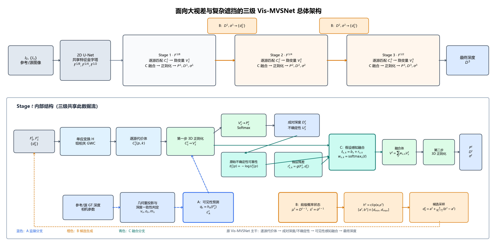
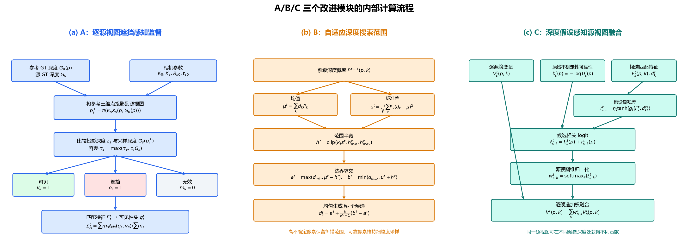
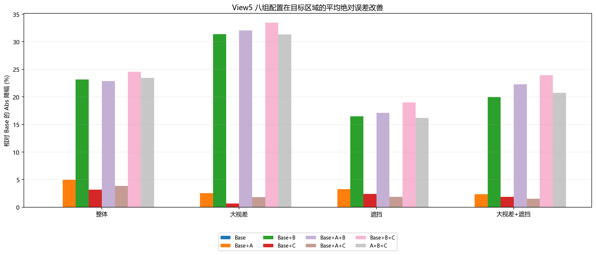
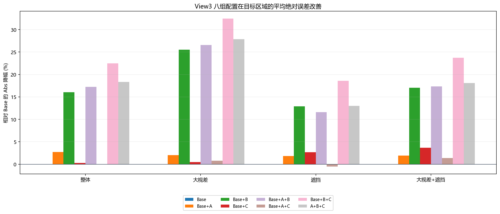
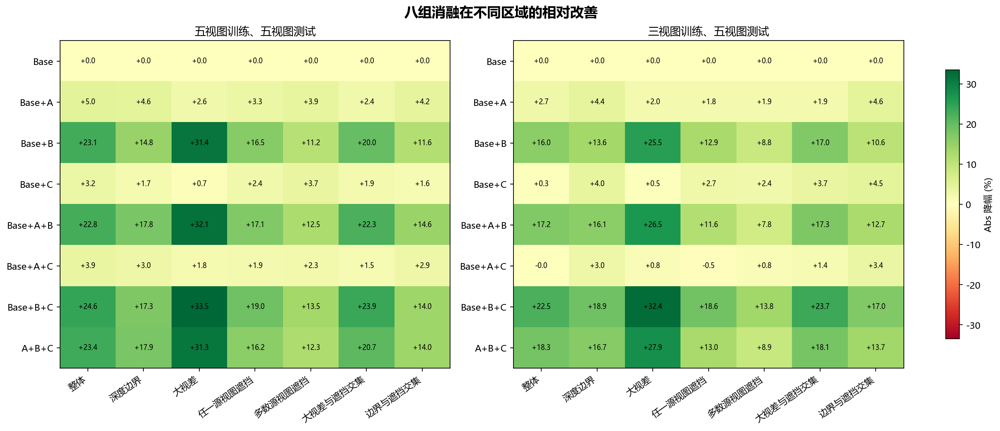
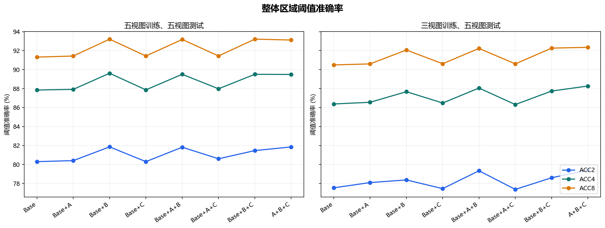

# 面向大视差与遮挡的 Vis-MVSNet 深度估计改进方法

## 摘要

针对 Vis-MVSNet 在大视差和复杂遮挡区域容易出现粗阶段匹配偏差、候选范围受限与错误视图证据累积的问题，本文提出一种由逐源视图遮挡感知监督、自适应深度搜索范围和深度假设感知源视图融合组成的三级改进方法。逐源遮挡监督利用参考—源视图几何一致性强化可见性学习；自适应范围根据前级估计状态调节后续深度候选，在覆盖能力与采样精度之间进行像素级平衡；深度假设感知融合则为不同候选深度分配源视图权重，抑制遮挡和错误对应产生的干扰。DTU 测试集上的八组消融表明，在五视图训练设置下，完整方法将整体平均绝对误差从 7.281 降至 5.575，相对降低 23.43%；在大视差、遮挡以及大视差与遮挡交集区域分别降低 31.34%、16.17% 和 20.75%。在三视图训练设置下，完整方法的整体平均绝对误差相对降低 18.35%，并在大视差与遮挡交集区域降低 18.10%。结果说明，三个模块能够从可见性学习、候选搜索和多视图融合三个环节改善困难区域的深度估计。

**关键词：** 多视图立体匹配；Vis-MVSNet；大视差；遮挡感知；自适应深度搜索；深度假设融合

## 1 引言

### 1.1 研究背景与问题

多视图立体匹配旨在由多幅已标定图像恢复场景的稠密几何。学习式方法通常将源视图特征依据一组深度假设变换到参考视图，构建并正则化匹配代价体，最终回归参考视图深度。MVSNet [2] 奠定了这一端到端框架，R-MVSNet [9]、Point-MVSNet [10]、CVP-MVSNet [11] 与 CasMVSNet [3] 随后分别从递归正则化、点云细化和由粗到细代价体等方向提高了分辨率与效率。级联结构在较低分辨率上估计粗深度，再围绕前级结果逐步缩小搜索区间，因而能够以有限的候选数量获得较细的深度分辨率。

然而，由粗到细的效率收益伴随着对前级估计的依赖。在大视差条件下，同一三维点在不同视图中的成像位置相距较远，局部外观差异和特征对齐误差随之增大；在复杂遮挡条件下，一部分源视图甚至不存在有效对应。若粗阶段由此产生较大深度偏差，后续局部搜索可能无法覆盖真实深度，错误又会继续影响更高分辨率阶段。Vis-MVSNet [1] 通过成对深度分布的不确定性估计源视图可靠性，有效改善了可见性相关融合，但匹配不确定性仍是对可靠性的间接刻画：相似的不确定性可能来自遮挡、弱纹理、重复纹理或反射。同时，像素级视图权重难以完整表示同一源视图在不同深度假设处的可靠性变化。因此，大视差和复杂遮挡仍可能通过“粗阶段失配—候选范围受限—错误证据聚合”在三级网络中形成连续的误差传播。

### 1.2 本文方法

为缓解上述误差传播，本文在 Vis-MVSNet 的三级主体中引入三个相互衔接的改进。首先，逐源视图遮挡感知监督利用参考深度、源视图深度与相机几何构造可见性标签，直接约束参考—源视图匹配表示。该监督不替代原有不确定性建模，而是为遮挡这一特定退化因素提供更明确的几何约束。其次，自适应深度搜索范围根据前级概率分布的离散程度调节后续阶段的搜索半宽，使不确定像素保留较大的纠错区间，同时在可靠位置维持较密的局部采样。最后，深度假设感知融合将源视图可靠性由像素级扩展到像素—深度假设级，使同一源视图在不同候选深度处具有不同权重，从而抑制遮挡边界和错误深度处的虚假匹配响应。

三个模块分别作用于监督信号、候选生成和代价聚合，并沿“可靠观测学习—真实深度覆盖—有效证据融合”的顺序构成统一方法。A 所学习的几何可见性表征改善匹配特征，B 为前级偏差保留修正空间，C 在该空间中进一步选择与每个深度假设一致的源视图证据。通过这种设计，三级结构的计算优势得以保留，而困难区域中的误差传播受到针对性约束。

### 1.3 本文工作

本文以原始 Vis-MVSNet 为基线，提出由 A、B、C 三个模块组成的联合改进方法，主要贡献如下：

1. **提出逐源视图遮挡感知监督模块 A。** 该模块以参考—源视图几何一致性构造可见性标签，为原有不确定性学习补充直接的遮挡监督，增强网络对复杂遮挡关系的表达能力。
2. **提出自适应深度搜索范围模块 B。** 该模块根据前级深度分布所反映的像素估计状态动态确定后续搜索区间，在固定候选预算下协调真实深度覆盖和局部采样精度，降低粗阶段偏差向后传播的风险。
3. **提出深度假设感知源视图融合模块 C。** 该模块将源视图权重由像素或视图层面细化到候选深度层面，使网络能够针对不同深度假设选择有效多视图证据，减轻遮挡与错误匹配响应对代价体的干扰。
4. 在统一协议下构造 $2^3$ 个模块组合的完整消融，并分别评价全图、大视差、遮挡及二者交集区域，以揭示各模块对不同困难条件的贡献及其互补关系。

## 2 相关工作

### 2.1 基于代价体的多视图深度估计

MVSNet [2] 利用可微单应性变换在参考相机视锥中构建三维代价体，并通过三维卷积完成正则化和深度回归，形成了学习式 MVS 的基本范式。由于完整三维代价体的显存开销随空间与深度分辨率快速增长，R-MVSNet [9] 使用循环单元沿深度方向依次正则化二维代价图，Point-MVSNet [10] 则从粗深度出发在三维点表示上迭代预测残差。CVP-MVSNet [11] 和 CasMVSNet [3] 将匹配过程组织为由粗到细的多尺度结构，在后续阶段围绕前级深度建立局部代价体。这类方法显著降低了高分辨率估计的计算负担，但也使精细阶段的候选空间受到粗阶段预测质量的制约。

### 2.2 可见性建模与多视图聚合

不同源视图对参考像素的有效性会随遮挡、视角和成像条件变化，因而等权聚合容易将错误匹配写入代价体。PVSNet [5] 预测逐像素可见性并据此构建加权代价体；Vis-MVSNet [1] 联合估计成对深度及其不确定性，以不确定性度量匹配可靠性并指导多视图融合。AA-RMVSNet [12] 进一步采用自适应的视图内与视图间聚合，以改善纹理不足和遮挡条件下的重建。上述方法证明了选择性使用源视图信息的重要性，但它们主要从预测可靠性或像素级权重出发。本文一方面通过逐源几何一致性显式监督遮挡关系，另一方面使视图权重随候选深度改变，从监督来源和融合粒度两个层面细化可见性建模。

### 2.3 深度假设搜索与概率建模

候选深度的覆盖范围与离散间隔共同决定代价体能够表达的深度精度。CasMVSNet [3] 在逐级提高空间分辨率的同时缩小搜索区间；UCS-Net [4] 根据前级深度分布的不确定性构建逐像素自适应薄体积。PatchmatchNet [6] 以可学习 PatchMatch 代替规则的全深度代价体，通过初始化、传播和评估迭代更新候选。GBi-Net [14] 将深度估计改写为广义二分搜索，并通过容错区间处理分类错误和越界样本；IterMVS [16] 则在循环隐藏状态中编码像素级深度概率分布并迭代更新。UniMVSNet [15] 从深度表示角度统一分类与回归，以兼顾代价体监督和亚像素估计。这些研究表明，候选空间不只是实现细节，而是影响覆盖能力、离散精度与误差恢复能力的关键因素。本文的自适应范围直接服务于三级结构中的前级误差修正，并与遮挡监督和深度假设感知融合共同优化困难区域。

### 2.4 上下文建模与几何先验

除候选搜索外，近年来的方法也通过更强的上下文和几何建模改善困难区域。TransMVSNet [13] 使用自注意力与交叉注意力在图像内和图像间传播长程信息；GeoMVSNet [17] 将粗阶段深度和概率体包含的几何线索传递到精细阶段；GoMVS [18] 根据局部表面几何将相邻位置的匹配代价对应到参考深度空间后再进行聚合。GC-MVSNet [19] 则在训练阶段引入跨视图、多尺度几何一致性约束。这些工作分别强调上下文、阶段间几何信息和局部几何一致性。本文聚焦于大视差与复杂遮挡共同造成的级联误差，从逐源可见性监督、自适应候选范围和候选深度相关视图融合三个环节建立一条连续的抑制路径。

## 3 方法

### 3.1 符号与总体框架

本文保留 Vis-MVSNet 的三级由粗到细主体，将 A、B、C 分别嵌入可见性学习、候选深度生成和多视图代价融合。Stage 1 在全局深度范围内建立粗粒度候选并获得初始深度分布；Stage 2 和 Stage 3 使用 B 根据前级估计状态更新局部候选范围，并使用 C 在每个候选深度处聚合源视图特征；A 在训练阶段以逐源几何可见性监督共享匹配表示。这样，三个模块分别作用于误差传播链的来源、搜索约束和证据聚合。

| 符号 | 定义 |
| --- | --- |
| $I_0,I_s$ | 参考图像与第 $s$ 个源图像 |
| $K_i,R_i,t_i$ | 相机内参及世界坐标到相机坐标的外参 |
| $\mathbf p,\widetilde{\mathbf p}$ | 参考像素二维坐标及齐次坐标 |
| $\phi_i^t,H_t,W_t,C_t$ | 阶段 $t$ 的特征及其空间大小、通道数 |
| $d_k^t(\mathbf p),N_t$ | 第 $k$ 个候选深度及该阶段候选数量 |
| $F_s^t(\mathbf p,k)$ | 参考—源视图匹配特征 |
| $P^t(\mathbf p,k)$ | 当前候选集合上的深度概率 |
| $\hat d^t,\sigma^t$ | 预测深度及深度概率标准差 |
| $G_i$ | 训练或评测时使用的真值深度 |
| $g_s,m_s,v_s,o_s$ | 几何有效掩码、监督掩码、可见标签、遮挡标签 |
| $q_s,b_s,r_{s,k}$ | 可见性预测、基础融合 logit、候选深度残差 |
| $\tau_a,\tau_r$ | 深度一致性绝对容差和相对容差 |
| $\kappa_t,h_{\min}^t,h_{\max}^t$ | 范围尺度及半宽上下界 |
| $\eta_t,\gamma,\alpha$ | 融合残差幅度、Focal 指数和类别权重 |
| $\beta_t,\lambda_A,\lambda_0$ | 阶段损失权重、A 损失权重及基线辅助项权重 |

深度 $d$ 表示沿相机光轴的深度；所有图像坐标、特征分辨率与内参须保持尺度一致。对于一般相机配置，使用相对变换 $R_{s0}=R_sR_0^\top$、$\mathbf t_{s0}=\mathbf t_s-R_sR_0^\top\mathbf t_0$，得到候选三维点在源相机中的位置：

$$
\mathbf X_s(\mathbf p,d)
=R_{s0}\!\left(dK_0^{-1}\widetilde{\mathbf p}\right)+\mathbf t_{s0},
\qquad
\mathbf p_s(d)=\pi\!\left(K_s\mathbf X_s(\mathbf p,d)\right).
\tag{1}
$$

其中 $\pi([x,y,z]^\top)=[x/z,y/z]^\top$。利用可微重采样在候选位置提取源特征，并形成匹配表示：

$$
F_s^t(\mathbf p,k)=
\Psi_t\!\left(
\phi_0^t(\mathbf p),
\operatorname{Sample}\!\left(\phi_s^t,\mathbf p_s(d_k^t(\mathbf p))\right)
\right).
\tag{2}
$$

$\Psi_t$ 表示由参考特征和重投影源特征形成的组相关匹配编码。基于相机几何进行特征变换的思路与 MVSNet 的可微匹配框架相关。[文献2](https://www.ecva.net/papers/eccv_2018/papers_ECCV/html/Yao_Yao_MVSNet_Depth_Inference_ECCV_2018_paper.php)

图1给出总体结构。Stage 1 在全局候选集合上估计粗深度；后续阶段由 B 更新候选集合，再由 C 聚合源视图信息。A 通过训练监督约束共享匹配表示。GT 深度仅参与标签构造、损失和评测，不作为推理输入。

**图1. 面向大视差与复杂遮挡的三级 Vis-MVSNet 总体架构。** 上部给出三尺度由粗到细推理过程，下部展开单个阶段的两步代价体正则化。原始主干首先对每个参考—源视图对构建代价体并回归成对深度与不确定性，再融合逐源隐变量并回归阶段深度。A 在逐源匹配特征上施加几何可见性监督；B 根据前级深度概率状态生成 Stage 2/3 候选；C 以基础可靠性和候选相关残差计算逐深度、逐源视图融合权重。

**图2. A、B、C 三个模块的内部计算流程。** A 由几何重投影和源深度一致性构造可见、遮挡与无效标签，并监督逐源可见性预测；B 由前级概率分布计算均值和标准差，经范围裁剪及全局边界求交后生成候选深度；C 将基础可靠性与候选深度残差相加，在源视图维归一化后逐候选融合隐变量。

### 3.2 A：逐源视图遮挡感知监督

#### 3.2.1 几何标签

将 $G_0(\mathbf p)$ 代入式(1)，得到源相机投影深度 $z_s(\mathbf p)$ 与像素位置 $\mathbf p_s^\star$。从源真值深度采样 $G_s(\mathbf p_s^\star)$，定义一致性容差：

$$
\tau_s(\mathbf p)=
\max\!\left(\tau_a,\tau_rG_s(\mathbf p_s^\star)\right).
\tag{3}
$$

$g_s(\mathbf p)=1$ 要求参考深度有效、投影位于源图像内、源投影深度为正且源真值深度有效。对这些位置分别定义可见和被遮挡标签：

$$
\begin{aligned}
v_s(\mathbf p)&=g_s(\mathbf p)\,
\mathbb 1\!\left[
|z_s(\mathbf p)-G_s(\mathbf p_s^\star)|\leq\tau_s(\mathbf p)
\right],\\
o_s(\mathbf p)&=g_s(\mathbf p)\,
\mathbb 1\!\left[
z_s(\mathbf p)>G_s(\mathbf p_s^\star)+\tau_s(\mathbf p)
\right],\\
m_s(\mathbf p)&=v_s(\mathbf p)+o_s(\mathbf p).
\end{aligned}
\tag{4}
$$

明显位于源表面前方的不一致点以及投影无效点不作为遮挡负样本，只有 $m_s=1$ 的位置进入可见性损失，从而避免将越界投影和缺失深度错误标记为遮挡。图2展示可见、遮挡和无效三种几何状态。

#### 3.2.2 可见性目标

由共享匹配表示提取逐源特征 $H_s^t(\mathbf p)$，预测可见性：

$$
q_s^t(\mathbf p)
=\operatorname{sigmoid}\!\left(f_A^t(H_s^t(\mathbf p))\right).
\tag{5}
$$

本文采用二元 Focal 形式同时处理可见/遮挡样本不均衡并加强困难样本的梯度：

$$
\ell_{\mathrm{vis}}(q,v)=
-\alpha v(1-q)^\gamma\log q
-(1-\alpha)(1-v)q^\gamma\log(1-q).
\tag{6}
$$

Focal Loss 通过降低易分类样本的损失权重，使训练更集中于遮挡边界和难匹配位置。[文献8](https://openaccess.thecvf.com/content_iccv_2017/html/Lin_Focal_Loss_for_ICCV_2017_paper.html) 当 $\gamma=0$ 时退化为带类别权重的交叉熵。数值计算中将 $q$ 限制在 $[\epsilon,1-\epsilon]$。

阶段监督为：

$$
\mathcal L_A^t=
\frac{\sum_s\sum_{\mathbf p}m_s^t(\mathbf p)\,
\ell_{\mathrm{vis}}\!\left(q_s^t(\mathbf p),v_s^t(\mathbf p)\right)}
{\max\!\left(1,\sum_s\sum_{\mathbf p}m_s^t(\mathbf p)\right)}.
\tag{7}
$$

所有标签均在对应特征尺度下构建或以保持离散语义的方式对齐。没有有效样本时，该项为零。A 通过共享匹配特征传递梯度，可见性概率不直接乘入融合权重。

### 3.3 B：自适应深度搜索范围

#### 3.3.1 估计状态与范围半宽

对 $t>1$，将上一阶段深度均值与标准差对齐到当前尺度，记为 $\mu^t(\mathbf p)$ 和 $s^t(\mathbf p)$。在深度单位一致的条件下，本文将搜索半宽定义为：

$$
h^t(\mathbf p)=
\operatorname{clip}\!\left(
\kappa_t s^t(\mathbf p),h_{\min}^t,h_{\max}^t
\right).
\tag{8}
$$

其中 $\kappa_t>0$ 控制标准差到搜索半宽的放大比例，$0<h_{\min}^t\leq h_{\max}^t$ 分别限制最小搜索宽度和最大纠错范围。上下界既防止高置信位置的候选塌缩，也避免低置信位置因范围过宽而过度降低采样分辨率。不确定性引导候选范围已有 UCS-Net 等研究基础。[文献4](https://openaccess.thecvf.com/content_CVPR_2020/html/Cheng_Deep_Stereo_Using_Adaptive_Thin_Volume_Representation_With_Uncertainty_Awareness_CVPR_2020_paper.html)

设有效全局深度范围为 $[d_{\min},d_{\max}]$，先将中心限制在其中，再取范围与全局区间的交集：

$$
\begin{aligned}
\bar\mu^t(\mathbf p)&=\operatorname{clip}
\left(\mu^t(\mathbf p),d_{\min},d_{\max}\right),\\
a^t(\mathbf p)&=\max\left(d_{\min},\bar\mu^t(\mathbf p)-h^t(\mathbf p)\right),\\
b^t(\mathbf p)&=\min\left(d_{\max},\bar\mu^t(\mathbf p)+h^t(\mathbf p)\right).
\end{aligned}
\tag{9}
$$

式（9）通过区间求交保证候选深度不越过全局边界，因此靠近 $d_{\min}$ 或 $d_{\max}$ 时实际范围会相应收缩。

#### 3.3.2 候选深度

令 $N_t\geq2$，均匀采样可写为：

$$
d_k^t(\mathbf p)=a^t(\mathbf p)
+\frac{k}{N_t-1}\left(b^t(\mathbf p)-a^t(\mathbf p)\right),
\qquad k=0,\ldots,N_t-1.
\tag{10}
$$

Stage 1 使用全局候选范围；后续阶段使用式(8)—(10)。在固定 $N_t$ 下，实际间距为：

$$
\Delta^t(\mathbf p)=
\frac{b^t(\mathbf p)-a^t(\mathbf p)}{N_t-1}.
\tag{11}
$$

在固定候选数下，扩大范围会同步增加采样间距。因此，B 并非简单扩大全部像素的搜索区间，而是在候选覆盖与局部离散精度之间进行逐像素调节。实验同时报告真实深度覆盖率、采样间距和最终深度误差，以分析这种调节是否有效。

### 3.4 C：深度假设感知源视图融合

#### 3.4.1 候选深度相关残差

令 $P_s^t(\mathbf p,k)$ 表示源视图的成对候选匹配概率，归一化深度坐标定义为：

$$
\xi_k^t(\mathbf p)=
2\frac{d_k^t(\mathbf p)-d_0^t(\mathbf p)}
{d_{N_t-1}^t(\mathbf p)-d_0^t(\mathbf p)+\epsilon}-1.
\tag{12}
$$

基于匹配特征、成对概率及深度坐标预测残差：

$$
r_s^t(\mathbf p,k)=
\eta_t\tanh\!\left(
g_C^t\left[F_s^t(\mathbf p,k),
P_s^t(\mathbf p,k),\xi_k^t(\mathbf p)\right]
\right).
\tag{13}
$$

$\eta_t\geq0$ 限定修正幅度，$g_C^t$ 表示沿候选深度和空间处理匹配特征的轻量预测器。该结构保留由成对不确定性得到的基础可靠性分支，并增加候选深度相关残差分支。

#### 3.4.2 权重归一化与融合

令 $b_s^t(\mathbf p)$ 为基础源视图可靠性 logit，$\mathcal S_v^t(\mathbf p,k)$ 为当前候选处几何投影有效的源视图集合。采用源视图维度上的 softmax：

$$
\alpha_s^t(\mathbf p,k)=
\frac{\exp\left(b_s^t(\mathbf p)+r_s^t(\mathbf p,k)\right)}
{\sum_{j\in\mathcal S_v^t(\mathbf p,k)}
\exp\left(b_j^t(\mathbf p)+r_j^t(\mathbf p,k)\right)},
\quad s\in\mathcal S_v^t(\mathbf p,k).
\tag{14}
$$

有效投影条件由相机参数与候选深度计算，不使用真值遮挡标签；无有效源视图的位置由有效性掩码排除。

融合特征为：

$$
F_{\mathrm{fused}}^t(\mathbf p,k)=
\sum_{s\in\mathcal S_v^t(\mathbf p,k)}
\alpha_s^t(\mathbf p,k)F_s^t(\mathbf p,k).
\tag{15}
$$

当 $r_s^t=0$ 时，权重退化为基础 logit 的归一化；该性质说明残差对基础权重的扩展关系，不额外证明整个网络与某个基线实现完全一致。

#### 3.4.3 概率、深度与标准差

对融合特征正则化后得到深度 logit $\ell^t(\mathbf p,k)$，在候选深度维度归一化：

$$
P^t(\mathbf p,k)=
\frac{\exp\left(\ell^t(\mathbf p,k)\right)}
{\sum_{j=0}^{N_t-1}\exp\left(\ell^t(\mathbf p,j)\right)}.
\tag{16}
$$

深度及标准差为：

$$
\hat d^t(\mathbf p)=
\sum_{k=0}^{N_t-1}P^t(\mathbf p,k)d_k^t(\mathbf p),
\tag{17}
$$

$$
\sigma^t(\mathbf p)=
\sqrt{\sum_{k=0}^{N_t-1}P^t(\mathbf p,k)
\left(d_k^t(\mathbf p)-\hat d^t(\mathbf p)\right)^2+\epsilon}.
\tag{18}
$$

该标准差描述当前候选集合上的概率离散程度，并作为后续阶段范围调节的像素级状态量。实验通过各阶段候选覆盖率验证其作用。

### 3.5 损失与训练流程

深度监督采用带参数 $\delta>0$ 的平滑绝对误差：

$$
\rho_\delta(e)=
\begin{cases}
e^2/(2\delta),& |e|<\delta,\\
|e|-\delta/2,& |e|\geq\delta.
\end{cases}
\tag{19}
$$

阶段深度损失为：

$$
\mathcal L_{\mathrm{depth}}^t=
\frac{\sum_{\mathbf p\in\Omega_{\mathrm{gt}}^t}
\rho_\delta\left(\hat d^t(\mathbf p)-G_0^t(\mathbf p)\right)}
{\max(1,|\Omega_{\mathrm{gt}}^t|)}.
\tag{20}
$$

总目标写为：

$$
\mathcal L=
\sum_{t=1}^{T}\beta_t
\left(
\mathcal L_{\mathrm{depth}}^t+
\lambda_A\mathcal L_A^t+
\lambda_0\mathcal L_{\mathrm{base,aux}}^t
\right).
\tag{21}
$$

$\mathcal L_{\mathrm{base,aux}}^t$ 表示 Vis-MVSNet 原有的成对深度—不确定性联合监督。不启用 A 时关闭可见性监督分支；关闭 B 时使用原始候选生成策略；关闭 C 时使用原始不确定性加权融合，从而形成八组受控消融。

**算法1：前向推理与训练目标。**

1. 输入图像与相机参数，提取各尺度特征。
2. Stage 1 构建全局候选集合。对后续阶段，根据上一阶段均值、标准差及式(8)—(10)构建候选；B 关闭时执行原始策略。
3. 根据式(1)—(2)构建逐源匹配特征，并获得基础可靠性与所需成对概率。
4. C 开启时执行式(12)—(15)；否则采用原始融合。
5. 由式(16)—(18)得到当前阶段概率、深度和标准差，进入下一阶段。
6. 推理时输出最终阶段深度；训练时额外构造几何标签，计算 A 的监督与式(21)。
7. 对总损失执行反向传播并更新网络参数。

## 4 实验设置

### 4.1 数据集与评测协议

实验在 DTU 数据集 [7] 上进行。采用测试划分、light 3 光照条件和像素加权聚合方式，推理阶段统一输入五个视图。为考察训练视图数量对方法的影响，分别使用五视图和三视图训练模型，并保持对应八组消融的评测协议一致。除整体区域外，进一步在深度边界、大视差、任一源视图遮挡、多数源视图遮挡、大视差与遮挡交集以及边界与遮挡交集区域进行评价。

平均绝对误差 Abs 衡量预测深度与真值深度之间的平均偏差，数值越低越好；Acc2、Acc4 和 Acc8 分别统计误差小于 2、4 和 8 个深度单位的像素比例，数值越高越好。S1–S3 coverage 表示真实深度落入对应阶段候选范围的像素比例，S1–S3 width 表示各阶段平均候选区间宽度。所有相对降幅均以 Base 为参照，按 $({\operatorname{Abs}}_{\mathrm{Base}}-{\operatorname{Abs}}_{\mathrm{model}})/{\operatorname{Abs}}_{\mathrm{Base}}\times100\%$ 计算；准确率和覆盖率变化采用百分点。

### 4.2 消融配置

A、B、C 分别表示逐源视图遮挡感知监督、自适应深度搜索范围和深度假设感知源视图融合。三个二值因素形成八组完整消融：

| 配置 | A | B | C |
| --- | ---: | ---: | ---: |
| Base | 0 | 0 | 0 |
| Base+A | 1 | 0 | 0 |
| Base+B | 0 | 1 | 0 |
| Base+C | 0 | 0 | 1 |
| Base+A+B | 1 | 1 | 0 |
| Base+A+C | 1 | 0 | 1 |
| Base+B+C | 0 | 1 | 1 |
| Ours (A+B+C) | 1 | 1 | 1 |

## 5 实验结果与分析

### 5.1 五视图训练结果

表1给出五视图训练、五视图测试条件下七类区域的平均绝对误差。括号内为相对 Base 的降幅。

**表1. 五视图训练下八组配置的区域平均绝对误差。**

| 配置 | 整体区域 | 深度边界 | 大视差 | 任一源视图遮挡 | 多数源视图遮挡 | 大视差与遮挡交集 | 边界与遮挡交集 |
| --- | ---: | ---: | ---: | ---: | ---: | ---: | ---: |
| Base | 7.281 (+0.00%) | 25.382 (+0.00%) | 21.469 (+0.00%) | 35.936 (+0.00%) | 49.134 (+0.00%) | 58.326 (+0.00%) | 38.742 (+0.00%) |
| Base+A | 6.920 (+4.96%) | 24.219 (+4.58%) | 20.921 (+2.55%) | 34.756 (+3.28%) | 47.199 (+3.94%) | 56.950 (+2.36%) | 37.102 (+4.23%) |
| Base+B | 5.596 (+23.15%) | 21.633 (+14.77%) | 14.730 (+31.39%) | 30.010 (+16.49%) | 43.633 (+11.20%) | 46.688 (+19.95%) | 34.249 (+11.60%) |
| Base+C | 7.049 (+3.18%) | 24.938 (+1.75%) | 21.326 (+0.66%) | 35.070 (+2.41%) | 47.305 (+3.72%) | 57.218 (+1.90%) | 38.137 (+1.56%) |
| Base+A+B | 5.618 (+22.84%) | 20.852 (+17.85%) | 14.583 (+32.07%) | 29.795 (+17.09%) | 43.010 (+12.46%) | 45.317 (+22.30%) | 33.074 (+14.63%) |
| Base+A+C | 7.001 (+3.85%) | 24.624 (+2.98%) | 21.081 (+1.81%) | 35.260 (+1.88%) | 48.009 (+2.29%) | 57.437 (+1.52%) | 37.618 (+2.90%) |
| Base+B+C | 5.493 (+24.56%) | 20.996 (+17.28%) | 14.286 (+33.46%) | 29.114 (+18.98%) | 42.489 (+13.52%) | 44.360 (+23.95%) | 33.300 (+14.05%) |
| Ours (A+B+C) | 5.575 (+23.43%) | 20.834 (+17.92%) | 14.741 (+31.34%) | 30.125 (+16.17%) | 43.109 (+12.26%) | 46.226 (+20.75%) | 33.326 (+13.98%) |

完整方法将整体 Abs 从 7.281 降至 5.575，相对降低 23.43%。在大视差区域，Abs 从 21.469 降至 14.741，降幅达到 31.34%；在任一源视图遮挡区域和大视差与遮挡交集区域，降幅分别为 16.17% 和 20.75%。这些区域的降幅均具有明确幅度，表明改进并非只作用于普通像素，而是集中覆盖了本文关注的困难匹配条件。

**图3. 五视图训练下八组配置相对 Base 的 Abs 降幅。** B 及包含 B 的组合在大视差区域呈现最明显改善，A 和 C 单独加入时也降低了多个区域的平均误差。

表2列出整体区域的全部十项指标。完整方法的 Acc2、Acc4 和 Acc8 分别为 81.85%、89.49% 和 93.12%，相对 Base 分别提高 1.55、1.64 和 1.80 个百分点。Stage 2 和 Stage 3 coverage 分别提高 1.47 和 1.43 个百分点，说明后续阶段对真实深度的覆盖能力得到改善。

**表2. 五视图训练下整体区域的全部指标。**

| 配置 | Abs ↓ | Acc2 ↑ | Acc4 ↑ | Acc8 ↑ | S1 coverage ↑ | S2 coverage ↑ | S3 coverage ↑ | S1 width | S2 width | S3 width |
| --- | ---: | ---: | ---: | ---: | ---: | ---: | ---: | ---: | ---: | ---: |
| Base | 7.281 | 80.30% | 87.85% | 91.32% | 96.52% | 95.71% | 94.03% | 188.000 | 62.796 | 16.130 |
| Base+A | 6.920 | 80.41% | 87.92% | 91.43% | 96.52% | 95.79% | 94.25% | 188.000 | 62.822 | 16.127 |
| Base+B | 5.596 | 81.86% | 89.62% | 93.21% | 96.52% | 97.18% | 95.45% | 188.000 | 62.000 | 15.000 |
| Base+C | 7.049 | 80.30% | 87.87% | 91.44% | 96.52% | 95.76% | 94.13% | 188.000 | 62.735 | 16.100 |
| Base+A+B | 5.618 | 81.82% | 89.51% | 93.18% | 96.52% | 97.14% | 95.42% | 188.000 | 62.000 | 15.000 |
| Base+A+C | 7.001 | 80.61% | 87.98% | 91.44% | 96.52% | 95.76% | 94.24% | 188.000 | 62.780 | 16.142 |
| Base+B+C | 5.493 | 81.47% | 89.51% | 93.22% | 96.52% | 97.23% | 95.51% | 188.000 | 62.000 | 15.000 |
| Ours (A+B+C) | 5.575 | 81.85% | 89.49% | 93.12% | 96.52% | 97.19% | 95.46% | 188.000 | 62.000 | 15.000 |

### 5.2 三视图训练结果

表3给出三视图训练、五视图测试条件下的区域平均绝对误差。

**表3. 三视图训练下八组配置的区域平均绝对误差。**

| 配置 | 整体区域 | 深度边界 | 大视差 | 任一源视图遮挡 | 多数源视图遮挡 | 大视差与遮挡交集 | 边界与遮挡交集 |
| --- | ---: | ---: | ---: | ---: | ---: | ---: | ---: |
| Base | 7.634 (+0.00%) | 26.615 (+0.00%) | 22.940 (+0.00%) | 37.639 (+0.00%) | 51.125 (+0.00%) | 62.056 (+0.00%) | 40.471 (+0.00%) |
| Base+A | 7.427 (+2.71%) | 25.448 (+4.39%) | 22.473 (+2.04%) | 36.947 (+1.84%) | 50.167 (+1.87%) | 60.868 (+1.91%) | 38.627 (+4.56%) |
| Base+B | 6.410 (+16.03%) | 23.008 (+13.55%) | 17.089 (+25.51%) | 32.785 (+12.90%) | 46.643 (+8.77%) | 51.496 (+17.02%) | 36.171 (+10.62%) |
| Base+C | 7.612 (+0.28%) | 25.561 (+3.96%) | 22.829 (+0.48%) | 36.630 (+2.68%) | 49.914 (+2.37%) | 59.772 (+3.68%) | 38.644 (+4.51%) |
| Base+A+B | 6.319 (+17.23%) | 22.341 (+16.06%) | 16.850 (+26.55%) | 33.277 (+11.59%) | 47.119 (+7.84%) | 51.307 (+17.32%) | 35.321 (+12.73%) |
| Base+A+C | 7.636 (-0.03%) | 25.824 (+2.97%) | 22.756 (+0.80%) | 37.830 (-0.51%) | 50.703 (+0.83%) | 61.209 (+1.36%) | 39.093 (+3.41%) |
| Base+B+C | 5.919 (+22.47%) | 21.592 (+18.88%) | 15.499 (+32.43%) | 30.651 (+18.57%) | 44.071 (+13.80%) | 47.328 (+23.73%) | 33.588 (+17.01%) |
| Ours (A+B+C) | 6.233 (+18.35%) | 22.172 (+16.69%) | 16.549 (+27.86%) | 32.749 (+12.99%) | 46.557 (+8.94%) | 50.825 (+18.10%) | 34.922 (+13.71%) |

完整方法将整体 Abs 从 7.634 降至 6.233，相对降低 18.35%；在大视差、任一源视图遮挡以及大视差与遮挡交集区域分别降低 27.86%、12.99% 和 18.10%。这说明在训练视图减少的条件下，联合方法仍能改善目标困难区域。

**图4. 三视图训练下八组配置相对 Base 的 Abs 降幅。**

**表4. 三视图训练下整体区域的全部指标。**

| 配置 | Abs ↓ | Acc2 ↑ | Acc4 ↑ | Acc8 ↑ | S1 coverage ↑ | S2 coverage ↑ | S3 coverage ↑ | S1 width | S2 width | S3 width |
| --- | ---: | ---: | ---: | ---: | ---: | ---: | ---: | ---: | ---: | ---: |
| Base | 7.634 | 77.55% | 86.38% | 90.50% | 96.52% | 95.68% | 93.71% | 188.000 | 62.750 | 16.170 |
| Base+A | 7.427 | 78.10% | 86.56% | 90.61% | 96.52% | 95.68% | 94.00% | 188.000 | 62.833 | 16.415 |
| Base+B | 6.410 | 78.37% | 87.67% | 92.07% | 96.52% | 97.02% | 94.71% | 188.000 | 62.000 | 15.000 |
| Base+C | 7.612 | 77.46% | 86.48% | 90.62% | 96.52% | 95.61% | 93.78% | 188.000 | 62.738 | 16.185 |
| Base+A+B | 6.319 | 79.34% | 88.06% | 92.24% | 96.52% | 97.00% | 94.82% | 188.000 | 62.000 | 15.000 |
| Base+A+C | 7.636 | 77.38% | 86.32% | 90.61% | 96.52% | 95.65% | 93.85% | 188.000 | 62.805 | 16.220 |
| Base+B+C | 5.919 | 78.61% | 87.74% | 92.27% | 96.52% | 97.18% | 95.02% | 188.000 | 62.000 | 15.000 |
| Ours (A+B+C) | 6.233 | 79.41% | 88.27% | 92.35% | 96.52% | 97.02% | 94.92% | 188.000 | 62.000 | 15.000 |

### 5.3 单模块与组合效果

表5和表6给出五视图训练条件下的十二组受控比较，每一行只改变一个模块。A 单独加入 Base 后，整体、深度边界和边界与遮挡交集区域的 Abs 分别降低 4.96%、4.58% 和 4.23%，说明显式遮挡监督对边界附近的不可靠观测具有积极作用。B 单独加入 Base 后，整体和大视差区域的 Abs 分别降低 23.15% 和 31.39%，是三项单模块改进中幅度最大的因素；其 Stage 2 和 Stage 3 整体 coverage 分别增加 1.47 和 1.42 个百分点，验证了候选范围调整与深度覆盖改善之间的联系。C 单独加入 Base 后，整体和大视差与遮挡交集区域的 Abs 分别降低 3.18% 和 1.90%；当 C 与 B 联合时，Base+B+C 在整体、大视差和大视差与遮挡交集区域分别获得 24.56%、33.46% 和 23.95% 的降幅，说明候选深度相关融合在可靠搜索空间内能够进一步发挥作用。

**表5. 五视图训练下加入单个模块时的 Abs 相对变化。**

| 因素 | 受控对照 | 整体 | 大视差 | 大视差+遮挡 | 边界+遮挡 |
| --- | ---: | ---: | ---: | ---: | ---: |
| 加入 A | Base → Base+A | +4.96% | +2.55% | +2.36% | +4.23% |
| 加入 A | Base+B → Base+A+B | -0.39% | +1.00% | +2.94% | +3.43% |
| 加入 A | Base+C → Base+A+C | +0.69% | +1.15% | -0.38% | +1.36% |
| 加入 A | Base+B+C → Ours (A+B+C) | -1.50% | -3.19% | -4.21% | -0.08% |
| 加入 B | Base → Base+B | +23.15% | +31.39% | +19.95% | +11.60% |
| 加入 B | Base+A → Base+A+B | +18.82% | +30.30% | +20.43% | +10.86% |
| 加入 B | Base+C → Base+B+C | +22.08% | +33.01% | +22.47% | +12.68% |
| 加入 B | Base+A+C → Ours (A+B+C) | +20.36% | +30.07% | +19.52% | +11.41% |
| 加入 C | Base → Base+C | +3.18% | +0.66% | +1.90% | +1.56% |
| 加入 C | Base+A → Base+A+C | -1.16% | -0.76% | -0.85% | -1.39% |
| 加入 C | Base+B → Base+B+C | +1.84% | +3.02% | +4.99% | +2.77% |
| 加入 C | Base+A+B → Ours (A+B+C) | +0.76% | -1.09% | -2.01% | -0.76% |

**表6. 五视图训练下加入单个模块时的 Acc4 变化。**

| 因素 | 受控对照 | 整体 | 大视差 | 大视差+遮挡 | 边界+遮挡 |
| --- | ---: | ---: | ---: | ---: | ---: |
| 加入 A | Base → Base+A | +0.07 pp | -0.13 pp | -0.26 pp | +0.50 pp |
| 加入 A | Base+B → Base+A+B | -0.11 pp | -0.28 pp | -0.22 pp | +0.40 pp |
| 加入 A | Base+C → Base+A+C | +0.11 pp | +0.25 pp | +0.15 pp | +0.18 pp |
| 加入 A | Base+B+C → Ours (A+B+C) | -0.01 pp | -0.77 pp | -1.23 pp | +0.21 pp |
| 加入 B | Base → Base+B | +1.77 pp | +6.75 pp | +7.60 pp | +1.62 pp |
| 加入 B | Base+A → Base+A+B | +1.59 pp | +6.60 pp | +7.64 pp | +1.52 pp |
| 加入 B | Base+C → Base+B+C | +1.64 pp | +6.91 pp | +7.67 pp | +1.44 pp |
| 加入 B | Base+A+C → Ours (A+B+C) | +1.51 pp | +5.89 pp | +6.30 pp | +1.47 pp |
| 加入 C | Base → Base+C | +0.02 pp | -0.28 pp | +0.03 pp | +0.17 pp |
| 加入 C | Base+A → Base+A+C | +0.06 pp | +0.09 pp | +0.44 pp | -0.15 pp |
| 加入 C | Base+B → Base+B+C | -0.11 pp | -0.13 pp | +0.10 pp | -0.00 pp |
| 加入 C | Base+A+B → Ours (A+B+C) | -0.01 pp | -0.62 pp | -0.90 pp | -0.20 pp |

**图5. 两套训练设置下八组消融在七类区域的 Abs 相对降幅。** 绿色表示平均误差降低，红色表示平均误差增加。

### 5.4 指标取舍

八组结果表明，各模块组合在平均误差和阈值准确率之间存在局部取舍。五视图训练时，Base+B+C 的整体 Abs 为 5.493，低于完整模型的 5.575；完整模型则在深度边界区域获得最低 Abs 20.834，在边界与遮挡交集区域的 Acc4 相对 Base+B+C 提高 0.21 个百分点。该结果表明，A 的加入更有利于边界和遮挡相关像素，但可能改变全图误差尾部，因此完整模型无需在所有汇总指标上同时超过每一个双模块组合。

从指标定义看，Abs 对少量大误差像素十分敏感，而 Acc4 只反映误差是否进入 4 个深度单位的容差范围。某一组合提高 Acc4 而 Abs 略有增大，表示更多像素跨入阈值范围，但剩余大误差像素的幅度可能增加。图6显示两套训练设置下八组配置的 Acc2、Acc4 和 Acc8，阈值越宽，不同配置之间的变化越能反映严重错误像素是否得到纠正。

**图6. 八组配置在整体区域的 Acc2、Acc4 和 Acc8。**

## 6 讨论

实验结果支持三个模块围绕同一目标形成分工。A 通过显式几何标签强化遮挡区域的可靠性学习，B 通过调整后续搜索范围提高真实深度覆盖，C 则在候选深度维度重新分配源视图贡献。B 对大视差区域的贡献最为突出，说明三级结构中的候选覆盖是限制困难像素恢复的重要因素；A 在边界及遮挡交集区域表现出更稳定的作用；C 的单独收益相对温和，但与 B 结合后在多个区域进一步降低平均误差，体现了搜索空间与融合策略之间的互补性。

完整方法在五视图训练和三视图训练条件下均显著优于 Base，且改善覆盖整体、大视差、遮挡和二者交集区域。与此同时，Base+B+C 在部分平均误差指标上优于完整模型，说明三模块联合会重新分配不同像素和不同误差尺度上的优化重点。本文据此将完整方法的结论限定为：三个模块共同提高了原始 Vis-MVSNet 在目标困难区域的综合表现，但单个区域或单项指标的最佳组合可能不同。

## 7 结论

本文针对 Vis-MVSNet 三级深度估计在大视差与复杂遮挡下的误差传播问题，提出逐源视图遮挡感知监督、自适应深度搜索范围和深度假设感知源视图融合。三个模块分别改善可见性学习、真实深度候选覆盖和多视图证据聚合。DTU 上的完整八组消融表明，五视图训练时，完整方法相对 Base 将整体、大视差、遮挡以及大视差与遮挡交集区域的 Abs 分别降低 23.43%、31.34%、16.17% 和 20.75%；三视图训练时，对应降幅分别为 18.35%、27.86%、12.99% 和 18.10%。结果验证了从监督、搜索和融合三个环节联合提升大视差与复杂遮挡区域深度估计的有效性。

## 附录 A：全部区域与全部指标

以下表格给出两套训练设置、七类区域、八组配置的全部十项指标。

### A.1 五视图训练、五视图测试

#### A.1.1 整体区域

| 配置 | Abs ↓ | Acc2 ↑ | Acc4 ↑ | Acc8 ↑ | S1 coverage ↑ | S2 coverage ↑ | S3 coverage ↑ | S1 width | S2 width | S3 width |
| --- | ---: | ---: | ---: | ---: | ---: | ---: | ---: | ---: | ---: | ---: |
| Base | 7.281 | 80.30% | 87.85% | 91.32% | 96.52% | 95.71% | 94.03% | 188.000 | 62.796 | 16.130 |
| Base+A | 6.920 | 80.41% | 87.92% | 91.43% | 96.52% | 95.79% | 94.25% | 188.000 | 62.822 | 16.127 |
| Base+B | 5.596 | 81.86% | 89.62% | 93.21% | 96.52% | 97.18% | 95.45% | 188.000 | 62.000 | 15.000 |
| Base+C | 7.049 | 80.30% | 87.87% | 91.44% | 96.52% | 95.76% | 94.13% | 188.000 | 62.735 | 16.100 |
| Base+A+B | 5.618 | 81.82% | 89.51% | 93.18% | 96.52% | 97.14% | 95.42% | 188.000 | 62.000 | 15.000 |
| Base+A+C | 7.001 | 80.61% | 87.98% | 91.44% | 96.52% | 95.76% | 94.24% | 188.000 | 62.780 | 16.142 |
| Base+B+C | 5.493 | 81.47% | 89.51% | 93.22% | 96.52% | 97.23% | 95.51% | 188.000 | 62.000 | 15.000 |
| Ours (A+B+C) | 5.575 | 81.85% | 89.49% | 93.12% | 96.52% | 97.19% | 95.46% | 188.000 | 62.000 | 15.000 |

#### A.1.2 深度边界

| 配置 | Abs ↓ | Acc2 ↑ | Acc4 ↑ | Acc8 ↑ | S1 coverage ↑ | S2 coverage ↑ | S3 coverage ↑ | S1 width | S2 width | S3 width |
| --- | ---: | ---: | ---: | ---: | ---: | ---: | ---: | ---: | ---: | ---: |
| Base | 25.382 | 40.15% | 53.97% | 65.15% | 92.47% | 88.94% | 80.45% | 188.000 | 63.185 | 17.964 |
| Base+A | 24.219 | 41.27% | 54.99% | 66.07% | 92.47% | 89.08% | 81.65% | 188.000 | 63.482 | 17.942 |
| Base+B | 21.633 | 41.32% | 55.71% | 67.43% | 92.47% | 89.78% | 78.80% | 188.000 | 62.000 | 15.000 |
| Base+C | 24.938 | 40.91% | 54.68% | 65.82% | 92.47% | 89.03% | 80.78% | 188.000 | 63.223 | 17.803 |
| Base+A+B | 20.852 | 41.90% | 56.34% | 68.20% | 92.47% | 89.78% | 79.37% | 188.000 | 62.000 | 15.000 |
| Base+A+C | 24.624 | 41.07% | 54.87% | 65.91% | 92.47% | 88.96% | 81.45% | 188.000 | 63.441 | 18.048 |
| Base+B+C | 20.996 | 41.09% | 55.70% | 67.63% | 92.47% | 89.94% | 79.05% | 188.000 | 62.000 | 15.000 |
| Ours (A+B+C) | 20.834 | 42.09% | 56.38% | 68.15% | 92.47% | 89.94% | 79.78% | 188.000 | 62.000 | 15.000 |

#### A.1.3 大视差

| 配置 | Abs ↓ | Acc2 ↑ | Acc4 ↑ | Acc8 ↑ | S1 coverage ↑ | S2 coverage ↑ | S3 coverage ↑ | S1 width | S2 width | S3 width |
| --- | ---: | ---: | ---: | ---: | ---: | ---: | ---: | ---: | ---: | ---: |
| Base | 21.469 | 61.79% | 71.26% | 76.43% | 84.48% | 83.39% | 80.39% | 188.000 | 58.408 | 15.710 |
| Base+A | 20.921 | 61.43% | 71.13% | 76.57% | 84.48% | 83.46% | 80.78% | 188.000 | 58.515 | 15.672 |
| Base+B | 14.730 | 67.26% | 78.01% | 83.94% | 84.48% | 89.84% | 87.46% | 188.000 | 62.000 | 15.000 |
| Base+C | 21.326 | 61.37% | 70.97% | 76.46% | 84.48% | 83.37% | 80.47% | 188.000 | 58.285 | 15.626 |
| Base+A+B | 14.583 | 66.70% | 77.73% | 83.97% | 84.48% | 89.79% | 87.47% | 188.000 | 62.000 | 15.000 |
| Base+A+C | 21.081 | 61.57% | 71.22% | 76.56% | 84.48% | 83.41% | 80.79% | 188.000 | 58.465 | 15.698 |
| Base+B+C | 14.286 | 66.35% | 77.88% | 84.10% | 84.48% | 89.98% | 87.64% | 188.000 | 62.000 | 15.000 |
| Ours (A+B+C) | 14.741 | 65.77% | 77.11% | 83.50% | 84.48% | 89.88% | 87.44% | 188.000 | 62.000 | 15.000 |

#### A.1.4 任一源视图遮挡

| 配置 | Abs ↓ | Acc2 ↑ | Acc4 ↑ | Acc8 ↑ | S1 coverage ↑ | S2 coverage ↑ | S3 coverage ↑ | S1 width | S2 width | S3 width |
| --- | ---: | ---: | ---: | ---: | ---: | ---: | ---: | ---: | ---: | ---: |
| Base | 35.936 | 38.61% | 50.14% | 59.67% | 86.48% | 81.09% | 72.27% | 188.000 | 61.363 | 17.265 |
| Base+A | 34.756 | 38.45% | 50.05% | 59.80% | 86.48% | 81.22% | 73.28% | 188.000 | 61.649 | 17.318 |
| Base+B | 30.010 | 41.50% | 54.40% | 65.14% | 86.48% | 85.18% | 75.11% | 188.000 | 62.000 | 15.000 |
| Base+C | 35.070 | 38.80% | 50.39% | 60.06% | 86.48% | 81.28% | 72.68% | 188.000 | 61.211 | 17.139 |
| Base+A+B | 29.795 | 41.29% | 54.11% | 65.03% | 86.48% | 84.81% | 75.05% | 188.000 | 62.000 | 15.000 |
| Base+A+C | 35.260 | 38.86% | 50.41% | 59.99% | 86.48% | 81.14% | 73.21% | 188.000 | 61.563 | 17.391 |
| Base+B+C | 29.114 | 41.42% | 54.39% | 65.27% | 86.48% | 85.40% | 75.43% | 188.000 | 62.000 | 15.000 |
| Ours (A+B+C) | 30.125 | 41.18% | 53.84% | 64.46% | 86.48% | 84.98% | 75.11% | 188.000 | 62.000 | 15.000 |

#### A.1.5 多数源视图遮挡

| 配置 | Abs ↓ | Acc2 ↑ | Acc4 ↑ | Acc8 ↑ | S1 coverage ↑ | S2 coverage ↑ | S3 coverage ↑ | S1 width | S2 width | S3 width |
| --- | ---: | ---: | ---: | ---: | ---: | ---: | ---: | ---: | ---: | ---: |
| Base | 49.134 | 30.12% | 40.10% | 49.47% | 86.12% | 77.20% | 64.82% | 188.000 | 62.315 | 18.106 |
| Base+A | 47.199 | 30.09% | 40.17% | 49.72% | 86.12% | 77.32% | 66.30% | 188.000 | 62.701 | 18.186 |
| Base+B | 43.633 | 32.62% | 43.86% | 54.47% | 86.12% | 80.65% | 66.25% | 188.000 | 62.000 | 15.000 |
| Base+C | 47.305 | 30.44% | 40.54% | 50.20% | 86.12% | 77.57% | 65.55% | 188.000 | 62.078 | 17.917 |
| Base+A+B | 43.010 | 32.20% | 43.39% | 54.25% | 86.12% | 80.04% | 66.28% | 188.000 | 62.000 | 15.000 |
| Base+A+C | 48.009 | 30.57% | 40.55% | 50.04% | 86.12% | 77.26% | 66.17% | 188.000 | 62.564 | 18.283 |
| Base+B+C | 42.489 | 32.51% | 43.96% | 54.78% | 86.12% | 80.85% | 66.84% | 188.000 | 62.000 | 15.000 |
| Ours (A+B+C) | 43.109 | 31.91% | 42.99% | 53.72% | 86.12% | 80.36% | 66.49% | 188.000 | 62.000 | 15.000 |

#### A.1.6 大视差与遮挡交集

| 配置 | Abs ↓ | Acc2 ↑ | Acc4 ↑ | Acc8 ↑ | S1 coverage ↑ | S2 coverage ↑ | S3 coverage ↑ | S1 width | S2 width | S3 width |
| --- | ---: | ---: | ---: | ---: | ---: | ---: | ---: | ---: | ---: | ---: |
| Base | 58.326 | 28.90% | 38.19% | 45.77% | 70.89% | 65.44% | 56.58% | 188.000 | 57.495 | 16.763 |
| Base+A | 56.950 | 28.54% | 37.93% | 45.82% | 70.89% | 65.44% | 57.70% | 188.000 | 57.847 | 16.777 |
| Base+B | 46.688 | 33.96% | 45.79% | 55.42% | 70.89% | 73.88% | 64.41% | 188.000 | 62.000 | 15.000 |
| Base+C | 57.218 | 28.83% | 38.22% | 46.05% | 70.89% | 65.52% | 57.01% | 188.000 | 57.202 | 16.594 |
| Base+A+B | 45.317 | 33.76% | 45.57% | 55.61% | 70.89% | 73.80% | 64.74% | 188.000 | 62.000 | 15.000 |
| Base+A+C | 57.437 | 29.16% | 38.37% | 46.18% | 70.89% | 65.55% | 57.82% | 188.000 | 57.805 | 16.863 |
| Base+B+C | 44.360 | 33.60% | 45.90% | 56.17% | 70.89% | 74.46% | 65.28% | 188.000 | 62.000 | 15.000 |
| Ours (A+B+C) | 46.226 | 32.94% | 44.67% | 54.67% | 70.89% | 73.89% | 64.84% | 188.000 | 62.000 | 15.000 |

#### A.1.7 边界与遮挡交集

| 配置 | Abs ↓ | Acc2 ↑ | Acc4 ↑ | Acc8 ↑ | S1 coverage ↑ | S2 coverage ↑ | S3 coverage ↑ | S1 width | S2 width | S3 width |
| --- | ---: | ---: | ---: | ---: | ---: | ---: | ---: | ---: | ---: | ---: |
| Base | 38.742 | 29.11% | 40.74% | 52.04% | 89.99% | 84.11% | 71.64% | 188.000 | 63.284 | 18.916 |
| Base+A | 37.102 | 29.61% | 41.24% | 52.70% | 89.99% | 84.15% | 73.29% | 188.000 | 63.652 | 18.907 |
| Base+B | 34.249 | 30.20% | 42.36% | 54.47% | 89.99% | 85.06% | 68.86% | 188.000 | 62.000 | 15.000 |
| Base+C | 38.137 | 29.34% | 40.91% | 52.28% | 89.99% | 84.21% | 71.95% | 188.000 | 63.293 | 18.751 |
| Base+A+B | 33.074 | 30.44% | 42.76% | 55.20% | 89.99% | 84.88% | 69.59% | 188.000 | 62.000 | 15.000 |
| Base+A+C | 37.618 | 29.52% | 41.09% | 52.52% | 89.99% | 84.12% | 73.09% | 188.000 | 63.665 | 19.061 |
| Base+B+C | 33.300 | 30.02% | 42.35% | 54.65% | 89.99% | 85.20% | 69.30% | 188.000 | 62.000 | 15.000 |
| Ours (A+B+C) | 33.326 | 30.47% | 42.56% | 54.78% | 89.99% | 85.10% | 69.91% | 188.000 | 62.000 | 15.000 |

### A.2 三视图训练、五视图测试

#### A.2.1 整体区域

| 配置 | Abs ↓ | Acc2 ↑ | Acc4 ↑ | Acc8 ↑ | S1 coverage ↑ | S2 coverage ↑ | S3 coverage ↑ | S1 width | S2 width | S3 width |
| --- | ---: | ---: | ---: | ---: | ---: | ---: | ---: | ---: | ---: | ---: |
| Base | 7.634 | 77.55% | 86.38% | 90.50% | 96.52% | 95.68% | 93.71% | 188.000 | 62.750 | 16.170 |
| Base+A | 7.427 | 78.10% | 86.56% | 90.61% | 96.52% | 95.68% | 94.00% | 188.000 | 62.833 | 16.415 |
| Base+B | 6.410 | 78.37% | 87.67% | 92.07% | 96.52% | 97.02% | 94.71% | 188.000 | 62.000 | 15.000 |
| Base+C | 7.612 | 77.46% | 86.48% | 90.62% | 96.52% | 95.61% | 93.78% | 188.000 | 62.738 | 16.185 |
| Base+A+B | 6.319 | 79.34% | 88.06% | 92.24% | 96.52% | 97.00% | 94.82% | 188.000 | 62.000 | 15.000 |
| Base+A+C | 7.636 | 77.38% | 86.32% | 90.61% | 96.52% | 95.65% | 93.85% | 188.000 | 62.805 | 16.220 |
| Base+B+C | 5.919 | 78.61% | 87.74% | 92.27% | 96.52% | 97.18% | 95.02% | 188.000 | 62.000 | 15.000 |
| Ours (A+B+C) | 6.233 | 79.41% | 88.27% | 92.35% | 96.52% | 97.02% | 94.92% | 188.000 | 62.000 | 15.000 |

#### A.2.2 深度边界

| 配置 | Abs ↓ | Acc2 ↑ | Acc4 ↑ | Acc8 ↑ | S1 coverage ↑ | S2 coverage ↑ | S3 coverage ↑ | S1 width | S2 width | S3 width |
| --- | ---: | ---: | ---: | ---: | ---: | ---: | ---: | ---: | ---: | ---: |
| Base | 26.615 | 38.79% | 52.84% | 64.08% | 92.47% | 88.58% | 79.51% | 188.000 | 63.356 | 18.159 |
| Base+A | 25.448 | 39.51% | 53.58% | 64.81% | 92.47% | 88.67% | 81.29% | 188.000 | 63.566 | 19.303 |
| Base+B | 23.008 | 39.06% | 53.90% | 66.18% | 92.47% | 89.30% | 77.32% | 188.000 | 62.000 | 15.000 |
| Base+C | 25.561 | 39.29% | 53.70% | 65.03% | 92.47% | 88.59% | 80.11% | 188.000 | 63.326 | 18.219 |
| Base+A+B | 22.341 | 40.49% | 55.07% | 67.05% | 92.47% | 89.47% | 78.08% | 188.000 | 62.000 | 15.000 |
| Base+A+C | 25.824 | 39.30% | 53.45% | 64.74% | 92.47% | 88.54% | 80.60% | 188.000 | 63.414 | 18.448 |
| Base+B+C | 21.592 | 39.96% | 54.77% | 67.03% | 92.47% | 89.71% | 78.16% | 188.000 | 62.000 | 15.000 |
| Ours (A+B+C) | 22.172 | 40.55% | 54.95% | 66.88% | 92.47% | 89.38% | 78.22% | 188.000 | 62.000 | 15.000 |

#### A.2.3 大视差

| 配置 | Abs ↓ | Acc2 ↑ | Acc4 ↑ | Acc8 ↑ | S1 coverage ↑ | S2 coverage ↑ | S3 coverage ↑ | S1 width | S2 width | S3 width |
| --- | ---: | ---: | ---: | ---: | ---: | ---: | ---: | ---: | ---: | ---: |
| Base | 22.940 | 56.45% | 67.67% | 73.78% | 84.48% | 83.19% | 79.15% | 188.000 | 58.430 | 15.846 |
| Base+A | 22.473 | 57.72% | 68.14% | 74.17% | 84.48% | 83.12% | 79.68% | 188.000 | 58.689 | 16.178 |
| Base+B | 17.089 | 59.59% | 72.62% | 80.25% | 84.48% | 89.45% | 85.13% | 188.000 | 62.000 | 15.000 |
| Base+C | 22.829 | 55.88% | 67.29% | 73.90% | 84.48% | 83.02% | 79.18% | 188.000 | 58.321 | 15.854 |
| Base+A+B | 16.850 | 61.89% | 74.01% | 81.08% | 84.48% | 89.39% | 85.59% | 188.000 | 62.000 | 15.000 |
| Base+A+C | 22.756 | 56.55% | 67.42% | 73.84% | 84.48% | 83.23% | 79.55% | 188.000 | 58.518 | 15.873 |
| Base+B+C | 15.499 | 60.47% | 73.15% | 80.88% | 84.48% | 89.89% | 85.94% | 188.000 | 62.000 | 15.000 |
| Ours (A+B+C) | 16.549 | 61.37% | 74.17% | 81.21% | 84.48% | 89.49% | 85.87% | 188.000 | 62.000 | 15.000 |

#### A.2.4 任一源视图遮挡

| 配置 | Abs ↓ | Acc2 ↑ | Acc4 ↑ | Acc8 ↑ | S1 coverage ↑ | S2 coverage ↑ | S3 coverage ↑ | S1 width | S2 width | S3 width |
| --- | ---: | ---: | ---: | ---: | ---: | ---: | ---: | ---: | ---: | ---: |
| Base | 37.639 | 35.81% | 47.38% | 57.25% | 86.48% | 80.77% | 71.03% | 188.000 | 61.391 | 17.494 |
| Base+A | 36.947 | 36.58% | 48.19% | 57.89% | 86.48% | 80.55% | 72.44% | 188.000 | 61.791 | 18.601 |
| Base+B | 32.785 | 37.50% | 50.40% | 61.78% | 86.48% | 84.46% | 72.54% | 188.000 | 62.000 | 15.000 |
| Base+C | 36.630 | 36.63% | 48.55% | 58.34% | 86.48% | 80.75% | 71.66% | 188.000 | 61.232 | 17.470 |
| Base+A+B | 33.277 | 38.60% | 51.21% | 62.21% | 86.48% | 84.03% | 72.67% | 188.000 | 62.000 | 15.000 |
| Base+A+C | 37.830 | 36.55% | 48.21% | 57.92% | 86.48% | 80.40% | 71.63% | 188.000 | 61.602 | 17.735 |
| Base+B+C | 30.651 | 38.33% | 51.36% | 62.72% | 86.48% | 84.86% | 73.55% | 188.000 | 62.000 | 15.000 |
| Ours (A+B+C) | 32.749 | 38.76% | 51.48% | 62.43% | 86.48% | 84.19% | 73.19% | 188.000 | 62.000 | 15.000 |

#### A.2.5 多数源视图遮挡

| 配置 | Abs ↓ | Acc2 ↑ | Acc4 ↑ | Acc8 ↑ | S1 coverage ↑ | S2 coverage ↑ | S3 coverage ↑ | S1 width | S2 width | S3 width |
| --- | ---: | ---: | ---: | ---: | ---: | ---: | ---: | ---: | ---: | ---: |
| Base | 51.125 | 27.69% | 37.62% | 47.17% | 86.12% | 76.80% | 63.54% | 188.000 | 62.280 | 18.366 |
| Base+A | 50.167 | 28.53% | 38.55% | 48.02% | 86.12% | 76.42% | 65.37% | 188.000 | 62.824 | 19.730 |
| Base+B | 46.643 | 28.94% | 39.93% | 51.00% | 86.12% | 79.58% | 63.44% | 188.000 | 62.000 | 15.000 |
| Base+C | 49.914 | 28.81% | 39.04% | 48.55% | 86.12% | 76.76% | 64.18% | 188.000 | 62.100 | 18.306 |
| Base+A+B | 47.119 | 30.13% | 40.96% | 51.64% | 86.12% | 78.90% | 63.59% | 188.000 | 62.000 | 15.000 |
| Base+A+C | 50.703 | 28.51% | 38.56% | 47.94% | 86.12% | 76.31% | 64.36% | 188.000 | 62.414 | 18.613 |
| Base+B+C | 44.071 | 29.97% | 41.28% | 52.38% | 86.12% | 80.01% | 64.72% | 188.000 | 62.000 | 15.000 |
| Ours (A+B+C) | 46.557 | 30.16% | 41.02% | 51.74% | 86.12% | 79.18% | 64.26% | 188.000 | 62.000 | 15.000 |

#### A.2.6 大视差与遮挡交集

| 配置 | Abs ↓ | Acc2 ↑ | Acc4 ↑ | Acc8 ↑ | S1 coverage ↑ | S2 coverage ↑ | S3 coverage ↑ | S1 width | S2 width | S3 width |
| --- | ---: | ---: | ---: | ---: | ---: | ---: | ---: | ---: | ---: | ---: |
| Base | 62.056 | 25.13% | 34.38% | 42.07% | 70.89% | 64.82% | 54.14% | 188.000 | 57.710 | 17.164 |
| Base+A | 60.868 | 26.43% | 35.39% | 42.80% | 70.89% | 64.45% | 55.56% | 188.000 | 58.415 | 18.003 |
| Base+B | 51.496 | 28.40% | 39.99% | 50.43% | 70.89% | 72.97% | 60.59% | 188.000 | 62.000 | 15.000 |
| Base+C | 59.772 | 26.25% | 35.69% | 43.41% | 70.89% | 64.97% | 55.14% | 188.000 | 57.272 | 17.045 |
| Base+A+B | 51.307 | 30.27% | 41.76% | 51.67% | 70.89% | 72.70% | 61.18% | 188.000 | 62.000 | 15.000 |
| Base+A+C | 61.209 | 26.06% | 35.15% | 42.76% | 70.89% | 64.90% | 55.44% | 188.000 | 57.794 | 17.265 |
| Base+B+C | 47.328 | 29.29% | 41.02% | 51.45% | 70.89% | 73.70% | 61.83% | 188.000 | 62.000 | 15.000 |
| Ours (A+B+C) | 50.825 | 29.83% | 41.46% | 51.67% | 70.89% | 72.80% | 61.88% | 188.000 | 62.000 | 15.000 |

#### A.2.7 边界与遮挡交集

| 配置 | Abs ↓ | Acc2 ↑ | Acc4 ↑ | Acc8 ↑ | S1 coverage ↑ | S2 coverage ↑ | S3 coverage ↑ | S1 width | S2 width | S3 width |
| --- | ---: | ---: | ---: | ---: | ---: | ---: | ---: | ---: | ---: | ---: |
| Base | 40.471 | 27.84% | 39.20% | 50.49% | 89.99% | 83.68% | 70.68% | 188.000 | 63.557 | 19.215 |
| Base+A | 38.627 | 28.50% | 40.07% | 51.31% | 89.99% | 83.70% | 73.14% | 188.000 | 63.795 | 20.610 |
| Base+B | 36.171 | 28.35% | 40.60% | 53.06% | 89.99% | 84.43% | 67.17% | 188.000 | 62.000 | 15.000 |
| Base+C | 38.644 | 28.61% | 40.44% | 51.87% | 89.99% | 83.75% | 71.42% | 188.000 | 63.407 | 19.170 |
| Base+A+B | 35.321 | 29.58% | 41.67% | 53.95% | 89.99% | 84.46% | 68.08% | 188.000 | 62.000 | 15.000 |
| Base+A+C | 39.093 | 28.51% | 40.24% | 51.56% | 89.99% | 83.61% | 72.28% | 188.000 | 63.538 | 19.519 |
| Base+B+C | 33.588 | 29.49% | 42.02% | 54.70% | 89.99% | 84.89% | 68.51% | 188.000 | 62.000 | 15.000 |
| Ours (A+B+C) | 34.922 | 29.28% | 41.25% | 53.62% | 89.99% | 84.44% | 68.25% | 188.000 | 62.000 | 15.000 |

## 参考文献

[1] Zhang, Jingyang; Yao, Yao; Li, Shiwei; Luo, Zixin; Fang, Tian. **Visibility-aware Multi-view Stereo Network**. British Machine Vision Conference (BMVC), 2020. [原始来源](https://arxiv.org/abs/2008.07928)。

[2] Yao, Yao; Luo, Zixin; Li, Shiwei; Fang, Tian; Quan, Long. **MVSNet: Depth Inference for Unstructured Multi-view Stereo**. European Conference on Computer Vision (ECCV), 2018, 767–783. [原始来源](https://www.ecva.net/papers/eccv_2018/papers_ECCV/html/Yao_Yao_MVSNet_Depth_Inference_ECCV_2018_paper.php)。

[3] Gu, Xiaodong; Fan, Zhiwen; Zhu, Siyu; Dai, Zuozhuo; Tan, Feitong; Tan, Ping. **Cascade Cost Volume for High-Resolution Multi-View Stereo and Stereo Matching**. IEEE/CVF Conference on Computer Vision and Pattern Recognition (CVPR), 2020, 2495–2504. [原始来源](https://openaccess.thecvf.com/content_CVPR_2020/html/Gu_Cascade_Cost_Volume_for_High-Resolution_Multi-View_Stereo_and_Stereo_Matching_CVPR_2020_paper.html)。

[4] Cheng, Shuo; Xu, Zexiang; Zhu, Shilin; Li, Zhuwen; Li, Li Erran; Ramamoorthi, Ravi; Su, Hao. **Deep Stereo Using Adaptive Thin Volume Representation With Uncertainty Awareness**. IEEE/CVF Conference on Computer Vision and Pattern Recognition (CVPR), 2020, 2524–2534. [原始来源](https://openaccess.thecvf.com/content_CVPR_2020/html/Cheng_Deep_Stereo_Using_Adaptive_Thin_Volume_Representation_With_Uncertainty_Awareness_CVPR_2020_paper.html)。

[5] Xu, Qingshan; Tao, Wenbing. **PVSNet: Pixelwise Visibility-Aware Multi-View Stereo Network**. arXiv preprint arXiv:2007.07714, 2020. [原始来源](https://arxiv.org/abs/2007.07714)。

[6] Wang, Fangjinhua; Galliani, Silvano; Vogel, Christoph; Speciale, Pablo; Pollefeys, Marc. **PatchmatchNet: Learned Multi-View Patchmatch Stereo**. IEEE/CVF Conference on Computer Vision and Pattern Recognition (CVPR), 2021, 14194–14203. [原始来源](https://openaccess.thecvf.com/content/CVPR2021/html/Wang_PatchmatchNet_Learned_Multi-View_Patchmatch_Stereo_CVPR_2021_paper.html)。

[7] Jensen, Rasmus; Dahl, Anders; Vogiatzis, George; Tola, Engin; Aanæs, Henrik. **Large Scale Multi-view Stereopsis Evaluation**. IEEE Conference on Computer Vision and Pattern Recognition (CVPR), 2014. [原始来源](https://openaccess.thecvf.com/content_cvpr_2014/papers/Jensen_Large_Scale_Multi-view_2014_CVPR_paper.pdf)。

[8] Lin, Tsung-Yi; Goyal, Priya; Girshick, Ross; He, Kaiming; Dollár, Piotr. **Focal Loss for Dense Object Detection**. IEEE International Conference on Computer Vision (ICCV), 2017. [原始来源](https://openaccess.thecvf.com/content_iccv_2017/html/Lin_Focal_Loss_for_ICCV_2017_paper.html)。

[9] Yao, Yao; Luo, Zixin; Li, Shiwei; Shen, Tianwei; Fang, Tian; Quan, Long. **Recurrent MVSNet for High-Resolution Multi-View Stereo Depth Inference**. IEEE/CVF Conference on Computer Vision and Pattern Recognition (CVPR), 2019, 5525–5534. [原始来源](https://openaccess.thecvf.com/content_CVPR_2019/html/Yao_Recurrent_MVSNet_for_High-Resolution_Multi-View_Stereo_Depth_Inference_CVPR_2019_paper.html)。

[10] Chen, Rui; Han, Songfang; Xu, Jing; Su, Hao. **Point-Based Multi-View Stereo Network**. IEEE/CVF International Conference on Computer Vision (ICCV), 2019, 1538–1547. [原始来源](https://openaccess.thecvf.com/content_ICCV_2019/html/Chen_Point-Based_Multi-View_Stereo_Network_ICCV_2019_paper.html)。

[11] Yang, Jiayu; Mao, Wei; Alvarez, José M.; Liu, Miaomiao. **Cost Volume Pyramid Based Depth Inference for Multi-View Stereo**. IEEE/CVF Conference on Computer Vision and Pattern Recognition (CVPR), 2020, 4877–4886. [原始来源](https://openaccess.thecvf.com/content_CVPR_2020/html/Yang_Cost_Volume_Pyramid_Based_Depth_Inference_for_Multi-View_Stereo_CVPR_2020_paper.html)。

[12] Wei, Zizhuang; Zhu, Qingtian; Min, Chen; Chen, Yisong; Wang, Guoping. **AA-RMVSNet: Adaptive Aggregation Recurrent Multi-View Stereo Network**. IEEE/CVF International Conference on Computer Vision (ICCV), 2021, 6187–6196. [原始来源](https://openaccess.thecvf.com/content/ICCV2021/html/Wei_AA-RMVSNet_Adaptive_Aggregation_Recurrent_Multi-View_Stereo_Network_ICCV_2021_paper.html)。

[13] Ding, Yikang; Yuan, Wentao; Zhu, Qingtian; Zhang, Haotian; Liu, Xiangyue; Wang, Yuanjiang; Liu, Xiao. **TransMVSNet: Global Context-Aware Multi-View Stereo Network With Transformers**. IEEE/CVF Conference on Computer Vision and Pattern Recognition (CVPR), 2022, 8585–8594. [原始来源](https://openaccess.thecvf.com/content/CVPR2022/html/Ding_TransMVSNet_Global_Context-Aware_Multi-View_Stereo_Network_With_Transformers_CVPR_2022_paper.html)。

[14] Mi, Zhenxing; Di, Chang; Xu, Dan. **Generalized Binary Search Network for Highly-Efficient Multi-View Stereo**. IEEE/CVF Conference on Computer Vision and Pattern Recognition (CVPR), 2022, 12991–13000. [原始来源](https://openaccess.thecvf.com/content/CVPR2022/html/Mi_Generalized_Binary_Search_Network_for_Highly-Efficient_Multi-View_Stereo_CVPR_2022_paper.html)。

[15] Peng, Rui; Wang, Rongjie; Wang, Zhenyu; Lai, Yawen; Wang, Ronggang. **Rethinking Depth Estimation for Multi-View Stereo: A Unified Representation**. IEEE/CVF Conference on Computer Vision and Pattern Recognition (CVPR), 2022, 8645–8654. [原始来源](https://openaccess.thecvf.com/content/CVPR2022/html/Peng_Rethinking_Depth_Estimation_for_Multi-View_Stereo_A_Unified_Representation_CVPR_2022_paper.html)。

[16] Wang, Fangjinhua; Galliani, Silvano; Vogel, Christoph; Pollefeys, Marc. **IterMVS: Iterative Probability Estimation for Efficient Multi-View Stereo**. IEEE/CVF Conference on Computer Vision and Pattern Recognition (CVPR), 2022, 8606–8615. [原始来源](https://openaccess.thecvf.com/content/CVPR2022/html/Wang_IterMVS_Iterative_Probability_Estimation_for_Efficient_Multi-View_Stereo_CVPR_2022_paper.html)。

[17] Zhang, Zhe; Peng, Rui; Hu, Yuxi; Wang, Ronggang. **GeoMVSNet: Learning Multi-View Stereo With Geometry Perception**. IEEE/CVF Conference on Computer Vision and Pattern Recognition (CVPR), 2023. [原始来源](https://openaccess.thecvf.com/content/CVPR2023/papers/Zhang_GeoMVSNet_Learning_Multi-View_Stereo_With_Geometry_Perception_CVPR_2023_paper.pdf)。

[18] Wu, Jiang; Li, Rui; Xu, Haofei; Zhao, Wenxun; Zhu, Yu; Sun, Jinqiu; Zhang, Yanning. **GoMVS: Geometrically Consistent Cost Aggregation for Multi-View Stereo**. IEEE/CVF Conference on Computer Vision and Pattern Recognition (CVPR), 2024, 20207–20216. [原始来源](https://openaccess.thecvf.com/content/CVPR2024/html/Wu_GoMVS_Geometrically_Consistent_Cost_Aggregation_for_Multi-View_Stereo_CVPR_2024_paper.html)。

[19] Vats, Vibhas K.; Joshi, Sripad; Crandall, David J.; Reza, Md. Alimoor; Jung, Soon-heung. **GC-MVSNet: Multi-View, Multi-Scale, Geometrically-Consistent Multi-View Stereo**. IEEE/CVF Winter Conference on Applications of Computer Vision (WACV), 2024, 3242–3252. [原始来源](https://openaccess.thecvf.com/content/WACV2024/html/Vats_GC-MVSNet_Multi-View_Multi-Scale_Geometrically-Consistent_Multi-View_Stereo_WACV_2024_paper.html)。

---
