# 面向大视差与复杂遮挡的 Vis-MVSNet 深度估计改进方法

## 摘要

针对 Vis-MVSNet 在大视差和复杂遮挡区域容易出现粗阶段匹配偏差、候选范围受限与错误视图证据累积的问题，本文提出一种由逐源视图遮挡感知监督、自适应深度搜索范围和深度假设感知源视图融合组成的三级改进方法。逐源遮挡监督利用参考—源视图几何一致性强化可见性学习；自适应范围根据前级估计状态调节后续深度候选，在覆盖能力与采样精度之间进行像素级平衡；深度假设感知融合则为不同候选深度分配源视图权重，抑制遮挡和错误对应产生的干扰。DTU 测试集上的八组消融表明，在五视图训练设置下，完整方法将整体平均绝对误差从 7.281 降至 5.575，相对降低 23.43%；在大视差、遮挡以及大视差与遮挡交集区域分别降低 31.34%、16.17% 和 20.75%。在三视图训练设置下，完整方法的整体平均绝对误差相对降低 18.35%，并在大视差与遮挡交集区域降低 18.10%。实际预测的三类困难场景对照进一步显示了误差降低与局部退化的空间分布。实验支持完整配置相对 Base 的困难区域平均误差改善，同时揭示不同组合在平均误差与阈值准确率之间的取舍。

**关键词：** 多视图立体匹配；Vis-MVSNet；大视差；遮挡感知；自适应深度搜索；深度假设融合

## 1 引言

### 1.1 研究背景与问题

多视图立体匹配旨在由多幅已标定图像恢复场景的稠密几何。学习式方法通常将源视图特征依据一组深度假设变换到参考视图，构建并正则化匹配代价体，最终回归参考视图深度。MVSNet [1] 奠定了这一端到端框架，R-MVSNet [2]、Point-MVSNet [3]、CVP-MVSNet [4] 与 CasMVSNet [5] 随后分别从递归正则化、点云细化和由粗到细代价体等方向提高了分辨率与效率。级联结构在较低分辨率上估计粗深度，再围绕前级结果逐步缩小搜索区间，因而能够以有限的候选数量获得较细的深度分辨率。

然而，由粗到细的效率收益伴随着对前级估计的依赖。在大视差条件下，同一三维点在不同视图中的成像位置相距较远，局部外观差异和特征对齐误差随之增大；在复杂遮挡条件下，一部分源视图甚至不存在有效对应。若粗阶段由此产生较大深度偏差，后续局部搜索可能无法覆盖真实深度，错误又会继续影响更高分辨率阶段。Vis-MVSNet [6] 通过成对深度分布的不确定性估计源视图可靠性，有效改善了可见性相关融合，但匹配不确定性仍是对可靠性的间接刻画：相似的不确定性可能来自遮挡、弱纹理、重复纹理或反射。同时，像素级视图权重难以完整表示同一源视图在不同深度假设处的可靠性变化。因此，大视差和复杂遮挡仍可能通过“粗阶段失配—候选范围受限—错误证据聚合”在三级网络中形成连续的误差传播。

### 1.2 本文方法

为缓解上述误差传播，本文在 Vis-MVSNet 的三级主体中引入三个相互衔接的改进。首先，逐源视图遮挡感知监督利用参考深度、源视图深度与相机几何构造可见性标签，直接约束参考—源视图匹配表示。该监督不替代原有不确定性建模，而是为遮挡这一特定退化因素提供更明确的几何约束。其次，自适应深度搜索范围根据前级概率分布的离散程度调节后续阶段的搜索半宽，使不确定像素保留较大的纠错区间，同时在可靠位置维持较密的局部采样。最后，深度假设感知融合将源视图可靠性由像素级扩展到像素—深度假设级，使同一源视图在不同候选深度处具有不同权重，从而抑制遮挡边界和错误深度处的虚假匹配响应。

三个模块分别作用于监督信号、候选生成和代价聚合，并沿“可靠观测学习—真实深度覆盖—有效证据融合”的顺序构成统一设计。A 旨在改善可靠性学习，B 旨在为前级偏差保留修正空间，C 在候选空间中学习逐深度假设的源视图贡献。保留三级结构使方法能够沿用由粗到细的估计流程，具体收益由后文实验检验。

### 1.3 本文工作

本文以 Vis-MVSNet 三级深度估计框架为研究基础，提出由 A、B、C 三个模块组成的联合改进方法，主要贡献如下：

1. **提出逐源视图遮挡感知监督模块 A。** 该模块以参考—源视图几何一致性构造可见性标签，为原有不确定性学习补充直接的遮挡监督，增强网络对复杂遮挡关系的表达能力。
2. **提出自适应深度搜索范围模块 B。** 该模块根据前级深度分布所反映的像素估计状态动态确定后续搜索区间，在固定候选预算下协调真实深度覆盖和局部采样精度，降低粗阶段偏差向后传播的风险。
3. **提出深度假设感知源视图融合模块 C。** 该模块将源视图权重由像素或视图层面细化到候选深度层面，使网络能够针对不同深度假设选择有效多视图证据，减轻遮挡与错误匹配响应对代价体的干扰。
4. 在统一协议下构造 $2^3$ 个模块组合的完整消融，并分别评价全图、大视差、遮挡及二者交集区域，以揭示各模块对不同困难条件的贡献及其互补关系。

## 2 相关工作

### 2.1 基于代价体的多视图深度估计

MVSNet [1] 利用可微单应性变换在参考相机视锥中构建三维代价体，并通过三维卷积完成正则化和深度回归，形成了学习式 MVS 的基本范式。由于完整三维代价体的显存开销随空间与深度分辨率快速增长，R-MVSNet [2] 使用循环单元沿深度方向依次正则化二维代价图，Point-MVSNet [3] 则从粗深度出发在三维点表示上迭代预测残差。CVP-MVSNet [4] 和 CasMVSNet [5] 将匹配过程组织为由粗到细的多尺度结构，在后续阶段围绕前级深度建立局部代价体。这类方法显著降低了高分辨率估计的计算负担，但也使精细阶段的候选空间受到粗阶段预测质量的制约。

### 2.2 可见性建模与多视图聚合

不同源视图对参考像素的有效性会随遮挡、视角和成像条件变化，因而等权聚合容易将错误匹配写入代价体。PVSNet [7] 预测逐像素可见性并据此构建加权代价体；Vis-MVSNet [6] 联合估计成对深度及其不确定性，以不确定性度量匹配可靠性并指导多视图融合。AA-RMVSNet [8] 进一步采用自适应的视图内与视图间聚合，以改善纹理不足和遮挡条件下的重建。上述方法证明了选择性使用源视图信息的重要性，但它们主要从预测可靠性或像素级权重出发。本文一方面通过逐源几何一致性显式监督遮挡关系，另一方面使视图权重随候选深度改变，从监督来源和融合粒度两个层面细化可见性建模。

### 2.3 深度假设搜索与概率建模

候选深度的覆盖范围与离散间隔共同决定代价体能够表达的深度精度。CasMVSNet [5] 在逐级提高空间分辨率的同时缩小搜索区间；UCS-Net [9] 根据前级深度分布的不确定性构建逐像素自适应薄体积。PatchmatchNet [10] 以可学习 PatchMatch 代替规则的全深度代价体，通过初始化、传播和评估迭代更新候选。GBi-Net [11] 将深度估计改写为广义二分搜索，并通过容错区间处理分类错误和越界样本；IterMVS [12] 则在循环隐藏状态中编码像素级深度概率分布并迭代更新。UniMVSNet [13] 从深度表示角度统一分类与回归，以兼顾代价体监督和亚像素估计。这些研究表明，候选空间不只是实现细节，而是影响覆盖能力、离散精度与误差恢复能力的关键因素。本文的自适应范围直接服务于三级结构中的前级误差修正，并与遮挡监督和深度假设感知融合共同优化困难区域。

### 2.4 上下文建模与几何先验

除候选搜索外，近年来的方法也通过更强的上下文和几何建模改善困难区域。TransMVSNet [14] 使用自注意力与交叉注意力在图像内和图像间传播长程信息；GeoMVSNet [15] 将粗阶段深度和概率体包含的几何线索传递到精细阶段；GoMVS [16] 根据局部表面几何将相邻位置的匹配代价对应到参考深度空间后再进行聚合。GC-MVSNet [17] 则在训练阶段引入跨视图、多尺度几何一致性约束。这些工作分别强调上下文、阶段间几何信息和局部几何一致性。本文聚焦于大视差与复杂遮挡共同造成的级联误差，从逐源可见性监督、自适应候选范围和候选深度相关视图融合三个环节建立一条连续的抑制路径。

## 3 方法

### 3.1 符号与总体框架

网络由共享特征提取、逐源匹配、可靠性估计、多视图融合和三级深度回归组成。Stage 1、Stage 2 和 Stage 3 分别在输入分辨率的 $1/8$、$1/4$ 和 $1/2$ 尺度运行。Stage 1 使用全局深度候选，B 根据前一级深度分布生成 Stage 2/3 的候选。每个阶段先对参考—源视图匹配体进行正则化，再由成对深度分布估计不确定性；C 在逐深度候选处融合逐源隐变量，融合体经第二次正则化产生阶段深度。A 在训练时提供几何遮挡监督，真值深度不作为推理输入。

| 符号 | 定义及形状（省略 batch 维） |
| --- | --- |
| $t\in\{1,2,3\},s\in\{1,\ldots,S\},k\in\{0,\ldots,N_t-1\}$ | 阶段、源视图和深度候选索引；$S$ 不含参考视图 |
| $I_0,I_s;K_i,R_i,\mathbf t_i$ | 参考/源图像，内参与世界到相机的外参 |
| $\phi_i^t\in\mathbb R^{C_t\times H_t\times W_t}$ | 阶段图像特征 |
| $\mathbf p,\widetilde{\mathbf p}$ | 参考像素二维及齐次坐标 |
| $d_k^t(\mathbf p)$ | 光轴深度候选，单位 mm |
| $F_s^t,V_s^t\in\mathbb R^{8\times N_t\times H_t\times W_t}$ | 组相关匹配体与逐源正则化隐变量 |
| $a_s^t,P_s^t\in\mathbb R^{N_t\times H_t\times W_t}$ | 成对候选得分及其深度维概率 |
| $E_s^t,u_s^t,z_s^t,q_s^t$ | 成对熵、预测对数不确定性尺度、可见性 logit 和概率；均为 $H_t\times W_t$ |
| $r_s^t,w_s^t\in\mathbb R^{N_t\times H_t\times W_t}$ | 候选相关融合残差和归一化源视图权重 |
| $P^t,\hat d^t,\sigma^t$ | 融合深度概率、期望深度和标准差 |
| $\mu^t,s^t,h^t,d_-^t,d_+^t$ | 前级均值/标准差对齐值、搜索半宽及区间两端；深度量单位均为 mm |
| $G_i,g_s,m_s,v_s,o_s$ | 真值深度、几何有效掩码、监督掩码、可见与遮挡标签 |
| $\tau_a,\tau_r,\kappa_t$ | 几何绝对容差（mm）、相对容差和半宽倍率（后两者无量纲） |
| $c_+,c_-,\gamma,\eta_t$ | Focal 类别权重、难度指数和残差幅度 |
| $\beta_t,\lambda_p,\lambda_u,\lambda_A,\lambda_C$ | 阶段、成对深度、不确定性、A、C 监督权重 |

所有内参与像素坐标使用对应特征尺度。设 $R_{s0}=R_sR_0^\top$、$\mathbf t_{s0}=\mathbf t_s-R_sR_0^\top\mathbf t_0$，参考像素和光轴深度对应的源相机坐标为：

$$
\mathbf X_s(\mathbf p,d)=R_{s0}(dK_0^{-1}\widetilde{\mathbf p})+\mathbf t_{s0},
\qquad \mathbf p_s(d)=\pi(K_s\mathbf X_s(\mathbf p,d)),
\quad \pi([x,y,z]^\top)=[x/z,y/z]^\top.
\tag{1}
$$

将源特征双线性重采样到参考视锥，与参考特征做八组组相关，构成逐源匹配体：

$$
F_s^t(\mathbf p,k)=\operatorname{GWC}_{8}\!\left(
\phi_0^t(\mathbf p),\operatorname{Sample}(\phi_s^t,\mathbf p_s(d_k^t(\mathbf p)))\right),
\quad V_s^t=\mathcal R_{\mathrm{pair}}^t(F_s^t).
\tag{2}
$$

成对得分 $a_s^t=\mathcal H_{\mathrm{depth}}^t(V_s^t)$ 经深度维 softmax 产生 $P_s^t$，成对深度为 $\hat d_s^t=\sum_kP_s^td_k^t$。概率熵 $E_s^t=-\sum_kP_s^t\log(P_s^t+\epsilon)$ 经共享二维编码器产生 $u_s^t$ 和 $z_s^t$。这里 $u_s^t$ 是可正可负的对数尺度，基础可靠性 logit 为 $-u_s^t$，对应正权重 $\exp(-u_s^t)$；它与融合概率的深度标准差 $\sigma^t$ 含义不同。该成对不确定性加权机制继承自 Vis-MVSNet [6]。

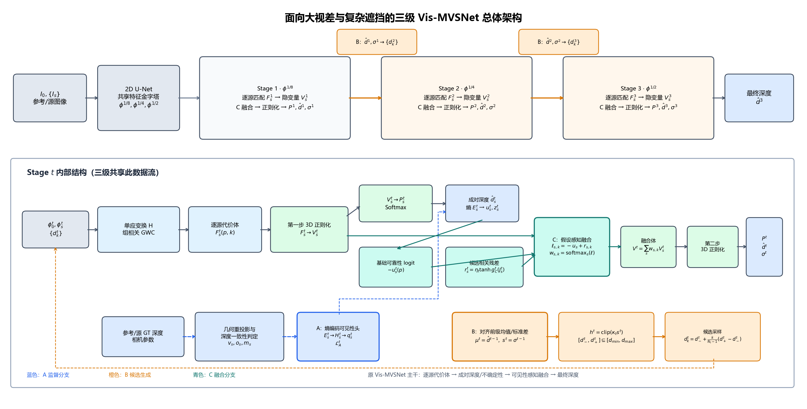

**图1. 三级总体结构及单阶段内部数据流。** 每个阶段先构建并正则化逐源匹配体，回归成对深度和对数不确定性，再融合隐变量并回归阶段深度。蓝色虚线为 A 的训练监督；橙色为 B 的候选生成；青色为 C 的逐候选融合。B 作用于 Stage 2/3，C 在三个阶段使用。

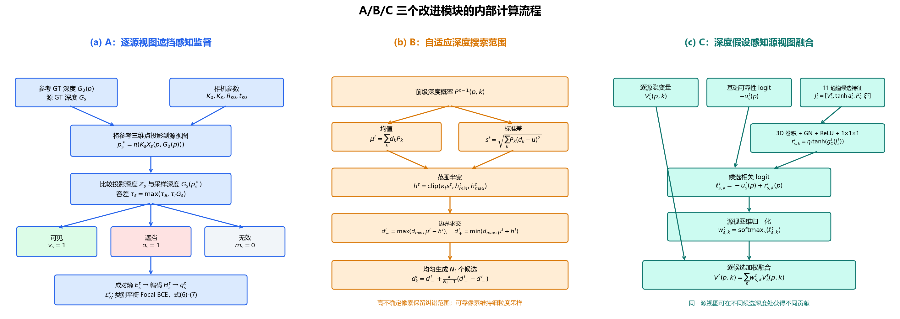

**图2. A、B、C 的内部计算。** A 由真值几何生成可见性标签并监督熵编码分支；B 根据均值与标准差调整候选范围；C 将对数不确定性基础分数与候选相关残差相加，在源视图维度归一化。GT 只参与训练监督和实验诊断。

### 3.2 A：逐源视图遮挡感知监督

将参考真值 $G_0(\mathbf p)$ 代入式(1)，得到源投影深度 $Z_s(\mathbf p)=[\mathbf X_s]_3$ 和像素 $\mathbf p_s^\star$，采样源深度 $\widetilde G_s(\mathbf p)=G_s(\mathbf p_s^\star)$。深度一致性容差定义为：

$$
\tau_s(\mathbf p)=\max(\tau_a,\tau_r\widetilde G_s(\mathbf p)).
\tag{3}
$$

几何有效掩码 $g_s=1$ 要求参考深度有效、源投影在图像内、投影深度为正、采样源深度及其掩码有效。定义：

$$
v_s=g_s\mathbb1[|Z_s-\widetilde G_s|\leq\tau_s],\qquad
o_s=g_s\mathbb1[Z_s>\widetilde G_s+\tau_s],\qquad m_s=v_s+o_s.
\tag{4}
$$

位于源表面前方的不一致点、越界投影和缺失深度不计为遮挡负样本。标签在相应尺度下由几何生成；只有 $m_s=1$ 的位置进入监督。

在共享熵编码特征 $H_s^t=\mathcal E^t(E_s^t)$ 上预测逐源可见性：

$$
z_s^t=f_A^t(H_s^t),\qquad q_s^t=\operatorname{sigmoid}(z_s^t).
\tag{5}
$$

为兼顾类别比例与难样本，定义 $p_y=qv+(1-q)(1-v)$、$c(v)=c_+v+c_-(1-v)$，采用加权 Focal BCE [18]：

$$
\ell_{\mathrm{vis}}(q,v)=c(v)(1-p_y)^\gamma[-v\log q-(1-v)\log(1-q)].
\tag{6}
$$

对每个阶段与源视图，在有效监督集合计算可见比例 $f_+=\sum m_sv_s/\max(1,\sum m_s)$；类别权重为 $c_+=\min(10,0.5/\max(f_+,10^{-3}))$ 和 $c_-=\min(10,0.5/\max(1-f_+,10^{-3}))$。实际计算使用带 logits 的稳定 BCE。

$$
\mathcal L_A^t=\frac1S\sum_s
\frac{\sum_{\mathbf p}m_s^t\ell_{\mathrm{vis}}(q_s^t,v_s^t)}
{\max(\epsilon,\sum_{\mathbf p}m_s^tc(v_s^t))}.
\tag{7}
$$

无有效样本时该源损失为零。$q_s^t$ 用于训练监督和诊断，不直接乘入融合权重。A 同时限制成对深度监督的有效位置，并使被遮挡样本的不确定性损失只更新不确定性分支，见式(20)。

### 3.3 B：自适应深度搜索范围

对 $t>1$，将前级深度与标准差双线性对齐，得到 $\mu^t$、$s^t$；当前阶段名义间距为 $\delta_t$，固定半宽记为 $h_0^t=\lfloor N_t/2\rfloor\delta_t$。搜索半宽为：

$$
h^t(\mathbf p)=\operatorname{clip}(\kappa_ts^t(\mathbf p),h_{\min}^t,h_{\max}^t),
\quad h_{\min}^t=\rho_{\min}h_0^t,\quad h_{\max}^t=\rho_{\max}h_0^t.
\tag{8}
$$

$\kappa_t\geq0$、$0<\rho_{\min}\leq\rho_{\max}$ 是无量纲参数。半宽上下界分别防止候选塌缩和过度扩大。不确定性引导薄体积的研究基础见 UCS-Net [9]；本文将其用于大视差条件下的级联纠错，并与几何监督、候选相关融合共同分析。

前级深度是全局有效候选的加权均值，因此 $\mu^t\in[d_{\min},d_{\max}]$。区间与全局边界相交：

$$
d_-^t=\max(d_{\min},\mu^t-h^t),\qquad
d_+^t=\min(d_{\max},\mu^t+h^t).
\tag{9}
$$

对 $N_t\geq2$，候选深度为：

$$
d_k^t=d_-^t+\frac{k}{N_t-1}(d_+^t-d_-^t),\qquad k=0,\ldots,N_t-1.
\tag{10}
$$

实际采样间距为：

$$
\Delta^t(\mathbf p)=\frac{d_+^t(\mathbf p)-d_-^t(\mathbf p)}{N_t-1}.
\tag{11}
$$

同样的候选预算下，扩大范围也会增大间距。因此范围覆盖和采样精度必须联合评价；标准差反映当前候选分布的离散程度，不能直接当作真实误差。实验同时报告候选覆盖率、归一化范围宽度和最终误差。

### 3.4 C：深度假设感知源视图融合

候选深度坐标归一化为：

$$
\xi_k^t=2\frac{d_k^t-d_0^t}{\max(d_{N_t-1}^t-d_0^t,\epsilon_d)}-1.
\tag{12}
$$

其中 $\epsilon_d$ 与深度具有相同单位。将八通道隐变量、成对得分的 $\tanh$、成对概率和候选坐标连接为十一通道输入，预测残差：

$$
J_s^t=\operatorname{Concat}(V_s^t,\tanh a_s^t,P_s^t,\xi^t),\quad
\zeta_s^t=g_C^t(J_s^t),\quad r_s^t=\eta_t\tanh\zeta_s^t.
\tag{13}
$$

$g_C^t$ 依次包含 $3\times3\times3$ 卷积（11→8 通道）、四组 GroupNorm、ReLU 与 $1\times1\times1$ 卷积（8→1 通道）。输出层以零初始化，使训练开始时残差为零。$\eta_t\geq0$ 约束残差幅度。

候选相关分数 $\ell_{s,k}^t=-u_s^t+r_{s,k}^t$ 在源视图维度归一化：

$$
w_{s,k}^t(\mathbf p)=\frac{\exp(-u_s^t(\mathbf p)+r_{s,k}^t(\mathbf p))}
{\sum_{j=1}^{S}\exp(-u_j^t(\mathbf p)+r_{j,k}^t(\mathbf p))}.
\tag{14}
$$

融合对象为逐源正则化隐变量：

$$
V^t(\mathbf p,k)=\sum_{s=1}^{S}w_{s,k}^t(\mathbf p)V_s^t(\mathbf p,k).
\tag{15}
$$

权重归一化满足 $w_{s,k}^t\geq0$、$\sum_sw_{s,k}^t=1$。$r_s^t=0$ 时恢复对数不确定性的基础归一化权重。此式与对正指数权重求和后归一化数学等价；softmax 的归一化维度为源视图，不是深度候选。

融合体经第二次三维正则化产生得分 $a^t$，深度维 softmax 得到：

$$
P^t(\mathbf p,k)=\frac{\exp a^t(\mathbf p,k)}{\sum_{j=0}^{N_t-1}\exp a^t(\mathbf p,j)}.
\tag{16}
$$

预测深度和标准差分别为：

$$
\hat d^t(\mathbf p)=\sum_kP^t(\mathbf p,k)d_k^t(\mathbf p).
\tag{17}
$$

$$
\sigma^t(\mathbf p)=\sqrt{\max\left(\sum_kP^t(\mathbf p,k)(d_k^t(\mathbf p)-\hat d^t(\mathbf p))^2,\epsilon_\sigma^2\right)}.
\tag{18}
$$

这里 $\epsilon_\sigma$ 为深度尺度的数值稳定下界。$\hat d^t$ 和 $\sigma^t$ 传递到下一阶段的候选生成。

### 3.5 损失与训练流程

设 $\Omega_t$ 为阶段有效真值集合，$\delta_0$ 为数据输入的基础深度间距。定义归一化误差 $e^t=|\hat d^t-G_0^t|/\delta_0$ 与 $e_s^t=|\hat d_s^t-G_0^t|/\delta_0$。阶段融合深度损失为：

$$
\mathcal L_d^t=\frac{\sum_{\mathbf p\in\Omega_t}e^t(\mathbf p)}{\max(1,|\Omega_t|)}.
\tag{19}
$$

定义 $\operatorname{Mean}_{M}(f)=\sum Mf/\max(1,\sum M)$。A 启用时，成对深度掩码 $M_{p,s}=v_s$，不确定性掩码 $M_{u,s}=m_s$，且 $\bar e_s=v_se_s+(1-v_s)\operatorname{sg}(e_s)$；A 关闭时，两掩码均为阶段真值有效掩码，$\bar e_s=e_s$。$\operatorname{sg}$ 表示停止梯度。成对深度和不确定性项为：

$$
\mathcal L_p^t=\frac1S\sum_s\operatorname{Mean}_{M_{p,s}}(e_s^t),\qquad
\mathcal L_u^t=\frac1S\sum_s\operatorname{Mean}_{M_{u,s}}(\bar e_s^t\exp(-u_s^t)+u_s^t).
\tag{20}
$$

不确定性项采用归一化误差对应的 Laplace 负对数似然形式（忽略常数）。若对 C 增加候选可见性监督，则以最近真值候选 $k^*=\arg\min_k|d_k^t-G_0^t|$ 处的 $\operatorname{sigmoid}(\zeta_{s,k^*}^t)$ 代替式(7)中的 $q_s^t$，得到 $\mathcal L_C^t$。联合目标为：

$$
\mathcal L=\sum_{t=1}^{3}\beta_t\left(\mathcal L_d^t+
\lambda_p\mathcal L_p^t+\lambda_u\mathcal L_u^t+
\lambda_A\mathcal L_A^t+\lambda_C\mathcal L_C^t\right).
\tag{21}
$$

关闭 A 时 $\lambda_A=0$；不使用候选可见性监督时 $\lambda_C=0$。损失权重、阶段候选数量和半宽倍率属于训练配置，应随所用检查点记录。监督标签和推理输入保持分离。

**算法1：三级前向过程。**

1. 提取三尺度参考和源特征。
2. Stage 1 构建全局候选，Stage 2/3 由前级深度及标准差生成候选。
3. 对每个源视图按式(1)—(2)生成逐源匹配隐变量，回归成对概率、深度、熵、对数不确定性及可见性 logit。
4. C 启用时按式(12)—(15)逐候选融合，否则使用基础不确定性权重。
5. 按式(16)—(18)回归阶段深度和标准差，将前级结果双线性对齐到下一尺度；阶段间候选生成保留计算图。
6. 推理输出最终深度；训练时按式(3)—(7)构造遮挡监督并计算式(19)—(21)。

## 4 实验设置

### 4.1 数据集与评测协议

实验采用 DTU 数据集 [19] 的测试划分，在 light 3 光照条件下评价参考视图深度。两套模型分别使用五视图和三视图训练，评测时均输入一个参考视图和四个源视图。每套设置包含 1078 个参考图像样本，整体有效深度像素为 16,254,332 个；同一设置内的八组配置使用相同样本、参考有效掩码及困难区域掩码。源视图按数据集 pair 文件给出的顺序选择，不因某个模型的结果重新选择。本文只评价深度估计，不由深度误差推导点云质量。

推理采用 192 个输入基础深度值及 1.06 的间距缩放，三个阶段的候选数量分别为 48、32、16，名义间距倍率分别为 4、2、1。可视化导出采用 batch size 1，输出深度与 GT 对齐后的案例数组分辨率为 128×160。训练视图数与推理视图数分开记述：三视图训练结果用于分析训练观测数量变化，不作为三视图推理的实验。

全测试集表格采用原逐图评测记录的像素加权汇总，个例表采用绘图时重新导出的预测数组。两类结果分别统计，案例指标不替代全测试集指标。重新导出与原评测记录间存在小幅数值差异，复核结果在附录 C 给出。

### 4.2 固定困难区域的构造

以参考 GT 有效像素集合 $\Omega_i$ 为评价域。根据式(1)，计算真值点在四个源视图中的投影，并定义最大二维重投影位移：

$$
\nu_i(\mathbf p)=\max_{s=1,\ldots,S}\|\mathbf p_s(G_0(\mathbf p))-\mathbf p\|_2,
\quad \mathcal D_i=\{\mathbf p\in\Omega_i:\nu_i(\mathbf p)\ge Q_{0.8}(\nu_i|_{\Omega_i})\}.
\tag{22}
$$

$Q_{0.8}$ 表示逐图第 80 百分位，$\nu$ 的单位为当前评价网格的像素。本文“大视差”采用上述重投影位移定义，包含水平和垂直分量，并非校正双目中的纯水平视差。位移统计沿用现有评测协议，未按源投影是否位于图像内进一步筛除；遮挡判断则严格检查源投影和源 GT 的有效性。百分位规则使每幅图约 20% 的有效像素进入大视差区域，因此该掩码用于区分图内相对位移较大的像素，不能单凭掩码面积比较不同场景的绝对位移难度。

以式(4)的逐源遮挡标签 $o_s$ 累加得到 $n_{\mathrm{occ}}$，以参考 GT 有效、投影在源图像内、源深度有效等条件确定的几何可比较视图数记为 $n_{\mathrm{cmp}}$。遮挡容差采用 $\tau_a=2$ mm、$\tau_r=0.01$。定义：

$$
\mathcal O_{1,i}=\{\mathbf p\in\Omega_i:n_{\mathrm{occ}}\ge1\},\quad
\mathcal O_{2,i}=\{\mathbf p\in\Omega_i:n_{\mathrm{occ}}\ge2\},\quad
\mathcal O_{\mathrm{half},i}=\{\mathbf p\in\Omega_i:n_{\mathrm{cmp}}>0,\ 2n_{\mathrm{occ}}\ge n_{\mathrm{cmp}}\}.
\tag{23}
$$

全测试集原表中的“多数源视图遮挡”对应 $\mathcal O_{\mathrm{half}}$，其准确含义为至少一半可比较源视图遮挡；“至少两个源视图遮挡”对应 $\mathcal O_2$。两者的分母或计数条件不同，本文分别报告，不将已有多数比例结果改名为两视图遮挡结果。遮挡比例图显示 $n_{\mathrm{occ}}/n_{\mathrm{cmp}}$，无可比较源视图时显示为零，零值本身不证明在全部源图像中可见。越界投影及源 GT 缺失不直接计为遮挡。

全测试集交集采用 $\mathcal D_i\cap\mathcal O_{1,i}$，定性分析额外统计 $\mathcal D_i\cap\mathcal O_{2,i}$。深度边界按参考 GT 深度梯度幅度的较大 10% 有效像素构造。所有困难区域只由 GT 与相机定义，同一像素集合用于比较所有模型。

### 4.3 评价指标

对于区域 $\mathcal R_i\subseteq\Omega_i$，令 $e_i(\mathbf p)=|\hat d_i(\mathbf p)-G_i(\mathbf p)|$。跨图像像素加权指标定义为：

$$
\operatorname{Abs}_{\mathcal R}=\frac{\sum_i\sum_{\mathbf p\in\mathcal R_i}e_i(\mathbf p)}{\sum_i|\mathcal R_i|},
\quad \operatorname{Acc}_{\tau,\mathcal R}=\frac{\sum_i\sum_{\mathbf p\in\mathcal R_i}\mathbb1[e_i(\mathbf p)<\tau]}{\sum_i|\mathcal R_i|},\quad \tau\in\{2,4,8\}\ \mathrm{mm}.
\tag{24}
$$

Abs 越低越好，Acc2/4/8 越高越好，阈值采用严格小于。Stage $t$ 的区间上下界对齐到评价网格后，覆盖率和归一化宽度定义为：

$$
\operatorname{Cov}_{t,\mathcal R}=\frac{\sum_i\sum_{\mathbf p\in\mathcal R_i}\mathbb1[d_{-,i}^t(\mathbf p)\le G_i(\mathbf p)\le d_{+,i}^t(\mathbf p)]}{\sum_i|\mathcal R_i|},
\quad \operatorname{Width}_{t,\mathcal R}=\frac{\sum_i\sum_{\mathbf p\in\mathcal R_i}(d_{+,i}^t(\mathbf p)-d_{-,i}^t(\mathbf p))/\delta_{0,i}}{\sum_i|\mathcal R_i|}.
\tag{25}
$$

Width 的单位为基础深度间距倍数，不是 mm，也不是越大或越小越好。覆盖率与最终误差共同评价候选搜索。相对改善与配对像素误差差值定义为：

$$
r_{\mathrm{Abs}}=100\frac{\operatorname{Abs}_{\mathrm{Base}}-\operatorname{Abs}_{\mathrm{model}}}{\operatorname{Abs}_{\mathrm{Base}}},
\qquad \Delta e(\mathbf p)=e_{\mathrm{Base}}(\mathbf p)-e_{\mathrm{Base+A+B+C}}(\mathbf p).
\tag{26}
$$

$r_{\mathrm{Abs}}>0$ 表示平均误差下降；准确率和覆盖率的变化使用百分点。差值图中 $\Delta e>0$ 为红色改善，$\Delta e<0$ 为蓝色退化，白色接近零。两种模型相同的大误差也可能显示为白色，需与绝对误差图联合阅读。

### 4.4 消融配置与定性选例

A、B、C 分别表示逐源视图遮挡感知监督、自适应深度搜索范围和深度假设感知源视图融合。本文采用如下八个实验配置标识，Base 为数值比较的参照配置：

| 配置 | A | B | C |
| --- | ---: | ---: | ---: |
| Base | 0 | 0 | 0 |
| Base+A | 1 | 0 | 0 |
| Base+B | 0 | 1 | 0 |
| Base+C | 0 | 0 | 1 |
| Base+A+B | 1 | 1 | 0 |
| Base+A+C | 1 | 0 | 1 |
| Base+B+C | 0 | 1 | 1 |
| Base+A+B+C | 1 | 1 | 1 |

定性分析按 GT 几何区分三类：大视差为主要求 $|\mathcal D|\ge30$、$|\mathcal O_2|/|\Omega|\le10\%$ 且 $|\mathcal D\cap\mathcal O_2|/|\mathcal D|\le25\%$；复杂遮挡为主要求 $|\mathcal O_2|\ge30$、$|\mathcal O_2|/|\Omega|\ge10\%$ 且交集占遮挡区域不超过 35%；交集类要求交集至少 30 像素、占有效像素至少 5%、占大视差区域至少 25%。满足交集条件时优先归入交集类。这些条件用于组织示例，不是通用的困难场景标准。

View3、View5 分别在各类合格候选中按原逐图记录的全图 Abs 相对降幅排序，仅选择正降幅，每类保留两个不同 scan 的案例。每类排名第一的案例放入正文，第二个案例放入附录 B，全部十二例的指标均报告。选例旨在解释改善发生的位置，属于收益导向的案例展示，不是随机抽样；整体效果由全部 1078 个样本的统计支持。选例后不修改困难掩码，也不隐藏所选图像中的退化像素。

## 5 实验结果与分析

### 5.1 五视图训练结果

表1给出五视图训练、五视图测试条件下七类区域的平均绝对误差。括号内为相对 Base 的降幅。

**表1. 五视图训练下八组配置的区域平均绝对误差。**

| 配置 | 整体区域 | 深度边界 | 大视差 | 任一源视图遮挡 | 多数源视图遮挡 | 大视差与遮挡交集 | 边界与遮挡交集 |
| --- | ---: | ---: | ---: | ---: | ---: | ---: | ---: |
| Base | 7.281 (+0.00%) | 25.382 (+0.00%) | 21.469 (+0.00%) | 35.936 (+0.00%) | 49.134 (+0.00%) | 58.326 (+0.00%) | 38.742 (+0.00%) |
| Base+A | 6.920 (+4.96%) | 24.219 (+4.58%) | 20.921 (+2.55%) | 34.756 (+3.28%) | 47.199 (+3.94%) | 56.950 (+2.36%) | 37.102 (+4.23%) |
| Base+B | 5.596 (+23.15%) | 21.633 (+14.77%) | 14.730 (+31.39%) | 30.010 (+16.49%) | 43.633 (+11.20%) | 46.688 (+19.95%) | 34.249 (+11.60%) |
| Base+C | 7.049 (+3.18%) | 24.938 (+1.75%) | 21.326 (+0.66%) | 35.070 (+2.41%) | 47.305 (+3.72%) | 57.218 (+1.90%) | 38.137 (+1.56%) |
| Base+A+B | 5.618 (+22.84%) | 20.852 (+17.85%) | 14.583 (+32.07%) | 29.795 (+17.09%) | 43.010 (+12.46%) | 45.317 (+22.30%) | 33.074 (+14.63%) |
| Base+A+C | 7.001 (+3.85%) | 24.624 (+2.98%) | 21.081 (+1.81%) | 35.260 (+1.88%) | 48.009 (+2.29%) | 57.437 (+1.52%) | 37.618 (+2.90%) |
| Base+B+C | 5.493 (+24.56%) | 20.996 (+17.28%) | 14.286 (+33.46%) | 29.114 (+18.98%) | 42.489 (+13.52%) | 44.360 (+23.95%) | 33.300 (+14.05%) |
| Base+A+B+C | 5.575 (+23.43%) | 20.834 (+17.92%) | 14.741 (+31.34%) | 30.125 (+16.17%) | 43.109 (+12.26%) | 46.226 (+20.75%) | 33.326 (+13.98%) |

完整方法将整体 Abs 从 7.281 降至 5.575，相对降低 23.43%。在大视差区域，Abs 从 21.469 降至 14.741，降幅达到 31.34%；在任一源视图遮挡区域和大视差与遮挡交集区域，降幅分别为 16.17% 和 20.75%。这表明改善覆盖了本文关注的困难匹配区域。该比较评价区域均值，不要求每个困难像素均改善。

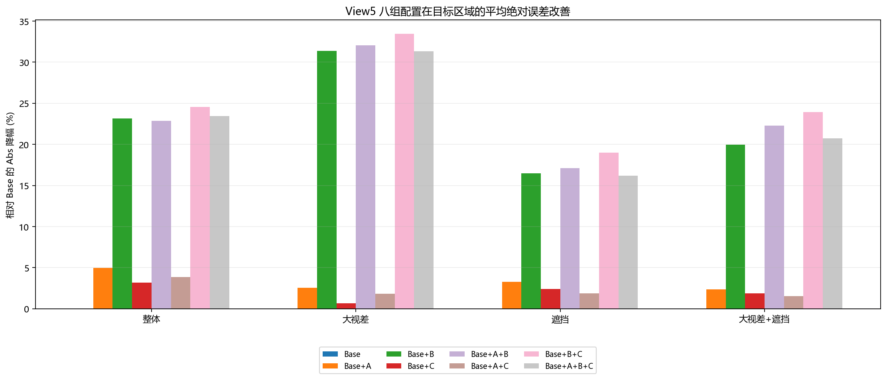

**图3. 五视图训练下八组配置相对 Base 的 Abs 降幅。** B 及包含 B 的组合在大视差区域呈现最明显改善，A 和 C 单独加入时也降低了多个区域的平均误差。

表2列出整体区域的全部十项指标。完整方法的 Acc2、Acc4 和 Acc8 分别为 81.85%、89.49% 和 93.12%，相对 Base 分别提高 1.55、1.64 和 1.80 个百分点。Stage 2 和 Stage 3 coverage 分别提高 1.47 和 1.43 个百分点，说明后续阶段对真实深度的覆盖能力得到改善。

**表2. 五视图训练下整体区域的全部指标。**

| 配置 | Abs ↓ | Acc2 ↑ | Acc4 ↑ | Acc8 ↑ | S1 coverage ↑ | S2 coverage ↑ | S3 coverage ↑ | S1 width | S2 width | S3 width |
| --- | ---: | ---: | ---: | ---: | ---: | ---: | ---: | ---: | ---: | ---: |
| Base | 7.281 | 80.30% | 87.85% | 91.32% | 96.52% | 95.71% | 94.03% | 188.000 | 62.796 | 16.130 |
| Base+A | 6.920 | 80.41% | 87.92% | 91.43% | 96.52% | 95.79% | 94.25% | 188.000 | 62.822 | 16.127 |
| Base+B | 5.596 | 81.86% | 89.62% | 93.21% | 96.52% | 97.18% | 95.45% | 188.000 | 62.000 | 15.000 |
| Base+C | 7.049 | 80.30% | 87.87% | 91.44% | 96.52% | 95.76% | 94.13% | 188.000 | 62.735 | 16.100 |
| Base+A+B | 5.618 | 81.82% | 89.51% | 93.18% | 96.52% | 97.14% | 95.42% | 188.000 | 62.000 | 15.000 |
| Base+A+C | 7.001 | 80.61% | 87.98% | 91.44% | 96.52% | 95.76% | 94.24% | 188.000 | 62.780 | 16.142 |
| Base+B+C | 5.493 | 81.47% | 89.51% | 93.22% | 96.52% | 97.23% | 95.51% | 188.000 | 62.000 | 15.000 |
| Base+A+B+C | 5.575 | 81.85% | 89.49% | 93.12% | 96.52% | 97.19% | 95.46% | 188.000 | 62.000 | 15.000 |

### 5.2 三视图训练结果

表3给出三视图训练、五视图测试条件下的区域平均绝对误差。

**表3. 三视图训练下八组配置的区域平均绝对误差。**

| 配置 | 整体区域 | 深度边界 | 大视差 | 任一源视图遮挡 | 多数源视图遮挡 | 大视差与遮挡交集 | 边界与遮挡交集 |
| --- | ---: | ---: | ---: | ---: | ---: | ---: | ---: |
| Base | 7.634 (+0.00%) | 26.615 (+0.00%) | 22.940 (+0.00%) | 37.639 (+0.00%) | 51.125 (+0.00%) | 62.056 (+0.00%) | 40.471 (+0.00%) |
| Base+A | 7.427 (+2.71%) | 25.448 (+4.39%) | 22.473 (+2.04%) | 36.947 (+1.84%) | 50.167 (+1.87%) | 60.868 (+1.91%) | 38.627 (+4.56%) |
| Base+B | 6.410 (+16.03%) | 23.008 (+13.55%) | 17.089 (+25.51%) | 32.785 (+12.90%) | 46.643 (+8.77%) | 51.496 (+17.02%) | 36.171 (+10.62%) |
| Base+C | 7.612 (+0.28%) | 25.561 (+3.96%) | 22.829 (+0.48%) | 36.630 (+2.68%) | 49.914 (+2.37%) | 59.772 (+3.68%) | 38.644 (+4.51%) |
| Base+A+B | 6.319 (+17.23%) | 22.341 (+16.06%) | 16.850 (+26.55%) | 33.277 (+11.59%) | 47.119 (+7.84%) | 51.307 (+17.32%) | 35.321 (+12.73%) |
| Base+A+C | 7.636 (-0.03%) | 25.824 (+2.97%) | 22.756 (+0.80%) | 37.830 (-0.51%) | 50.703 (+0.83%) | 61.209 (+1.36%) | 39.093 (+3.41%) |
| Base+B+C | 5.919 (+22.47%) | 21.592 (+18.88%) | 15.499 (+32.43%) | 30.651 (+18.57%) | 44.071 (+13.80%) | 47.328 (+23.73%) | 33.588 (+17.01%) |
| Base+A+B+C | 6.233 (+18.35%) | 22.172 (+16.69%) | 16.549 (+27.86%) | 32.749 (+12.99%) | 46.557 (+8.94%) | 50.825 (+18.10%) | 34.922 (+13.71%) |

完整方法将整体 Abs 从 7.634 降至 6.233，相对降低 18.35%；在大视差、任一源视图遮挡以及大视差与遮挡交集区域分别降低 27.86%、12.99% 和 18.10%。这说明在训练视图减少的条件下，联合方法仍能改善目标困难区域。

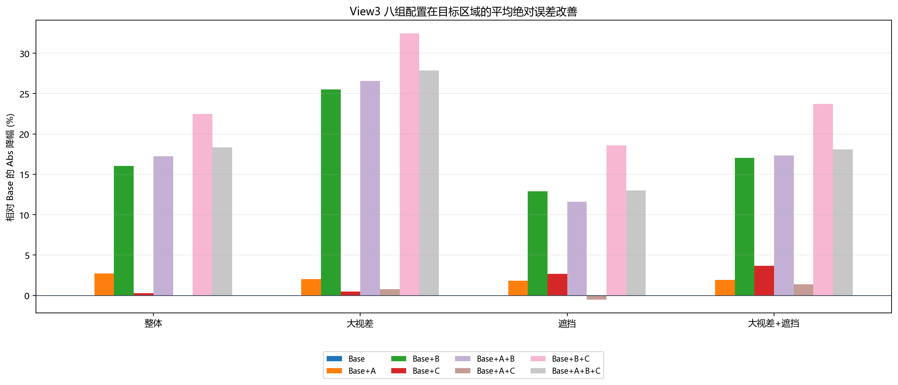

**图4. 三视图训练下八组配置相对 Base 的 Abs 降幅。**

**表4. 三视图训练下整体区域的全部指标。**

| 配置 | Abs ↓ | Acc2 ↑ | Acc4 ↑ | Acc8 ↑ | S1 coverage ↑ | S2 coverage ↑ | S3 coverage ↑ | S1 width | S2 width | S3 width |
| --- | ---: | ---: | ---: | ---: | ---: | ---: | ---: | ---: | ---: | ---: |
| Base | 7.634 | 77.55% | 86.38% | 90.50% | 96.52% | 95.68% | 93.71% | 188.000 | 62.750 | 16.170 |
| Base+A | 7.427 | 78.10% | 86.56% | 90.61% | 96.52% | 95.68% | 94.00% | 188.000 | 62.833 | 16.415 |
| Base+B | 6.410 | 78.37% | 87.67% | 92.07% | 96.52% | 97.02% | 94.71% | 188.000 | 62.000 | 15.000 |
| Base+C | 7.612 | 77.46% | 86.48% | 90.62% | 96.52% | 95.61% | 93.78% | 188.000 | 62.738 | 16.185 |
| Base+A+B | 6.319 | 79.34% | 88.06% | 92.24% | 96.52% | 97.00% | 94.82% | 188.000 | 62.000 | 15.000 |
| Base+A+C | 7.636 | 77.38% | 86.32% | 90.61% | 96.52% | 95.65% | 93.85% | 188.000 | 62.805 | 16.220 |
| Base+B+C | 5.919 | 78.61% | 87.74% | 92.27% | 96.52% | 97.18% | 95.02% | 188.000 | 62.000 | 15.000 |
| Base+A+B+C | 6.233 | 79.41% | 88.27% | 92.35% | 96.52% | 97.02% | 94.92% | 188.000 | 62.000 | 15.000 |

### 5.3 单模块与组合效果

表5和表6给出五视图训练条件下的十二组受控比较，每一行只改变一个模块。A 单独加入 Base 后，整体、深度边界和边界与遮挡交集区域的 Abs 分别降低 4.96%、4.58% 和 4.23%，表明 A 对应配置在这些区域取得了平均误差收益。B 单独加入 Base 后，整体和大视差区域的 Abs 分别降低 23.15% 和 31.39%，是三项单模块改进中幅度最大的因素；其 Stage 2 和 Stage 3 整体 coverage 分别增加 1.47 和 1.42 个百分点，提供了该配置变化与深度覆盖改善同时出现的观察。覆盖率本身不证明自适应范围的内部机制。C 单独加入 Base 后，整体和大视差与遮挡交集区域的 Abs 分别降低 3.18% 和 1.90%；当 C 与 B 联合时，Base+B+C 在整体、大视差和大视差与遮挡交集区域分别获得 24.56%、33.46% 和 23.95% 的降幅，说明候选深度相关融合在可靠搜索空间内能够进一步发挥作用。

**表5. 五视图训练下加入单个模块时的 Abs 相对变化。**

| 因素 | 受控对照 | 整体 | 大视差 | 大视差+遮挡 | 边界+遮挡 |
| --- | ---: | ---: | ---: | ---: | ---: |
| 加入 A | Base → Base+A | +4.96% | +2.55% | +2.36% | +4.23% |
| 加入 A | Base+B → Base+A+B | -0.39% | +1.00% | +2.94% | +3.43% |
| 加入 A | Base+C → Base+A+C | +0.69% | +1.15% | -0.38% | +1.36% |
| 加入 A | Base+B+C → Base+A+B+C | -1.50% | -3.19% | -4.21% | -0.08% |
| 加入 B | Base → Base+B | +23.15% | +31.39% | +19.95% | +11.60% |
| 加入 B | Base+A → Base+A+B | +18.82% | +30.30% | +20.43% | +10.86% |
| 加入 B | Base+C → Base+B+C | +22.08% | +33.01% | +22.47% | +12.68% |
| 加入 B | Base+A+C → Base+A+B+C | +20.36% | +30.07% | +19.52% | +11.41% |
| 加入 C | Base → Base+C | +3.18% | +0.66% | +1.90% | +1.56% |
| 加入 C | Base+A → Base+A+C | -1.16% | -0.76% | -0.85% | -1.39% |
| 加入 C | Base+B → Base+B+C | +1.84% | +3.02% | +4.99% | +2.77% |
| 加入 C | Base+A+B → Base+A+B+C | +0.76% | -1.09% | -2.01% | -0.76% |

**表6. 五视图训练下加入单个模块时的 Acc4 变化。**

| 因素 | 受控对照 | 整体 | 大视差 | 大视差+遮挡 | 边界+遮挡 |
| --- | ---: | ---: | ---: | ---: | ---: |
| 加入 A | Base → Base+A | +0.07 pp | -0.13 pp | -0.26 pp | +0.50 pp |
| 加入 A | Base+B → Base+A+B | -0.11 pp | -0.28 pp | -0.22 pp | +0.40 pp |
| 加入 A | Base+C → Base+A+C | +0.11 pp | +0.25 pp | +0.15 pp | +0.18 pp |
| 加入 A | Base+B+C → Base+A+B+C | -0.01 pp | -0.77 pp | -1.23 pp | +0.21 pp |
| 加入 B | Base → Base+B | +1.77 pp | +6.75 pp | +7.60 pp | +1.62 pp |
| 加入 B | Base+A → Base+A+B | +1.59 pp | +6.60 pp | +7.64 pp | +1.52 pp |
| 加入 B | Base+C → Base+B+C | +1.64 pp | +6.91 pp | +7.67 pp | +1.44 pp |
| 加入 B | Base+A+C → Base+A+B+C | +1.51 pp | +5.89 pp | +6.30 pp | +1.47 pp |
| 加入 C | Base → Base+C | +0.02 pp | -0.28 pp | +0.03 pp | +0.17 pp |
| 加入 C | Base+A → Base+A+C | +0.06 pp | +0.09 pp | +0.44 pp | -0.15 pp |
| 加入 C | Base+B → Base+B+C | -0.11 pp | -0.13 pp | +0.10 pp | -0.00 pp |
| 加入 C | Base+A+B → Base+A+B+C | -0.01 pp | -0.62 pp | -0.90 pp | -0.20 pp |

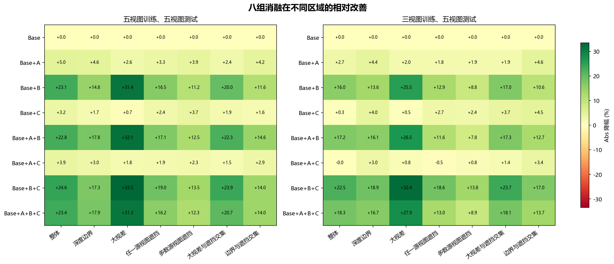

**图5. 两套训练设置下八组消融在七类区域的 Abs 相对降幅。** 绿色表示平均误差降低，红色表示平均误差增加。

### 5.4 指标取舍

八组结果表明，各模块组合在平均误差和阈值准确率之间存在局部取舍。五视图训练时，Base+B+C 的整体 Abs 为 5.493，低于完整模型的 5.575；完整模型则在深度边界区域获得最低 Abs 20.834，在边界与遮挡交集区域的 Acc4 相对 Base+B+C 提高 0.21 个百分点。这只支持该对照中边界 Abs 和边界遮挡 Acc4 的局部收益，不能据此推断 A 对所有遮挡区域均有利。完整组合在整体 Abs 上并未超过该双模块组合，应保留这一结果。

从指标定义看，Abs 对少量大误差像素十分敏感，而 Acc4 只反映误差是否进入 4 个深度单位的容差范围。某一组合提高 Acc4 而 Abs 增大，意味着进入阈值范围的像素净比例提高，但阈值内外的误差幅度变化仍需配对分布验证。图6显示两套训练设置下八组配置的 Acc2、Acc4 和 Acc8，阈值越宽，不同配置之间的变化越能反映严重错误像素是否得到纠正。

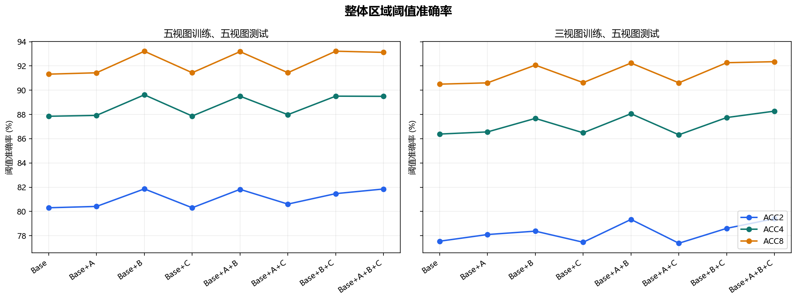

**图6. 八组配置在整体区域的 Acc2、Acc4 和 Acc8。**

### 5.5 大视差与复杂遮挡的定性分析

图7—图12对比 Base 与完整方法。每幅图由三行五列组成（表7）。参考图困难叠加中的红色、绿色、黄色分别表示仅大视差、仅至少两源遮挡及两者交集；其颜色含义不同于误差差值图。黄色轮廓依据固定 GT 困难掩码绘制。黑色深度及误差区域表示 GT 无效，不将其解释为模型漏估。

**表7. 定性图子图顺序。**

| 行 | 第一列 | 第二列 | 第三列 | 第四列 | 第五列 |
| --- | --- | --- | --- | --- | --- |
| 第一行 | 参考 RGB | GT 深度 | GT 重投影位移 | 源视图遮挡比例 | 困难区域 RGB 叠加 |
| 第二行 | Base 深度 | 完整方法深度 | Base 绝对误差 | 完整方法绝对误差 | 误差差值：红改善、蓝退化 |
| 第三行 | 至少一源遮挡 | 至少两源遮挡 | 大视差掩码 | 大视差∩至少一源遮挡 | 大视差∩至少两源遮挡 |

#### 5.5.1 大视差为主的场景

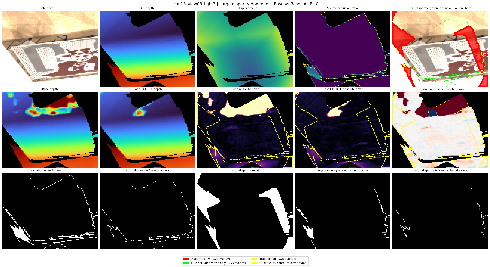

**图7. View5 的大视差为主案例 scan13_view03_light3。** 子图顺序与表7一致。GT 与两组预测的深度色域统一为 434.9–784.8 mm；绝对误差显示为 0–20 mm，误差差值显示为 ±10 mm。误差差值中的红色为改善，蓝色为退化，黄色轮廓标记固定 GT 困难区域。超过显示范围的数值只在着色时截断，仍完整参与指标计算。

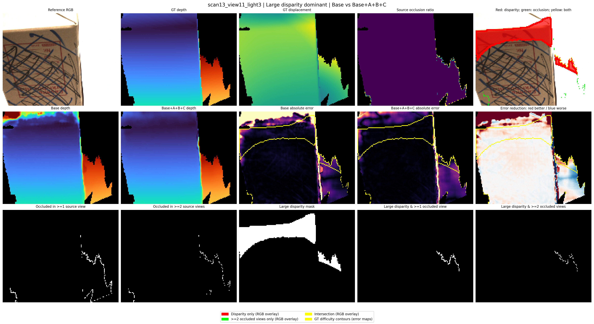

**图8. View3 的大视差为主案例 scan13_view11_light3。** 子图顺序与表7一致。GT 与两组预测的深度色域统一为 426.7–861.2 mm；绝对误差显示为 0–20 mm，误差差值显示为 ±10 mm。误差差值中的红色为改善，蓝色为退化，黄色轮廓标记固定 GT 困难区域。超过显示范围的数值只在着色时截断，仍完整参与指标计算。

**表8. 大视差为主的四个案例及其固定目标区域指标。** Abs 使用未截断误差，降幅按完整精度计算。

| 设置 | 案例 | 区域 | 像素数 | Base Abs/mm | 完整 Abs/mm | Abs 降幅 | Base Acc2 | 完整 Acc2 | Acc2变化/pp |
| --- | --- | --- | --- | --- | --- | --- | --- | --- | --- |
| View5 | scan13_view03_light3 | 整体 | 15186 | 26.380 | 3.840 | +85.44% | 70.56% | 84.02% | +13.46 |
| View5 | scan13_view03_light3 | 大视差 | 3038 | 2.708 | 1.890 | +30.20% | 79.10% | 83.41% | +4.31 |
| View5 | scan34_view17_light3 | 整体 | 19543 | 5.242 | 1.217 | +76.78% | 87.52% | 91.45% | +3.93 |
| View5 | scan34_view17_light3 | 大视差 | 3909 | 24.087 | 3.556 | +85.24% | 46.58% | 74.80% | +28.22 |
| View3 | scan13_view11_light3 | 整体 | 15148 | 14.446 | 2.554 | +82.32% | 72.81% | 76.70% | +3.89 |
| View3 | scan13_view11_light3 | 大视差 | 3030 | 5.286 | 2.031 | +61.57% | 65.74% | 84.22% | +18.48 |
| View3 | scan34_view18_light3 | 整体 | 19537 | 10.302 | 2.569 | +75.07% | 79.31% | 84.62% | +5.31 |
| View3 | scan34_view18_light3 | 大视差 | 3908 | 47.720 | 9.697 | +79.68% | 27.46% | 41.07% | +13.61 |

图7的纸盒场景中，大视差主要分布在图像侧部，至少两源遮挡区域较小。Base 在盒体上部出现明显的异常深度块，完整方法缩小了这一大误差区域；同时，红蓝差值图保留了边缘处的局部退化。该例全图 Abs 降幅为 85.44%，但大视差区域降幅为 30.20%，说明按全图收益选出的案例，其主要收益不一定全部发生在大视差掩码内。图8从另一参考方向观察同一 scan，较大位移覆盖盒体上沿，其大视差 Abs 从 5.286 降至 2.031 mm，Acc2 从 65.74% 提高至 84.22%。附录中的 scan34 案例进一步提供了不同对象的对照。

#### 5.5.2 复杂遮挡为主的场景

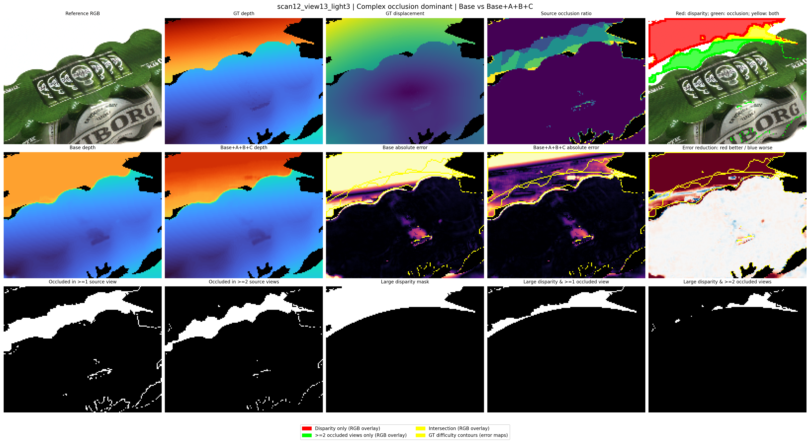

**图9. View5 的复杂遮挡为主案例 scan12_view13_light3。** 子图顺序与表7一致。GT 与两组预测的深度色域统一为 554.0–1089.9 mm；绝对误差显示为 0–20 mm，误差差值显示为 ±10 mm。误差差值中的红色为改善，蓝色为退化，黄色轮廓标记固定 GT 困难区域。超过显示范围的数值只在着色时截断，仍完整参与指标计算。

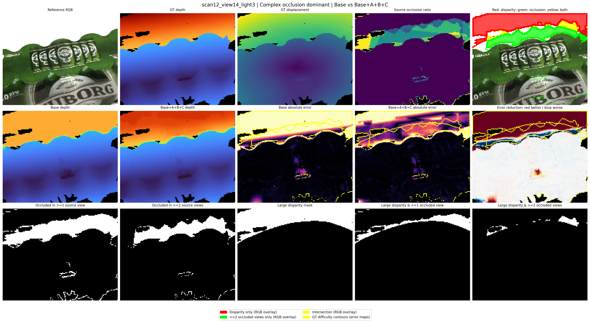

**图10. View3 的复杂遮挡为主案例 scan12_view14_light3。** 子图顺序与表7一致。GT 与两组预测的深度色域统一为 581.6–1088.3 mm；绝对误差显示为 0–20 mm，误差差值显示为 ±10 mm。误差差值中的红色为改善，蓝色为退化，黄色轮廓标记固定 GT 困难区域。超过显示范围的数值只在着色时截断，仍完整参与指标计算。

**表9. 复杂遮挡为主的四个案例及其固定目标区域指标。** Abs 使用未截断误差，降幅按完整精度计算。

| 设置 | 案例 | 区域 | 像素数 | Base Abs/mm | 完整 Abs/mm | Abs 降幅 | Base Acc2 | 完整 Acc2 | Acc2变化/pp |
| --- | --- | --- | --- | --- | --- | --- | --- | --- | --- |
| View5 | scan12_view13_light3 | 整体 | 18574 | 20.096 | 5.832 | +70.98% | 65.78% | 69.24% | +3.46 |
| View5 | scan12_view13_light3 | 至少两源遮挡 | 1986 | 36.076 | 20.317 | +43.68% | 8.01% | 15.56% | +7.55 |
| View5 | scan4_view13_light3 | 整体 | 17411 | 11.001 | 3.627 | +67.03% | 71.94% | 73.44% | +1.50 |
| View5 | scan4_view13_light3 | 至少两源遮挡 | 2166 | 22.148 | 10.824 | +51.13% | 42.98% | 52.54% | +9.56 |
| View3 | scan12_view14_light3 | 整体 | 19529 | 21.084 | 7.607 | +63.92% | 66.01% | 67.86% | +1.85 |
| View3 | scan12_view14_light3 | 至少两源遮挡 | 2205 | 32.352 | 22.974 | +28.99% | 7.98% | 11.29% | +3.31 |
| View3 | scan4_view13_light3 | 整体 | 17411 | 10.876 | 3.930 | +63.86% | 72.44% | 76.52% | +4.08 |
| View3 | scan4_view13_light3 | 至少两源遮挡 | 2166 | 22.944 | 13.658 | +40.47% | 50.83% | 54.39% | +3.55 |

图9与图10展示多物体形成的遮挡带。遮挡比例图与至少两源遮挡掩码定位到前景轮廓附近的带状区域，而物体内部的可比较遮挡比例较低。完整方法纠正了部分背景深度偏差，并改变了轮廓附近的过渡。View5 的 scan12_view13 至少两源遮挡区域 Abs 从 36.076 降至 20.317 mm，Acc2 从 8.01% 提高至 15.56%；View3 的 scan12_view14 对应 Abs 从 32.352 降至 22.974 mm，Acc2 从 7.98% 提高至 11.29%。两例仍存在误差较高和蓝色退化的轮廓像素，因此结论是该遮挡区域的统计误差降低，而非所有遮挡像素均恢复准确。

#### 5.5.3 大视差与遮挡交集明显的场景

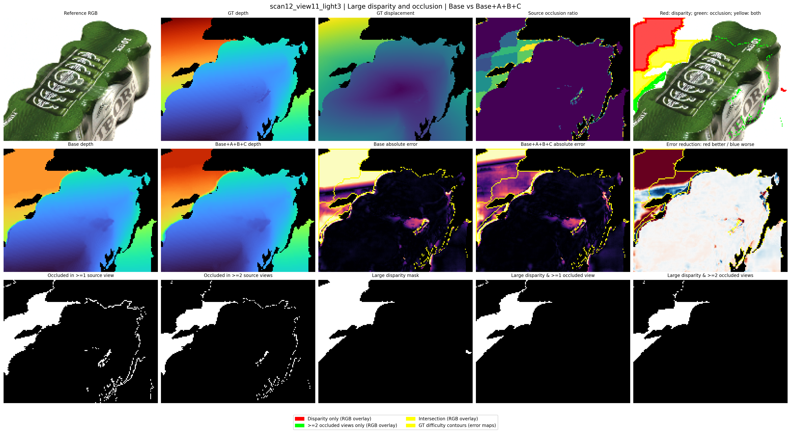

**图11. View5 的大视差与遮挡交集案例 scan12_view11_light3。** 子图顺序与表7一致。GT 与两组预测的深度色域统一为 543.6–1082.2 mm；绝对误差显示为 0–20 mm，误差差值显示为 ±10 mm。误差差值中的红色为改善，蓝色为退化，黄色轮廓标记固定 GT 困难区域。超过显示范围的数值只在着色时截断，仍完整参与指标计算。

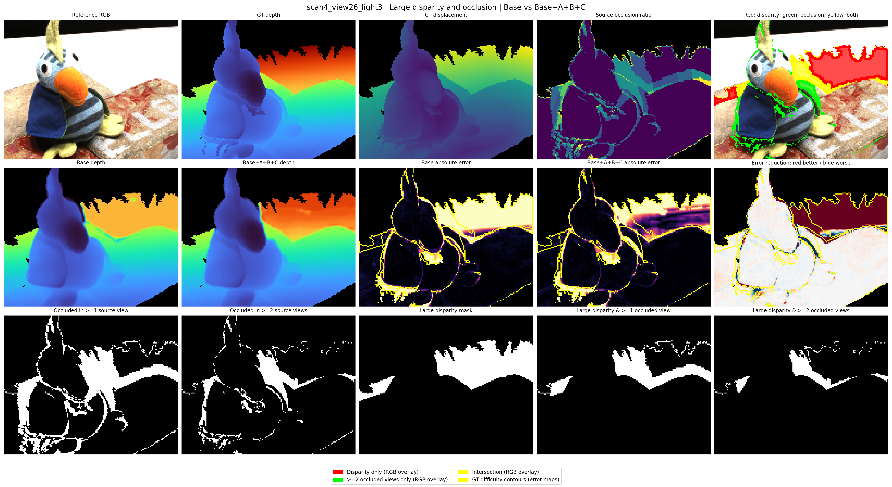

**图12. View3 的大视差与遮挡交集案例 scan4_view26_light3。** 子图顺序与表7一致。GT 与两组预测的深度色域统一为 559.0–1110.3 mm；绝对误差显示为 0–20 mm，误差差值显示为 ±10 mm。误差差值中的红色为改善，蓝色为退化，黄色轮廓标记固定 GT 困难区域。超过显示范围的数值只在着色时截断，仍完整参与指标计算。

**表10. 大视差与遮挡交集的四个案例及其固定目标区域指标。** Abs 使用未截断误差，降幅按完整精度计算。

| 设置 | 案例 | 区域 | 像素数 | Base Abs/mm | 完整 Abs/mm | Abs 降幅 | Base Acc2 | 完整 Acc2 | Acc2变化/pp |
| --- | --- | --- | --- | --- | --- | --- | --- | --- | --- |
| View5 | scan12_view11_light3 | 整体 | 15869 | 11.536 | 4.473 | +61.22% | 72.17% | 70.97% | -1.20 |
| View5 | scan12_view11_light3 | 大视差∩至少两源遮挡 | 1355 | 19.168 | 14.197 | +25.93% | 9.37% | 1.25% | -8.12 |
| View5 | scan4_view26_light3 | 整体 | 14595 | 17.052 | 7.168 | +57.97% | 70.59% | 72.26% | +1.68 |
| View5 | scan4_view26_light3 | 大视差∩至少两源遮挡 | 763 | 74.252 | 47.922 | +35.46% | 11.27% | 17.69% | +6.42 |
| View3 | scan4_view26_light3 | 整体 | 14595 | 18.032 | 7.558 | +58.09% | 70.87% | 72.63% | +1.77 |
| View3 | scan4_view26_light3 | 大视差∩至少两源遮挡 | 763 | 89.511 | 45.494 | +49.17% | 10.09% | 12.58% | +2.49 |
| View3 | scan75_view37_light3 | 整体 | 9871 | 27.332 | 12.665 | +53.66% | 60.38% | 64.57% | +4.19 |
| View3 | scan75_view37_light3 | 大视差∩至少两源遮挡 | 973 | 72.976 | 20.670 | +71.68% | 0.51% | 27.75% | +27.24 |

图11中黄色叠加位于前景轮廓与后方表面的连接处，交集掩码占有效像素的 8.54%。完整方法纠正了较大的背景偏差，但部分遮挡过渡带出现蓝色退化。至少两源遮挡交集 Abs 从 19.168 降至 14.197 mm，Acc2 却从 9.37% 降至 1.25%，需要结合误差分布解释。图12的玩偶场景中，交集区域为 763 像素，占有效像素的 5.23%；对应 Abs 从 89.511 降至 45.495 mm，Acc2 从 10.09% 提高至 12.58%。该案例 75.88% 的交集像素误差下降，但改进后平均误差仍较高，说明改善幅度与达到严格精度要求是两个不同问题。

### 5.6 误差幅度与阈值准确率的配对分析

为了区分平均误差下降与严格精度改善，对图11同一 GT 像素集合直接计算误差分布。表11给出全图、大视差和至少两源遮挡交集的 Abs、Acc2、第95百分位误差及误差不小于20 mm的比例。这些统计均来自本次实际预测，不由误差图颜色估计。

**表11. 图11案例的误差分布。**

| 区域 | 模型 | 像素数 | Abs/mm | Acc2 | P95/mm | 误差≥20mm |
| --- | --- | --- | --- | --- | --- | --- |
| 整体 | Base | 15869 | 11.536 | 72.17% | 88.965 | 13.80% |
| 整体 | Base+A+B+C | 15869 | 4.473 | 70.97% | 18.108 | 4.51% |
| 大视差 | Base | 3174 | 50.088 | 5.48% | 129.873 | 62.85% |
| 大视差 | Base+A+B+C | 3174 | 14.047 | 2.96% | 42.296 | 16.82% |
| 大视差∩至少两源遮挡 | Base | 1355 | 19.168 | 9.37% | 48.262 | 32.92% |
| 大视差∩至少两源遮挡 | Base+A+B+C | 1355 | 14.197 | 1.25% | 23.054 | 7.68% |

Abs 是误差分布的均值，Acc2 只统计是否进入 2 mm 容差。部分严重错误即使大幅减小，仍可能位于该阈值外；与此同时，原本低于阈值的像素可能因轮廓过渡变化跨到阈值外。因此，均值下降与 Acc2 下降可以同时发生。表11和图11说明该取舍确实出现在实际案例中，但该配对结果不意味着所有配置变化都由相同机制引起。

具体而言，交集区域误差不小于20 mm的比例由32.92%降至7.68%，第95百分位误差由48.262降至23.054 mm，体现了严重错误幅度的降低。对1355个相同像素进行2 mm阈值配对，有125个像素由阈值内变为阈值外，另有15个由阈值外进入阈值内；两者的净变化解释了该区域Acc2下降。该结果同时呈现了大误差修正和严格阈值精度退化，不能简写为全面提高准确率。

## 6 讨论

### 6.1 面向困难区域的效果与解释

两套训练设置下，完整配置在全测试集大视差、任一源遮挡和二者交集的 Abs 均低于 Base；固定 GT 掩码和配对个例进一步定位了部分收益。因此，现有证据支持在当前 DTU 深度评测协议下改善目标困难区域的平均估计误差。全图与区域统计、绝对误差图和配对差值图相互补充：前者评价总体幅度，后者显示改善与退化的位置。

从设计看，A 补充几何可见性监督，B 调节后级候选覆盖，C 细化候选相关视图权重。但最终误差和 coverage 的变化只提供与设计动机相关的观察，不能单独识别某个内部机制。特别是概率标准差不等于真实误差；低标准差的错误预测仍可能产生过窄的后续范围。具体机制需通过成对可靠性、候选覆盖及逐候选权重的联合诊断检验。

### 6.2 模块组合与局部退化

单模块相对 Base 的收益与模块加入已有组合后的收益不同。五视图训练时，Base+B+C 的整体、大视差和交集 Abs 低于完整配置，完整配置则在深度边界 Abs 上更低；三视图训练时，完整配置的整体 Acc2/4/8 高于 Base+B+C，而整体 Abs 较高。这些结果说明不同组合可能改变误差分布，不能把八组消融写成每增加一个模块都必然提高的单调路径。

对于完整方法，其实验结论是相对 Base 的目标区域改善。现有结果尚不支持完整组合在所有评价维度上均优于所有子组合，也不支持每个模块在每种组合中的边际收益均为正。定性图保留的蓝色区域以及图11的 Acc2 下降，与这一边界一致。

### 6.3 评价范围与局限

本文结果限定于 DTU 测试划分、light 3 和五视图推理。三视图训练实验考察训练观测数量，不证明更少推理视图下的性能。大视差使用逐图重投影位移百分位，“至少两源遮挡”仅在当前十二个可视化案例中补充评价，不能将其个例降幅写成全测试集的复杂遮挡降幅。案例按全图收益排序，适于解释成功现象，但不能用于估计成功率。

目前未通过重复训练给出方差或统计显著性，也未通过统一协议的外部方法比较建立领先性。因此本文不使用统计显著或最优方法的结论。进一步工作包括扩大光照和场景评价、报告重复训练及运行开销，并通过可靠性与融合权重诊断检验模块作用。本文关注参考视图深度估计，结论不延伸到未经评价的三维重建质量。

## 7 结论

本文围绕 Vis-MVSNet 三级结构在大视差与复杂遮挡下的匹配困难，构建逐源视图遮挡感知监督、自适应深度搜索范围和深度假设感知源视图融合方法。三个环节分别从监督、候选生成与源视图聚合角度处理困难匹配。按本文八组实验配置，五视图训练时完整方法相对 Base 的整体、大视差、任一源遮挡及交集 Abs 分别降低 23.43%、31.34%、16.17% 和 20.75%；三视图训练时分别降低 18.35%、27.86%、12.99% 和 18.10%。

三类场景的真实预测对照显示，部分大误差背景、遮挡轮廓和交集区域得到改善，同时仍存在局部退化和平均误差与严格阈值准确率之间的取舍。本文据此将结论限定为当前评测条件下目标困难区域的深度误差改善，保留不同模块组合和不同误差尺度下的差异。

## 附录 A：全测试集全部区域与全部指标

以下表格给出两套训练设置、七类区域、八组配置的全部十项指标。

### A.1 五视图训练、五视图测试

#### A.1.1 整体区域

| 配置 | Abs ↓ | Acc2 ↑ | Acc4 ↑ | Acc8 ↑ | S1 coverage ↑ | S2 coverage ↑ | S3 coverage ↑ | S1 width | S2 width | S3 width |
| --- | ---: | ---: | ---: | ---: | ---: | ---: | ---: | ---: | ---: | ---: |
| Base | 7.281 | 80.30% | 87.85% | 91.32% | 96.52% | 95.71% | 94.03% | 188.000 | 62.796 | 16.130 |
| Base+A | 6.920 | 80.41% | 87.92% | 91.43% | 96.52% | 95.79% | 94.25% | 188.000 | 62.822 | 16.127 |
| Base+B | 5.596 | 81.86% | 89.62% | 93.21% | 96.52% | 97.18% | 95.45% | 188.000 | 62.000 | 15.000 |
| Base+C | 7.049 | 80.30% | 87.87% | 91.44% | 96.52% | 95.76% | 94.13% | 188.000 | 62.735 | 16.100 |
| Base+A+B | 5.618 | 81.82% | 89.51% | 93.18% | 96.52% | 97.14% | 95.42% | 188.000 | 62.000 | 15.000 |
| Base+A+C | 7.001 | 80.61% | 87.98% | 91.44% | 96.52% | 95.76% | 94.24% | 188.000 | 62.780 | 16.142 |
| Base+B+C | 5.493 | 81.47% | 89.51% | 93.22% | 96.52% | 97.23% | 95.51% | 188.000 | 62.000 | 15.000 |
| Base+A+B+C | 5.575 | 81.85% | 89.49% | 93.12% | 96.52% | 97.19% | 95.46% | 188.000 | 62.000 | 15.000 |

#### A.1.2 深度边界

| 配置 | Abs ↓ | Acc2 ↑ | Acc4 ↑ | Acc8 ↑ | S1 coverage ↑ | S2 coverage ↑ | S3 coverage ↑ | S1 width | S2 width | S3 width |
| --- | ---: | ---: | ---: | ---: | ---: | ---: | ---: | ---: | ---: | ---: |
| Base | 25.382 | 40.15% | 53.97% | 65.15% | 92.47% | 88.94% | 80.45% | 188.000 | 63.185 | 17.964 |
| Base+A | 24.219 | 41.27% | 54.99% | 66.07% | 92.47% | 89.08% | 81.65% | 188.000 | 63.482 | 17.942 |
| Base+B | 21.633 | 41.32% | 55.71% | 67.43% | 92.47% | 89.78% | 78.80% | 188.000 | 62.000 | 15.000 |
| Base+C | 24.938 | 40.91% | 54.68% | 65.82% | 92.47% | 89.03% | 80.78% | 188.000 | 63.223 | 17.803 |
| Base+A+B | 20.852 | 41.90% | 56.34% | 68.20% | 92.47% | 89.78% | 79.37% | 188.000 | 62.000 | 15.000 |
| Base+A+C | 24.624 | 41.07% | 54.87% | 65.91% | 92.47% | 88.96% | 81.45% | 188.000 | 63.441 | 18.048 |
| Base+B+C | 20.996 | 41.09% | 55.70% | 67.63% | 92.47% | 89.94% | 79.05% | 188.000 | 62.000 | 15.000 |
| Base+A+B+C | 20.834 | 42.09% | 56.38% | 68.15% | 92.47% | 89.94% | 79.78% | 188.000 | 62.000 | 15.000 |

#### A.1.3 大视差

| 配置 | Abs ↓ | Acc2 ↑ | Acc4 ↑ | Acc8 ↑ | S1 coverage ↑ | S2 coverage ↑ | S3 coverage ↑ | S1 width | S2 width | S3 width |
| --- | ---: | ---: | ---: | ---: | ---: | ---: | ---: | ---: | ---: | ---: |
| Base | 21.469 | 61.79% | 71.26% | 76.43% | 84.48% | 83.39% | 80.39% | 188.000 | 58.408 | 15.710 |
| Base+A | 20.921 | 61.43% | 71.13% | 76.57% | 84.48% | 83.46% | 80.78% | 188.000 | 58.515 | 15.672 |
| Base+B | 14.730 | 67.26% | 78.01% | 83.94% | 84.48% | 89.84% | 87.46% | 188.000 | 62.000 | 15.000 |
| Base+C | 21.326 | 61.37% | 70.97% | 76.46% | 84.48% | 83.37% | 80.47% | 188.000 | 58.285 | 15.626 |
| Base+A+B | 14.583 | 66.70% | 77.73% | 83.97% | 84.48% | 89.79% | 87.47% | 188.000 | 62.000 | 15.000 |
| Base+A+C | 21.081 | 61.57% | 71.22% | 76.56% | 84.48% | 83.41% | 80.79% | 188.000 | 58.465 | 15.698 |
| Base+B+C | 14.286 | 66.35% | 77.88% | 84.10% | 84.48% | 89.98% | 87.64% | 188.000 | 62.000 | 15.000 |
| Base+A+B+C | 14.741 | 65.77% | 77.11% | 83.50% | 84.48% | 89.88% | 87.44% | 188.000 | 62.000 | 15.000 |

#### A.1.4 任一源视图遮挡

| 配置 | Abs ↓ | Acc2 ↑ | Acc4 ↑ | Acc8 ↑ | S1 coverage ↑ | S2 coverage ↑ | S3 coverage ↑ | S1 width | S2 width | S3 width |
| --- | ---: | ---: | ---: | ---: | ---: | ---: | ---: | ---: | ---: | ---: |
| Base | 35.936 | 38.61% | 50.14% | 59.67% | 86.48% | 81.09% | 72.27% | 188.000 | 61.363 | 17.265 |
| Base+A | 34.756 | 38.45% | 50.05% | 59.80% | 86.48% | 81.22% | 73.28% | 188.000 | 61.649 | 17.318 |
| Base+B | 30.010 | 41.50% | 54.40% | 65.14% | 86.48% | 85.18% | 75.11% | 188.000 | 62.000 | 15.000 |
| Base+C | 35.070 | 38.80% | 50.39% | 60.06% | 86.48% | 81.28% | 72.68% | 188.000 | 61.211 | 17.139 |
| Base+A+B | 29.795 | 41.29% | 54.11% | 65.03% | 86.48% | 84.81% | 75.05% | 188.000 | 62.000 | 15.000 |
| Base+A+C | 35.260 | 38.86% | 50.41% | 59.99% | 86.48% | 81.14% | 73.21% | 188.000 | 61.563 | 17.391 |
| Base+B+C | 29.114 | 41.42% | 54.39% | 65.27% | 86.48% | 85.40% | 75.43% | 188.000 | 62.000 | 15.000 |
| Base+A+B+C | 30.125 | 41.18% | 53.84% | 64.46% | 86.48% | 84.98% | 75.11% | 188.000 | 62.000 | 15.000 |

#### A.1.5 多数源视图遮挡

| 配置 | Abs ↓ | Acc2 ↑ | Acc4 ↑ | Acc8 ↑ | S1 coverage ↑ | S2 coverage ↑ | S3 coverage ↑ | S1 width | S2 width | S3 width |
| --- | ---: | ---: | ---: | ---: | ---: | ---: | ---: | ---: | ---: | ---: |
| Base | 49.134 | 30.12% | 40.10% | 49.47% | 86.12% | 77.20% | 64.82% | 188.000 | 62.315 | 18.106 |
| Base+A | 47.199 | 30.09% | 40.17% | 49.72% | 86.12% | 77.32% | 66.30% | 188.000 | 62.701 | 18.186 |
| Base+B | 43.633 | 32.62% | 43.86% | 54.47% | 86.12% | 80.65% | 66.25% | 188.000 | 62.000 | 15.000 |
| Base+C | 47.305 | 30.44% | 40.54% | 50.20% | 86.12% | 77.57% | 65.55% | 188.000 | 62.078 | 17.917 |
| Base+A+B | 43.010 | 32.20% | 43.39% | 54.25% | 86.12% | 80.04% | 66.28% | 188.000 | 62.000 | 15.000 |
| Base+A+C | 48.009 | 30.57% | 40.55% | 50.04% | 86.12% | 77.26% | 66.17% | 188.000 | 62.564 | 18.283 |
| Base+B+C | 42.489 | 32.51% | 43.96% | 54.78% | 86.12% | 80.85% | 66.84% | 188.000 | 62.000 | 15.000 |
| Base+A+B+C | 43.109 | 31.91% | 42.99% | 53.72% | 86.12% | 80.36% | 66.49% | 188.000 | 62.000 | 15.000 |

#### A.1.6 大视差与遮挡交集

| 配置 | Abs ↓ | Acc2 ↑ | Acc4 ↑ | Acc8 ↑ | S1 coverage ↑ | S2 coverage ↑ | S3 coverage ↑ | S1 width | S2 width | S3 width |
| --- | ---: | ---: | ---: | ---: | ---: | ---: | ---: | ---: | ---: | ---: |
| Base | 58.326 | 28.90% | 38.19% | 45.77% | 70.89% | 65.44% | 56.58% | 188.000 | 57.495 | 16.763 |
| Base+A | 56.950 | 28.54% | 37.93% | 45.82% | 70.89% | 65.44% | 57.70% | 188.000 | 57.847 | 16.777 |
| Base+B | 46.688 | 33.96% | 45.79% | 55.42% | 70.89% | 73.88% | 64.41% | 188.000 | 62.000 | 15.000 |
| Base+C | 57.218 | 28.83% | 38.22% | 46.05% | 70.89% | 65.52% | 57.01% | 188.000 | 57.202 | 16.594 |
| Base+A+B | 45.317 | 33.76% | 45.57% | 55.61% | 70.89% | 73.80% | 64.74% | 188.000 | 62.000 | 15.000 |
| Base+A+C | 57.437 | 29.16% | 38.37% | 46.18% | 70.89% | 65.55% | 57.82% | 188.000 | 57.805 | 16.863 |
| Base+B+C | 44.360 | 33.60% | 45.90% | 56.17% | 70.89% | 74.46% | 65.28% | 188.000 | 62.000 | 15.000 |
| Base+A+B+C | 46.226 | 32.94% | 44.67% | 54.67% | 70.89% | 73.89% | 64.84% | 188.000 | 62.000 | 15.000 |

#### A.1.7 边界与遮挡交集

| 配置 | Abs ↓ | Acc2 ↑ | Acc4 ↑ | Acc8 ↑ | S1 coverage ↑ | S2 coverage ↑ | S3 coverage ↑ | S1 width | S2 width | S3 width |
| --- | ---: | ---: | ---: | ---: | ---: | ---: | ---: | ---: | ---: | ---: |
| Base | 38.742 | 29.11% | 40.74% | 52.04% | 89.99% | 84.11% | 71.64% | 188.000 | 63.284 | 18.916 |
| Base+A | 37.102 | 29.61% | 41.24% | 52.70% | 89.99% | 84.15% | 73.29% | 188.000 | 63.652 | 18.907 |
| Base+B | 34.249 | 30.20% | 42.36% | 54.47% | 89.99% | 85.06% | 68.86% | 188.000 | 62.000 | 15.000 |
| Base+C | 38.137 | 29.34% | 40.91% | 52.28% | 89.99% | 84.21% | 71.95% | 188.000 | 63.293 | 18.751 |
| Base+A+B | 33.074 | 30.44% | 42.76% | 55.20% | 89.99% | 84.88% | 69.59% | 188.000 | 62.000 | 15.000 |
| Base+A+C | 37.618 | 29.52% | 41.09% | 52.52% | 89.99% | 84.12% | 73.09% | 188.000 | 63.665 | 19.061 |
| Base+B+C | 33.300 | 30.02% | 42.35% | 54.65% | 89.99% | 85.20% | 69.30% | 188.000 | 62.000 | 15.000 |
| Base+A+B+C | 33.326 | 30.47% | 42.56% | 54.78% | 89.99% | 85.10% | 69.91% | 188.000 | 62.000 | 15.000 |

### A.2 三视图训练、五视图测试

#### A.2.1 整体区域

| 配置 | Abs ↓ | Acc2 ↑ | Acc4 ↑ | Acc8 ↑ | S1 coverage ↑ | S2 coverage ↑ | S3 coverage ↑ | S1 width | S2 width | S3 width |
| --- | ---: | ---: | ---: | ---: | ---: | ---: | ---: | ---: | ---: | ---: |
| Base | 7.634 | 77.55% | 86.38% | 90.50% | 96.52% | 95.68% | 93.71% | 188.000 | 62.750 | 16.170 |
| Base+A | 7.427 | 78.10% | 86.56% | 90.61% | 96.52% | 95.68% | 94.00% | 188.000 | 62.833 | 16.415 |
| Base+B | 6.410 | 78.37% | 87.67% | 92.07% | 96.52% | 97.02% | 94.71% | 188.000 | 62.000 | 15.000 |
| Base+C | 7.612 | 77.46% | 86.48% | 90.62% | 96.52% | 95.61% | 93.78% | 188.000 | 62.738 | 16.185 |
| Base+A+B | 6.319 | 79.34% | 88.06% | 92.24% | 96.52% | 97.00% | 94.82% | 188.000 | 62.000 | 15.000 |
| Base+A+C | 7.636 | 77.38% | 86.32% | 90.61% | 96.52% | 95.65% | 93.85% | 188.000 | 62.805 | 16.220 |
| Base+B+C | 5.919 | 78.61% | 87.74% | 92.27% | 96.52% | 97.18% | 95.02% | 188.000 | 62.000 | 15.000 |
| Base+A+B+C | 6.233 | 79.41% | 88.27% | 92.35% | 96.52% | 97.02% | 94.92% | 188.000 | 62.000 | 15.000 |

#### A.2.2 深度边界

| 配置 | Abs ↓ | Acc2 ↑ | Acc4 ↑ | Acc8 ↑ | S1 coverage ↑ | S2 coverage ↑ | S3 coverage ↑ | S1 width | S2 width | S3 width |
| --- | ---: | ---: | ---: | ---: | ---: | ---: | ---: | ---: | ---: | ---: |
| Base | 26.615 | 38.79% | 52.84% | 64.08% | 92.47% | 88.58% | 79.51% | 188.000 | 63.356 | 18.159 |
| Base+A | 25.448 | 39.51% | 53.58% | 64.81% | 92.47% | 88.67% | 81.29% | 188.000 | 63.566 | 19.303 |
| Base+B | 23.008 | 39.06% | 53.90% | 66.18% | 92.47% | 89.30% | 77.32% | 188.000 | 62.000 | 15.000 |
| Base+C | 25.561 | 39.29% | 53.70% | 65.03% | 92.47% | 88.59% | 80.11% | 188.000 | 63.326 | 18.219 |
| Base+A+B | 22.341 | 40.49% | 55.07% | 67.05% | 92.47% | 89.47% | 78.08% | 188.000 | 62.000 | 15.000 |
| Base+A+C | 25.824 | 39.30% | 53.45% | 64.74% | 92.47% | 88.54% | 80.60% | 188.000 | 63.414 | 18.448 |
| Base+B+C | 21.592 | 39.96% | 54.77% | 67.03% | 92.47% | 89.71% | 78.16% | 188.000 | 62.000 | 15.000 |
| Base+A+B+C | 22.172 | 40.55% | 54.95% | 66.88% | 92.47% | 89.38% | 78.22% | 188.000 | 62.000 | 15.000 |

#### A.2.3 大视差

| 配置 | Abs ↓ | Acc2 ↑ | Acc4 ↑ | Acc8 ↑ | S1 coverage ↑ | S2 coverage ↑ | S3 coverage ↑ | S1 width | S2 width | S3 width |
| --- | ---: | ---: | ---: | ---: | ---: | ---: | ---: | ---: | ---: | ---: |
| Base | 22.940 | 56.45% | 67.67% | 73.78% | 84.48% | 83.19% | 79.15% | 188.000 | 58.430 | 15.846 |
| Base+A | 22.473 | 57.72% | 68.14% | 74.17% | 84.48% | 83.12% | 79.68% | 188.000 | 58.689 | 16.178 |
| Base+B | 17.089 | 59.59% | 72.62% | 80.25% | 84.48% | 89.45% | 85.13% | 188.000 | 62.000 | 15.000 |
| Base+C | 22.829 | 55.88% | 67.29% | 73.90% | 84.48% | 83.02% | 79.18% | 188.000 | 58.321 | 15.854 |
| Base+A+B | 16.850 | 61.89% | 74.01% | 81.08% | 84.48% | 89.39% | 85.59% | 188.000 | 62.000 | 15.000 |
| Base+A+C | 22.756 | 56.55% | 67.42% | 73.84% | 84.48% | 83.23% | 79.55% | 188.000 | 58.518 | 15.873 |
| Base+B+C | 15.499 | 60.47% | 73.15% | 80.88% | 84.48% | 89.89% | 85.94% | 188.000 | 62.000 | 15.000 |
| Base+A+B+C | 16.549 | 61.37% | 74.17% | 81.21% | 84.48% | 89.49% | 85.87% | 188.000 | 62.000 | 15.000 |

#### A.2.4 任一源视图遮挡

| 配置 | Abs ↓ | Acc2 ↑ | Acc4 ↑ | Acc8 ↑ | S1 coverage ↑ | S2 coverage ↑ | S3 coverage ↑ | S1 width | S2 width | S3 width |
| --- | ---: | ---: | ---: | ---: | ---: | ---: | ---: | ---: | ---: | ---: |
| Base | 37.639 | 35.81% | 47.38% | 57.25% | 86.48% | 80.77% | 71.03% | 188.000 | 61.391 | 17.494 |
| Base+A | 36.947 | 36.58% | 48.19% | 57.89% | 86.48% | 80.55% | 72.44% | 188.000 | 61.791 | 18.601 |
| Base+B | 32.785 | 37.50% | 50.40% | 61.78% | 86.48% | 84.46% | 72.54% | 188.000 | 62.000 | 15.000 |
| Base+C | 36.630 | 36.63% | 48.55% | 58.34% | 86.48% | 80.75% | 71.66% | 188.000 | 61.232 | 17.470 |
| Base+A+B | 33.277 | 38.60% | 51.21% | 62.21% | 86.48% | 84.03% | 72.67% | 188.000 | 62.000 | 15.000 |
| Base+A+C | 37.830 | 36.55% | 48.21% | 57.92% | 86.48% | 80.40% | 71.63% | 188.000 | 61.602 | 17.735 |
| Base+B+C | 30.651 | 38.33% | 51.36% | 62.72% | 86.48% | 84.86% | 73.55% | 188.000 | 62.000 | 15.000 |
| Base+A+B+C | 32.749 | 38.76% | 51.48% | 62.43% | 86.48% | 84.19% | 73.19% | 188.000 | 62.000 | 15.000 |

#### A.2.5 多数源视图遮挡

| 配置 | Abs ↓ | Acc2 ↑ | Acc4 ↑ | Acc8 ↑ | S1 coverage ↑ | S2 coverage ↑ | S3 coverage ↑ | S1 width | S2 width | S3 width |
| --- | ---: | ---: | ---: | ---: | ---: | ---: | ---: | ---: | ---: | ---: |
| Base | 51.125 | 27.69% | 37.62% | 47.17% | 86.12% | 76.80% | 63.54% | 188.000 | 62.280 | 18.366 |
| Base+A | 50.167 | 28.53% | 38.55% | 48.02% | 86.12% | 76.42% | 65.37% | 188.000 | 62.824 | 19.730 |
| Base+B | 46.643 | 28.94% | 39.93% | 51.00% | 86.12% | 79.58% | 63.44% | 188.000 | 62.000 | 15.000 |
| Base+C | 49.914 | 28.81% | 39.04% | 48.55% | 86.12% | 76.76% | 64.18% | 188.000 | 62.100 | 18.306 |
| Base+A+B | 47.119 | 30.13% | 40.96% | 51.64% | 86.12% | 78.90% | 63.59% | 188.000 | 62.000 | 15.000 |
| Base+A+C | 50.703 | 28.51% | 38.56% | 47.94% | 86.12% | 76.31% | 64.36% | 188.000 | 62.414 | 18.613 |
| Base+B+C | 44.071 | 29.97% | 41.28% | 52.38% | 86.12% | 80.01% | 64.72% | 188.000 | 62.000 | 15.000 |
| Base+A+B+C | 46.557 | 30.16% | 41.02% | 51.74% | 86.12% | 79.18% | 64.26% | 188.000 | 62.000 | 15.000 |

#### A.2.6 大视差与遮挡交集

| 配置 | Abs ↓ | Acc2 ↑ | Acc4 ↑ | Acc8 ↑ | S1 coverage ↑ | S2 coverage ↑ | S3 coverage ↑ | S1 width | S2 width | S3 width |
| --- | ---: | ---: | ---: | ---: | ---: | ---: | ---: | ---: | ---: | ---: |
| Base | 62.056 | 25.13% | 34.38% | 42.07% | 70.89% | 64.82% | 54.14% | 188.000 | 57.710 | 17.164 |
| Base+A | 60.868 | 26.43% | 35.39% | 42.80% | 70.89% | 64.45% | 55.56% | 188.000 | 58.415 | 18.003 |
| Base+B | 51.496 | 28.40% | 39.99% | 50.43% | 70.89% | 72.97% | 60.59% | 188.000 | 62.000 | 15.000 |
| Base+C | 59.772 | 26.25% | 35.69% | 43.41% | 70.89% | 64.97% | 55.14% | 188.000 | 57.272 | 17.045 |
| Base+A+B | 51.307 | 30.27% | 41.76% | 51.67% | 70.89% | 72.70% | 61.18% | 188.000 | 62.000 | 15.000 |
| Base+A+C | 61.209 | 26.06% | 35.15% | 42.76% | 70.89% | 64.90% | 55.44% | 188.000 | 57.794 | 17.265 |
| Base+B+C | 47.328 | 29.29% | 41.02% | 51.45% | 70.89% | 73.70% | 61.83% | 188.000 | 62.000 | 15.000 |
| Base+A+B+C | 50.825 | 29.83% | 41.46% | 51.67% | 70.89% | 72.80% | 61.88% | 188.000 | 62.000 | 15.000 |

#### A.2.7 边界与遮挡交集

| 配置 | Abs ↓ | Acc2 ↑ | Acc4 ↑ | Acc8 ↑ | S1 coverage ↑ | S2 coverage ↑ | S3 coverage ↑ | S1 width | S2 width | S3 width |
| --- | ---: | ---: | ---: | ---: | ---: | ---: | ---: | ---: | ---: | ---: |
| Base | 40.471 | 27.84% | 39.20% | 50.49% | 89.99% | 83.68% | 70.68% | 188.000 | 63.557 | 19.215 |
| Base+A | 38.627 | 28.50% | 40.07% | 51.31% | 89.99% | 83.70% | 73.14% | 188.000 | 63.795 | 20.610 |
| Base+B | 36.171 | 28.35% | 40.60% | 53.06% | 89.99% | 84.43% | 67.17% | 188.000 | 62.000 | 15.000 |
| Base+C | 38.644 | 28.61% | 40.44% | 51.87% | 89.99% | 83.75% | 71.42% | 188.000 | 63.407 | 19.170 |
| Base+A+B | 35.321 | 29.58% | 41.67% | 53.95% | 89.99% | 84.46% | 68.08% | 188.000 | 62.000 | 15.000 |
| Base+A+C | 39.093 | 28.51% | 40.24% | 51.56% | 89.99% | 83.61% | 72.28% | 188.000 | 63.538 | 19.519 |
| Base+B+C | 33.588 | 29.49% | 42.02% | 54.70% | 89.99% | 84.89% | 68.51% | 188.000 | 62.000 | 15.000 |
| Base+A+B+C | 34.922 | 29.28% | 41.25% | 53.62% | 89.99% | 84.44% | 68.25% | 188.000 | 62.000 | 15.000 |

## 附录 B：其余六个真实预测案例

每类第二个 scan 的案例使用与正文相同的布局、固定困难掩码和颜色规则，指标已包含于表8—表10。

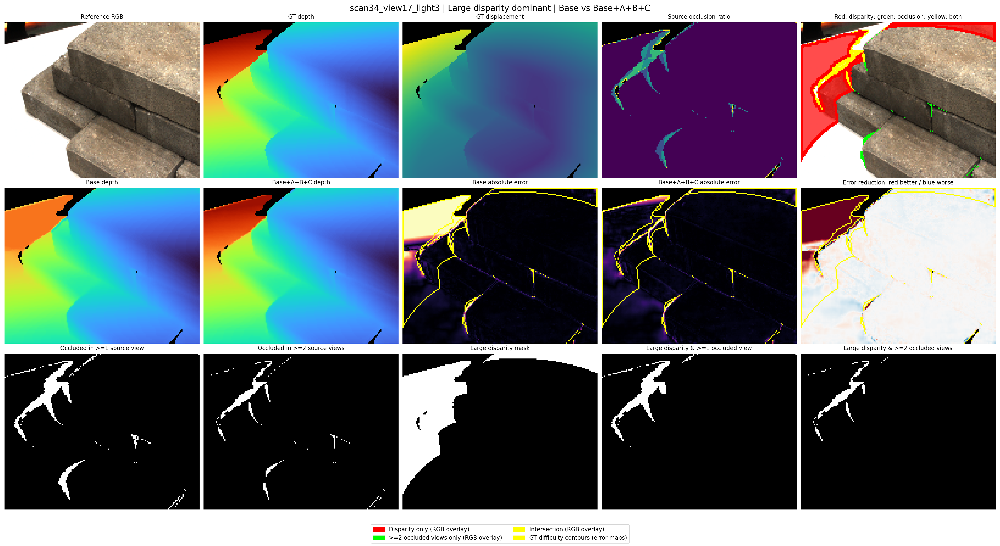

**图13. View5 的大视差为主案例 scan34_view17_light3。** 子图顺序与表7一致。GT 与两组预测的深度色域统一为 567.9–1043.4 mm；绝对误差显示为 0–20 mm，误差差值显示为 ±10 mm。误差差值中的红色为改善，蓝色为退化，黄色轮廓标记固定 GT 困难区域。超过显示范围的数值只在着色时截断，仍完整参与指标计算。

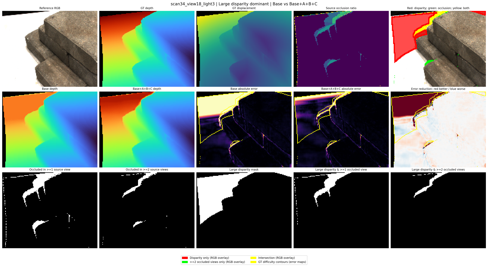

**图14. View3 的大视差为主案例 scan34_view18_light3。** 子图顺序与表7一致。GT 与两组预测的深度色域统一为 541.8–1057.8 mm；绝对误差显示为 0–20 mm，误差差值显示为 ±10 mm。误差差值中的红色为改善，蓝色为退化，黄色轮廓标记固定 GT 困难区域。超过显示范围的数值只在着色时截断，仍完整参与指标计算。

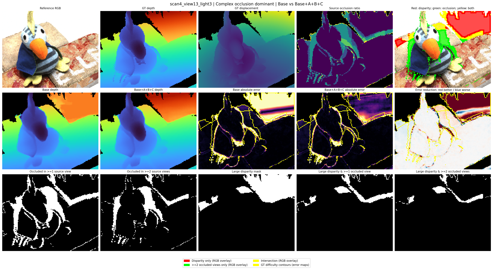

**图15. View5 的复杂遮挡为主案例 scan4_view13_light3。** 子图顺序与表7一致。GT 与两组预测的深度色域统一为 560.1–1053.2 mm；绝对误差显示为 0–20 mm，误差差值显示为 ±10 mm。误差差值中的红色为改善，蓝色为退化，黄色轮廓标记固定 GT 困难区域。超过显示范围的数值只在着色时截断，仍完整参与指标计算。

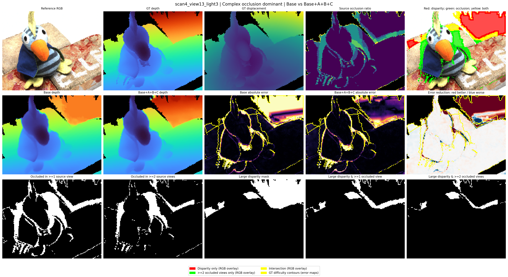

**图16. View3 的复杂遮挡为主案例 scan4_view13_light3。** 子图顺序与表7一致。GT 与两组预测的深度色域统一为 560.1–1053.2 mm；绝对误差显示为 0–20 mm，误差差值显示为 ±10 mm。误差差值中的红色为改善，蓝色为退化，黄色轮廓标记固定 GT 困难区域。超过显示范围的数值只在着色时截断，仍完整参与指标计算。

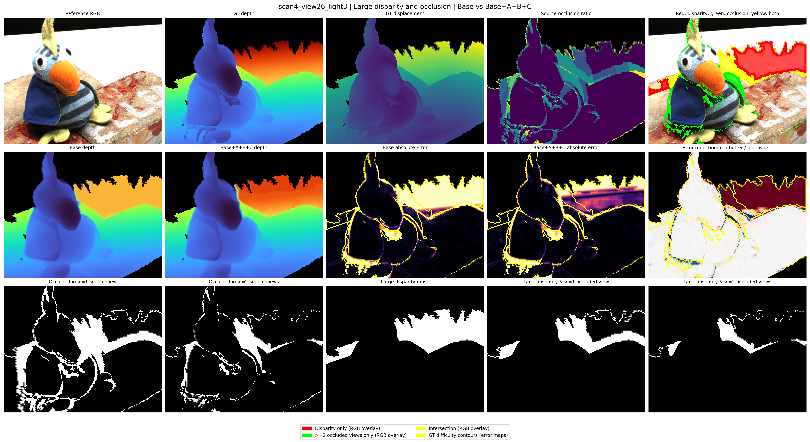

**图17. View5 的大视差与遮挡交集案例 scan4_view26_light3。** 子图顺序与表7一致。GT 与两组预测的深度色域统一为 559.0–1110.3 mm；绝对误差显示为 0–20 mm，误差差值显示为 ±10 mm。误差差值中的红色为改善，蓝色为退化，黄色轮廓标记固定 GT 困难区域。超过显示范围的数值只在着色时截断，仍完整参与指标计算。

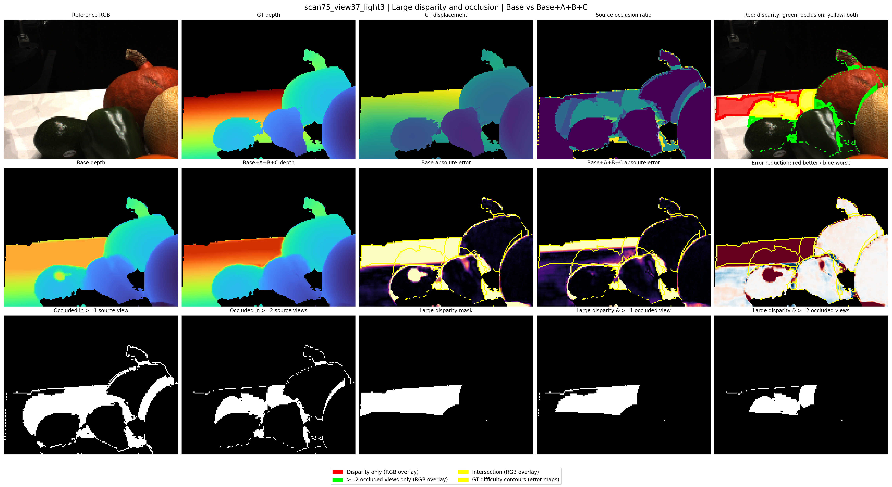

**图18. View3 的大视差与遮挡交集案例 scan75_view37_light3。** 子图顺序与表7一致。GT 与两组预测的深度色域统一为 568.1–1090.3 mm；绝对误差显示为 0–20 mm，误差差值显示为 ±10 mm。误差差值中的红色为改善，蓝色为退化，黄色轮廓标记固定 GT 困难区域。超过显示范围的数值只在着色时截断，仍完整参与指标计算。

## 附录 C：可视化重新导出的数值复核

全测试集表来自原始完整评测；图7—图18及表8—表11来自本次十二例的重新导出。每个设置和配置核对六例、七个原评测区域、十项指标，共420项。采用绝对容差0.001及相对容差0.0001，结果如下；未用原 CSV 数值替换本次图像对应指标。

**表12. 原评测与可视化重新导出的复核差异。**

| 设置 | 配置 | 超容差项/核对项 | Abs最大差/mm | Acc2最大差/pp |
| --- | --- | --- | --- | --- |
| View5 | Base | 24/420 | 0.016926 | 0.2457 |
| View5 | Base+A+B+C | 10/420 | 0.008912 | 0.1570 |
| View3 | Base | 21/420 | 0.027199 | 0.1475 |
| View3 | Base+A+B+C | 28/420 | 0.019859 | 0.1826 |

上述差异没有被视为严格复现成功。案例表已从所示预测数组重新核算 Abs、Acc2/4/8 与固定区域像素数；可视化导出的区域统计不与原全测试集汇总混合。

## 参考文献

[1] Yao, Yao; Luo, Zixin; Li, Shiwei; Fang, Tian; Quan, Long. **MVSNet: Depth Inference for Unstructured Multi-view Stereo**. European Conference on Computer Vision (ECCV), 2018, 767–783. [原始来源](https://www.ecva.net/papers/eccv_2018/papers_ECCV/html/Yao_Yao_MVSNet_Depth_Inference_ECCV_2018_paper.php)。

[2] Yao, Yao; Luo, Zixin; Li, Shiwei; Shen, Tianwei; Fang, Tian; Quan, Long. **Recurrent MVSNet for High-Resolution Multi-View Stereo Depth Inference**. IEEE/CVF Conference on Computer Vision and Pattern Recognition (CVPR), 2019, 5525–5534. [原始来源](https://openaccess.thecvf.com/content_CVPR_2019/html/Yao_Recurrent_MVSNet_for_High-Resolution_Multi-View_Stereo_Depth_Inference_CVPR_2019_paper.html)。

[3] Chen, Rui; Han, Songfang; Xu, Jing; Su, Hao. **Point-Based Multi-View Stereo Network**. IEEE/CVF International Conference on Computer Vision (ICCV), 2019, 1538–1547. [原始来源](https://openaccess.thecvf.com/content_ICCV_2019/html/Chen_Point-Based_Multi-View_Stereo_Network_ICCV_2019_paper.html)。

[4] Yang, Jiayu; Mao, Wei; Alvarez, José M.; Liu, Miaomiao. **Cost Volume Pyramid Based Depth Inference for Multi-View Stereo**. IEEE/CVF Conference on Computer Vision and Pattern Recognition (CVPR), 2020, 4877–4886. [原始来源](https://openaccess.thecvf.com/content_CVPR_2020/html/Yang_Cost_Volume_Pyramid_Based_Depth_Inference_for_Multi-View_Stereo_CVPR_2020_paper.html)。

[5] Gu, Xiaodong; Fan, Zhiwen; Zhu, Siyu; Dai, Zuozhuo; Tan, Feitong; Tan, Ping. **Cascade Cost Volume for High-Resolution Multi-View Stereo and Stereo Matching**. IEEE/CVF Conference on Computer Vision and Pattern Recognition (CVPR), 2020, 2495–2504. [原始来源](https://openaccess.thecvf.com/content_CVPR_2020/html/Gu_Cascade_Cost_Volume_for_High-Resolution_Multi-View_Stereo_and_Stereo_Matching_CVPR_2020_paper.html)。

[6] Zhang, Jingyang; Yao, Yao; Li, Shiwei; Luo, Zixin; Fang, Tian. **Visibility-aware Multi-view Stereo Network**. British Machine Vision Conference (BMVC), 2020. [原始来源](https://arxiv.org/abs/2008.07928)。

[7] Xu, Qingshan; Tao, Wenbing. **PVSNet: Pixelwise Visibility-Aware Multi-View Stereo Network**. arXiv preprint arXiv:2007.07714, 2020. [原始来源](https://arxiv.org/abs/2007.07714)。

[8] Wei, Zizhuang; Zhu, Qingtian; Min, Chen; Chen, Yisong; Wang, Guoping. **AA-RMVSNet: Adaptive Aggregation Recurrent Multi-View Stereo Network**. IEEE/CVF International Conference on Computer Vision (ICCV), 2021, 6187–6196. [原始来源](https://openaccess.thecvf.com/content/ICCV2021/html/Wei_AA-RMVSNet_Adaptive_Aggregation_Recurrent_Multi-View_Stereo_Network_ICCV_2021_paper.html)。

[9] Cheng, Shuo; Xu, Zexiang; Zhu, Shilin; Li, Zhuwen; Li, Li Erran; Ramamoorthi, Ravi; Su, Hao. **Deep Stereo Using Adaptive Thin Volume Representation With Uncertainty Awareness**. IEEE/CVF Conference on Computer Vision and Pattern Recognition (CVPR), 2020, 2524–2534. [原始来源](https://openaccess.thecvf.com/content_CVPR_2020/html/Cheng_Deep_Stereo_Using_Adaptive_Thin_Volume_Representation_With_Uncertainty_Awareness_CVPR_2020_paper.html)。

[10] Wang, Fangjinhua; Galliani, Silvano; Vogel, Christoph; Speciale, Pablo; Pollefeys, Marc. **PatchmatchNet: Learned Multi-View Patchmatch Stereo**. IEEE/CVF Conference on Computer Vision and Pattern Recognition (CVPR), 2021, 14194–14203. [原始来源](https://openaccess.thecvf.com/content/CVPR2021/html/Wang_PatchmatchNet_Learned_Multi-View_Patchmatch_Stereo_CVPR_2021_paper.html)。

[11] Mi, Zhenxing; Di, Chang; Xu, Dan. **Generalized Binary Search Network for Highly-Efficient Multi-View Stereo**. IEEE/CVF Conference on Computer Vision and Pattern Recognition (CVPR), 2022, 12991–13000. [原始来源](https://openaccess.thecvf.com/content/CVPR2022/html/Mi_Generalized_Binary_Search_Network_for_Highly-Efficient_Multi-View_Stereo_CVPR_2022_paper.html)。

[12] Wang, Fangjinhua; Galliani, Silvano; Vogel, Christoph; Pollefeys, Marc. **IterMVS: Iterative Probability Estimation for Efficient Multi-View Stereo**. IEEE/CVF Conference on Computer Vision and Pattern Recognition (CVPR), 2022, 8606–8615. [原始来源](https://openaccess.thecvf.com/content/CVPR2022/html/Wang_IterMVS_Iterative_Probability_Estimation_for_Efficient_Multi-View_Stereo_CVPR_2022_paper.html)。

[13] Peng, Rui; Wang, Rongjie; Wang, Zhenyu; Lai, Yawen; Wang, Ronggang. **Rethinking Depth Estimation for Multi-View Stereo: A Unified Representation**. IEEE/CVF Conference on Computer Vision and Pattern Recognition (CVPR), 2022, 8645–8654. [原始来源](https://openaccess.thecvf.com/content/CVPR2022/html/Peng_Rethinking_Depth_Estimation_for_Multi-View_Stereo_A_Unified_Representation_CVPR_2022_paper.html)。

[14] Ding, Yikang; Yuan, Wentao; Zhu, Qingtian; Zhang, Haotian; Liu, Xiangyue; Wang, Yuanjiang; Liu, Xiao. **TransMVSNet: Global Context-Aware Multi-View Stereo Network With Transformers**. IEEE/CVF Conference on Computer Vision and Pattern Recognition (CVPR), 2022, 8585–8594. [原始来源](https://openaccess.thecvf.com/content/CVPR2022/html/Ding_TransMVSNet_Global_Context-Aware_Multi-View_Stereo_Network_With_Transformers_CVPR_2022_paper.html)。

[15] Zhang, Zhe; Peng, Rui; Hu, Yuxi; Wang, Ronggang. **GeoMVSNet: Learning Multi-View Stereo With Geometry Perception**. IEEE/CVF Conference on Computer Vision and Pattern Recognition (CVPR), 2023. [原始来源](https://openaccess.thecvf.com/content/CVPR2023/papers/Zhang_GeoMVSNet_Learning_Multi-View_Stereo_With_Geometry_Perception_CVPR_2023_paper.pdf)。

[16] Wu, Jiang; Li, Rui; Xu, Haofei; Zhao, Wenxun; Zhu, Yu; Sun, Jinqiu; Zhang, Yanning. **GoMVS: Geometrically Consistent Cost Aggregation for Multi-View Stereo**. IEEE/CVF Conference on Computer Vision and Pattern Recognition (CVPR), 2024, 20207–20216. [原始来源](https://openaccess.thecvf.com/content/CVPR2024/html/Wu_GoMVS_Geometrically_Consistent_Cost_Aggregation_for_Multi-View_Stereo_CVPR_2024_paper.html)。

[17] Vats, Vibhas K.; Joshi, Sripad; Crandall, David J.; Reza, Md. Alimoor; Jung, Soon-heung. **GC-MVSNet: Multi-View, Multi-Scale, Geometrically-Consistent Multi-View Stereo**. IEEE/CVF Winter Conference on Applications of Computer Vision (WACV), 2024, 3242–3252. [原始来源](https://openaccess.thecvf.com/content/WACV2024/html/Vats_GC-MVSNet_Multi-View_Multi-Scale_Geometrically-Consistent_Multi-View_Stereo_WACV_2024_paper.html)。

[18] Lin, Tsung-Yi; Goyal, Priya; Girshick, Ross; He, Kaiming; Dollár, Piotr. **Focal Loss for Dense Object Detection**. IEEE International Conference on Computer Vision (ICCV), 2017. [原始来源](https://openaccess.thecvf.com/content_iccv_2017/html/Lin_Focal_Loss_for_ICCV_2017_paper.html)。

[19] Jensen, Rasmus; Dahl, Anders; Vogiatzis, George; Tola, Engin; Aanæs, Henrik. **Large Scale Multi-view Stereopsis Evaluation**. IEEE Conference on Computer Vision and Pattern Recognition (CVPR), 2014, 406–413. [原始来源](https://openaccess.thecvf.com/content_cvpr_2014/papers/Jensen_Large_Scale_Multi-view_2014_CVPR_paper.pdf)。
