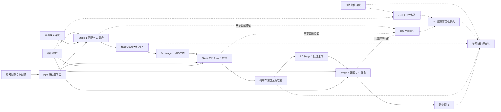

# 面向大视差与遮挡的 Vis-MVSNet 深度估计改进方法

## 摘要

大视差与复杂遮挡会同时加剧跨视图对应歧义和源视图可见性变化，是多视图立体匹配中的典型困难条件。Vis-MVSNet 以三级由粗到细的方式估计深度，并利用匹配不确定性指导多视图信息融合，已经具备处理可见性差异的基础能力。然而，当第一阶段在大视差、遮挡边界或弱纹理区域产生偏差时，后续阶段围绕前级预测建立的局部候选空间可能无法充分覆盖真实深度；同时，匹配不确定性属于可靠性的间接表征，难以单独承担显式遮挡关系监督，而固定到像素或源视图层面的融合权重也不足以完整刻画不同深度假设下的视图贡献。由此，前级匹配偏差可能通过候选范围和多视图融合在三级网络中持续传播。针对上述问题，本文提出一种面向大视差与复杂遮挡的 Vis-MVSNet 改进方法，包括逐源视图遮挡感知监督、自适应深度搜索范围和深度假设感知源视图融合三个模块。前者显式约束参考视图与各源视图之间的几何可见性，中者根据像素估计状态动态组织后续阶段的候选深度，后者在每个深度假设处重新衡量各源视图证据。三个模块分别作用于可见性学习、级联搜索和代价融合，共同抑制困难区域中的误差传播。本文采用完整八组消融，并结合整体区域、大视差区域、遮挡区域及二者交集的平均误差和阈值准确率，对各模块及其组合进行评价。

**关键词：** 多视图立体匹配；Vis-MVSNet；大视差；遮挡感知；自适应深度搜索；深度假设融合

## 1 引言

### 1.1 研究背景与问题

多视图立体匹配旨在由多幅已标定图像恢复场景的稠密几何。学习式方法通常将源视图特征依据一组深度假设变换到参考视图，构建并正则化匹配代价体，最终回归参考视图深度。MVSNet [2] 奠定了这一端到端框架，R-MVSNet [9]、Point-MVSNet [10]、CVP-MVSNet [11] 与 CasMVSNet [3] 随后分别从递归正则化、点云细化和由粗到细代价体等方向提高了分辨率与效率。级联结构在较低分辨率上估计粗深度，再围绕前级结果逐步缩小搜索区间，因而能够以有限的候选数量获得较细的深度分辨率。

然而，由粗到细的效率收益伴随着对前级估计的依赖。在大视差条件下，同一三维点在不同视图中的成像位置相距较远，局部外观差异和特征对齐误差随之增大；在复杂遮挡条件下，一部分源视图甚至不存在有效对应。若粗阶段由此产生较大深度偏差，后续局部搜索可能无法覆盖真实深度，错误又会继续影响更高分辨率阶段。Vis-MVSNet [1] 通过成对深度分布的不确定性估计源视图可靠性，有效改善了可见性相关融合，但匹配不确定性仍是对可靠性的间接刻画：相似的不确定性可能来自遮挡、弱纹理、重复纹理或反射。同时，像素级视图权重难以完整表示同一源视图在不同深度假设处的可靠性变化。因此，大视差和复杂遮挡仍可能通过“粗阶段失配—候选范围受限—错误证据聚合”在三级网络中形成连续的误差传播。

### 1.2 本文方法

为缓解上述误差传播，本文在 Vis-MVSNet 的三级主体中引入三个相互衔接的改进。首先，逐源视图遮挡感知监督利用参考深度、源视图深度与相机几何构造可见性标签，直接约束参考—源视图匹配表示。该监督不替代原有不确定性建模，而是为遮挡这一特定退化因素提供更明确的几何约束。其次，自适应深度搜索范围根据前级概率分布的离散程度调节后续阶段的搜索半宽，使不确定像素保留较大的纠错区间，同时在可靠位置维持较密的局部采样。最后，深度假设感知融合将源视图可靠性由像素级扩展到像素—深度假设级，使同一源视图在不同候选深度处具有不同权重，从而抑制遮挡边界和错误深度处的虚假匹配响应。

三个模块分别作用于监督信号、候选生成和代价聚合，并沿“可靠观测学习—真实深度覆盖—有效证据融合”的顺序构成统一方法。A 所学习的几何可见性表征改善匹配特征，B 为前级偏差保留修正空间，C 在该空间中进一步选择与每个深度假设一致的源视图证据。通过这种设计，三级结构的计算优势得以保留，而困难区域中的误差传播受到针对性约束。

### 1.3 本文工作

本文以原始 Vis-MVSNet 为基线，提出由 A、B、C 三个模块组成的联合改进方法，主要贡献如下：

1. **提出逐源视图遮挡感知监督模块 A。** 该模块以参考—源视图几何一致性构造可见性标签，为原有不确定性学习补充直接的遮挡监督，增强网络对复杂遮挡关系的表达能力。
2. **提出自适应深度搜索范围模块 B。** 该模块根据前级深度分布所反映的像素估计状态动态确定后续搜索区间，在固定候选预算下协调真实深度覆盖和局部采样精度，降低粗阶段偏差向后传播的风险。
3. **提出深度假设感知源视图融合模块 C。** 该模块将源视图权重由像素或视图层面细化到候选深度层面，使网络能够针对不同深度假设选择有效多视图证据，减轻遮挡与错误匹配响应对代价体的干扰。
4. 在统一协议下构造 $2^3$ 个模块组合的完整消融，并分别评价全图、大视差、遮挡及二者交集区域，以揭示各模块对不同困难条件的贡献及其互补关系。

## 2 相关工作

### 2.1 基于代价体的多视图深度估计

MVSNet [2] 利用可微单应性变换在参考相机视锥中构建三维代价体，并通过三维卷积完成正则化和深度回归，形成了学习式 MVS 的基本范式。由于完整三维代价体的显存开销随空间与深度分辨率快速增长，R-MVSNet [9] 使用循环单元沿深度方向依次正则化二维代价图，Point-MVSNet [10] 则从粗深度出发在三维点表示上迭代预测残差。CVP-MVSNet [11] 和 CasMVSNet [3] 将匹配过程组织为由粗到细的多尺度结构，在后续阶段围绕前级深度建立局部代价体。这类方法显著降低了高分辨率估计的计算负担，但也使精细阶段的候选空间受到粗阶段预测质量的制约。

### 2.2 可见性建模与多视图聚合

不同源视图对参考像素的有效性会随遮挡、视角和成像条件变化，因而等权聚合容易将错误匹配写入代价体。PVSNet [5] 预测逐像素可见性并据此构建加权代价体；Vis-MVSNet [1] 联合估计成对深度及其不确定性，以不确定性度量匹配可靠性并指导多视图融合。AA-RMVSNet [12] 进一步采用自适应的视图内与视图间聚合，以改善纹理不足和遮挡条件下的重建。上述方法证明了选择性使用源视图信息的重要性，但它们主要从预测可靠性或像素级权重出发。本文一方面通过逐源几何一致性显式监督遮挡关系，另一方面使视图权重随候选深度改变，从监督来源和融合粒度两个层面细化可见性建模。

### 2.3 深度假设搜索与概率建模

候选深度的覆盖范围与离散间隔共同决定代价体能够表达的深度精度。CasMVSNet [3] 在逐级提高空间分辨率的同时缩小搜索区间；UCS-Net [4] 根据前级深度分布的不确定性构建逐像素自适应薄体积。PatchmatchNet [6] 以可学习 PatchMatch 代替规则的全深度代价体，通过初始化、传播和评估迭代更新候选。GBi-Net [14] 将深度估计改写为广义二分搜索，并通过容错区间处理分类错误和越界样本；IterMVS [16] 则在循环隐藏状态中编码像素级深度概率分布并迭代更新。UniMVSNet [15] 从深度表示角度统一分类与回归，以兼顾代价体监督和亚像素估计。这些研究表明，候选空间不只是实现细节，而是影响覆盖能力、离散精度与误差恢复能力的关键因素。本文的自适应范围直接服务于三级结构中的前级误差修正，并与遮挡监督和深度假设感知融合共同优化困难区域。

### 2.4 上下文建模与几何先验

除候选搜索外，近年来的方法也通过更强的上下文和几何建模改善困难区域。TransMVSNet [13] 使用自注意力与交叉注意力在图像内和图像间传播长程信息；GeoMVSNet [17] 将粗阶段深度和概率体包含的几何线索传递到精细阶段；GoMVS [18] 根据局部表面几何将相邻位置的匹配代价对应到参考深度空间后再进行聚合。GC-MVSNet [19] 则在训练阶段引入跨视图、多尺度几何一致性约束。这些工作分别强调上下文、阶段间几何信息和局部几何一致性。本文聚焦于大视差与复杂遮挡共同造成的级联误差，从逐源可见性监督、自适应候选范围和候选深度相关视图融合三个环节建立一条连续的抑制路径。

## 3 方法

### 3.1 符号与总体框架

本文保留 Vis-MVSNet 的三级由粗到细主体，将 A、B、C 分别嵌入可见性学习、候选深度生成和多视图代价融合。Stage 1 在全局深度范围内建立粗粒度候选并获得初始深度分布；Stage 2 和 Stage 3 使用 B 根据前级估计状态更新局部候选范围，并使用 C 在每个候选深度处聚合源视图特征；A 在训练阶段以逐源几何可见性监督共享匹配表示。这样，三个模块分别作用于误差传播链的来源、搜索约束和证据聚合。

| 符号 | 定义 |
| --- | --- |
| $I_0,I_s$ | 参考图像与第 $s$ 个源图像 |
| $K_i,R_i,t_i$ | 相机内参及世界坐标到相机坐标的外参 |
| $\mathbf p,\widetilde{\mathbf p}$ | 参考像素二维坐标及齐次坐标 |
| $\phi_i^t,H_t,W_t,C_t$ | 阶段 $t$ 的特征及其空间大小、通道数 |
| $d_k^t(\mathbf p),N_t$ | 第 $k$ 个候选深度及该阶段候选数量 |
| $F_s^t(\mathbf p,k)$ | 参考—源视图匹配特征 |
| $P^t(\mathbf p,k)$ | 当前候选集合上的深度概率 |
| $\hat d^t,\sigma^t$ | 预测深度及深度概率标准差 |
| $G_i$ | 训练或评测时使用的真值深度 |
| $g_s,m_s,v_s,o_s$ | 几何有效掩码、监督掩码、可见标签、遮挡标签 |
| $q_s,b_s,r_{s,k}$ | 可见性预测、基础融合 logit、候选深度残差 |
| $\tau_a,\tau_r$ | 深度一致性绝对容差和相对容差 |
| $\kappa_t,h_{\min}^t,h_{\max}^t$ | 范围尺度及半宽上下界 |
| $\eta_t,\gamma,\alpha$ | 融合残差幅度、Focal 指数和类别权重 |
| $\beta_t,\lambda_A,\lambda_0$ | 阶段损失权重、A 损失权重及基线辅助项权重 |

深度 $d$ 表示沿相机光轴的深度；所有图像坐标、特征分辨率与内参须保持尺度一致。对于一般相机配置，使用相对变换 $R_{s0}=R_sR_0^\top$、$\mathbf t_{s0}=\mathbf t_s-R_sR_0^\top\mathbf t_0$，得到候选三维点在源相机中的位置：

$$
\mathbf X_s(\mathbf p,d)
=R_{s0}\!\left(dK_0^{-1}\widetilde{\mathbf p}\right)+\mathbf t_{s0},
\qquad
\mathbf p_s(d)=\pi\!\left(K_s\mathbf X_s(\mathbf p,d)\right).
\tag{1}
$$

其中 $\pi([x,y,z]^\top)=[x/z,y/z]^\top$。利用可微重采样在候选位置提取源特征，并形成匹配表示：

$$
F_s^t(\mathbf p,k)=
\Psi_t\!\left(
\phi_0^t(\mathbf p),
\operatorname{Sample}\!\left(\phi_s^t,\mathbf p_s(d_k^t(\mathbf p))\right)
\right).
\tag{2}
$$

$\Psi_t$ 表示匹配特征构建及其编码，不在此固定为方差、相关性或特定卷积结构。基于相机几何进行特征变换的思路与 MVSNet 的可微匹配框架相关。[文献2](https://www.ecva.net/papers/eccv_2018/papers_ECCV/html/Yao_Yao_MVSNet_Depth_Inference_ECCV_2018_paper.php)

图1给出总体结构。Stage 1 在全局候选集合上估计粗深度；后续阶段由 B 更新候选集合，再由 C 聚合源视图信息。A 通过训练监督约束共享匹配表示。GT 深度仅参与标签构造、损失和评测，不作为推理输入。

**图1：总体框架，连线草图。**

**图注：** 灰色主干表示特征提取、匹配与深度估计，A 为训练监督，B 为后续阶段候选生成，C 位于每个阶段的源视图融合处。实线表示推理信息流，虚线表示训练监督及辅助分支。详细绘图说明见 [绘图指南](PAPER_FIGURE_GUIDE.md)。

### 3.2 A：逐源视图遮挡感知监督

#### 3.2.1 几何标签

将 $G_0(\mathbf p)$ 代入式(1)，得到源相机投影深度 $z_s(\mathbf p)$ 与像素位置 $\mathbf p_s^\star$。从源真值深度采样 $G_s(\mathbf p_s^\star)$，定义一致性容差：

$$
\tau_s(\mathbf p)=
\max\!\left(\tau_a,\tau_rG_s(\mathbf p_s^\star)\right).
\tag{3}
$$

$g_s(\mathbf p)=1$ 要求参考深度有效、投影位于源图像内、源投影深度为正且源真值深度有效。对这些位置分别定义可见和被遮挡标签：

$$
\begin{aligned}
v_s(\mathbf p)&=g_s(\mathbf p)\,
\mathbb 1\!\left[
|z_s(\mathbf p)-G_s(\mathbf p_s^\star)|\leq\tau_s(\mathbf p)
\right],\\
o_s(\mathbf p)&=g_s(\mathbf p)\,
\mathbb 1\!\left[
z_s(\mathbf p)>G_s(\mathbf p_s^\star)+\tau_s(\mathbf p)
\right],\\
m_s(\mathbf p)&=v_s(\mathbf p)+o_s(\mathbf p).
\end{aligned}
\tag{4}
$$

明显位于源表面前方的不一致点以及投影无效点不作为遮挡负样本，只有 $m_s=1$ 的位置进入可见性损失，从而避免将越界投影和缺失深度错误标记为遮挡。图2展示可见、遮挡和无效三种几何状态。

#### 3.2.2 可见性目标

由共享匹配表示提取逐源特征 $H_s^t(\mathbf p)$，预测可见性：

$$
q_s^t(\mathbf p)
=\operatorname{sigmoid}\!\left(f_A^t(H_s^t(\mathbf p))\right).
\tag{5}
$$

可采用二元 Focal 形式描述类别权重及难样本调制：

$$
\ell_{\mathrm{vis}}(q,v)=
-\alpha v(1-q)^\gamma\log q
-(1-\alpha)(1-v)q^\gamma\log(1-q).
\tag{6}
$$

Focal Loss 原用于减弱易分类样本的相对影响；这里将其作为可见性监督的一种参数化选项，而非声称其原论文验证了本任务。[文献8](https://openaccess.thecvf.com/content_iccv_2017/html/Lin_Focal_Loss_for_ICCV_2017_paper.html) 当 $\gamma=0$ 时退化为带类别权重的交叉熵。数值计算中将 $q$ 限制在 $[\epsilon,1-\epsilon]$。

阶段监督为：

$$
\mathcal L_A^t=
\frac{\sum_s\sum_{\mathbf p}m_s^t(\mathbf p)\,
\ell_{\mathrm{vis}}\!\left(q_s^t(\mathbf p),v_s^t(\mathbf p)\right)}
{\max\!\left(1,\sum_s\sum_{\mathbf p}m_s^t(\mathbf p)\right)}.
\tag{7}
$$

所有标签均在对应特征尺度下构建或以保持离散语义的方式对齐。没有有效样本时，该项为零。A 通过共享匹配特征传递梯度，可见性概率不直接乘入融合权重。

### 3.3 B：自适应深度搜索范围

#### 3.3.1 估计状态与范围半宽

对 $t>1$，将上一阶段深度均值与标准差对齐到当前尺度，记为 $\mu^t(\mathbf p)$ 和 $s^t(\mathbf p)$。在深度单位一致的条件下，一种完整的范围参数化为：

$$
h^t(\mathbf p)=
\operatorname{clip}\!\left(
\kappa_t s^t(\mathbf p),h_{\min}^t,h_{\max}^t
\right).
\tag{8}
$$

其中 $\kappa_t>0$，$0<h_{\min}^t\leq h_{\max}^t$。上下界防止范围退化或无限扩大。式(8)是一种用于展开本稿的范围设计，不为未核定的实验指定参数值。不确定性引导候选范围已有 UCS-Net 等研究基础。[文献4](https://openaccess.thecvf.com/content_CVPR_2020/html/Cheng_Deep_Stereo_Using_Adaptive_Thin_Volume_Representation_With_Uncertainty_Awareness_CVPR_2020_paper.html)

设有效全局深度范围为 $[d_{\min},d_{\max}]$，先将中心限制在其中，再取范围与全局区间的交集：

$$
\begin{aligned}
\bar\mu^t(\mathbf p)&=\operatorname{clip}
\left(\mu^t(\mathbf p),d_{\min},d_{\max}\right),\\
a^t(\mathbf p)&=\max\left(d_{\min},\bar\mu^t(\mathbf p)-h^t(\mathbf p)\right),\\
b^t(\mathbf p)&=\min\left(d_{\max},\bar\mu^t(\mathbf p)+h^t(\mathbf p)\right).
\end{aligned}
\tag{9}
$$

式（9）通过区间求交保证候选深度不越过全局边界，因此靠近 $d_{\min}$ 或 $d_{\max}$ 时实际范围会相应收缩。

#### 3.3.2 候选深度

令 $N_t\geq2$，均匀采样可写为：

$$
d_k^t(\mathbf p)=a^t(\mathbf p)
+\frac{k}{N_t-1}\left(b^t(\mathbf p)-a^t(\mathbf p)\right),
\qquad k=0,\ldots,N_t-1.
\tag{10}
$$

Stage 1 使用全局候选范围；后续阶段使用式(8)—(10)。在固定 $N_t$ 下，实际间距为：

$$
\Delta^t(\mathbf p)=
\frac{b^t(\mathbf p)-a^t(\mathbf p)}{N_t-1}.
\tag{11}
$$

在固定候选数下，扩大范围会同步增加采样间距。因此，B 并非简单扩大全部像素的搜索区间，而是在候选覆盖与局部离散精度之间进行逐像素调节。实验同时报告真实深度覆盖率、采样间距和最终深度误差，以分析这种调节是否有效。

### 3.4 C：深度假设感知源视图融合

#### 3.4.1 候选深度相关残差

令 $P_s^t(\mathbf p,k)$ 表示源视图的成对候选匹配概率，归一化深度坐标定义为：

$$
\xi_k^t(\mathbf p)=
2\frac{d_k^t(\mathbf p)-d_0^t(\mathbf p)}
{d_{N_t-1}^t(\mathbf p)-d_0^t(\mathbf p)+\epsilon}-1.
\tag{12}
$$

基于匹配特征、成对概率及深度坐标预测残差：

$$
r_s^t(\mathbf p,k)=
\eta_t\tanh\!\left(
g_C^t\left[F_s^t(\mathbf p,k),
P_s^t(\mathbf p,k),\xi_k^t(\mathbf p)\right]
\right).
\tag{13}
$$

$\eta_t\geq0$ 限定修正幅度，$g_C^t$ 表示沿候选深度和空间处理匹配特征的预测器，其层数与通道数不在此预设。图4应分别画出基础可靠性分支和残差分支。

#### 3.4.2 权重归一化与融合

令 $b_s^t(\mathbf p)$ 为基础源视图可靠性 logit，$\mathcal S_v^t(\mathbf p,k)$ 为当前候选处几何投影有效的源视图集合。采用源视图维度上的 softmax：

$$
\alpha_s^t(\mathbf p,k)=
\frac{\exp\left(b_s^t(\mathbf p)+r_s^t(\mathbf p,k)\right)}
{\sum_{j\in\mathcal S_v^t(\mathbf p,k)}
\exp\left(b_j^t(\mathbf p)+r_j^t(\mathbf p,k)\right)},
\quad s\in\mathcal S_v^t(\mathbf p,k).
\tag{14}
$$

这里的有效投影条件由相机与候选深度计算，不使用真值遮挡标签。无有效源视图的位置输出有效性掩码并采用约定的无证据处理。该处理在训练、评测与图示中保持一致。

融合特征为：

$$
F_{\mathrm{fused}}^t(\mathbf p,k)=
\sum_{s\in\mathcal S_v^t(\mathbf p,k)}
\alpha_s^t(\mathbf p,k)F_s^t(\mathbf p,k).
\tag{15}
$$

当 $r_s^t=0$ 时，权重退化为基础 logit 的归一化；该性质说明残差对基础权重的扩展关系，不额外证明整个网络与某个基线实现完全一致。

#### 3.4.3 概率、深度与标准差

对融合特征正则化后得到深度 logit $\ell^t(\mathbf p,k)$，在候选深度维度归一化：

$$
P^t(\mathbf p,k)=
\frac{\exp\left(\ell^t(\mathbf p,k)\right)}
{\sum_{j=0}^{N_t-1}\exp\left(\ell^t(\mathbf p,j)\right)}.
\tag{16}
$$

深度及标准差为：

$$
\hat d^t(\mathbf p)=
\sum_{k=0}^{N_t-1}P^t(\mathbf p,k)d_k^t(\mathbf p),
\tag{17}
$$

$$
\sigma^t(\mathbf p)=
\sqrt{\sum_{k=0}^{N_t-1}P^t(\mathbf p,k)
\left(d_k^t(\mathbf p)-\hat d^t(\mathbf p)\right)^2+\epsilon}.
\tag{18}
$$

该标准差描述当前候选集合上的概率离散程度，并不等同于真实预测误差。为检验它对范围调节的有效性，实验进一步统计不同阶段的候选覆盖率及低方差错误样本。

### 3.5 损失与训练流程

深度监督采用带参数 $\delta>0$ 的平滑绝对误差：

$$
\rho_\delta(e)=
\begin{cases}
e^2/(2\delta),& |e|<\delta,\\
|e|-\delta/2,& |e|\geq\delta.
\end{cases}
\tag{19}
$$

阶段深度损失为：

$$
\mathcal L_{\mathrm{depth}}^t=
\frac{\sum_{\mathbf p\in\Omega_{\mathrm{gt}}^t}
\rho_\delta\left(\hat d^t(\mathbf p)-G_0^t(\mathbf p)\right)}
{\max(1,|\Omega_{\mathrm{gt}}^t|)}.
\tag{20}
$$

总目标写为：

$$
\mathcal L=
\sum_{t=1}^{T}\beta_t
\left(
\mathcal L_{\mathrm{depth}}^t+
\lambda_A\mathcal L_A^t+
\lambda_0\mathcal L_{\mathrm{base,aux}}^t
\right).
\tag{21}
$$

$\mathcal L_{\mathrm{base,aux}}^t$ 汇总最终保留的原方法辅助监督，逐项形式需在方法定稿时补齐；其不能被误写为新增贡献。不启用 A 时关闭其监督分支；关闭 B 时使用原始候选生成策略；关闭 C 时采用原始融合方式。深度概率生成、不确定性估计及阶段对齐的定义在各配置中保持清楚一致。

**算法1：前向推理与训练目标。**

1. 输入图像与相机参数，提取各尺度特征。
2. Stage 1 构建全局候选集合。对后续阶段，根据上一阶段均值、标准差及式(8)—(10)构建候选；B 关闭时执行原始策略。
3. 根据式(1)—(2)构建逐源匹配特征，并获得基础可靠性与所需成对概率。
4. C 开启时执行式(12)—(15)；否则采用原始融合。
5. 由式(16)—(18)得到当前阶段概率、深度和标准差，进入下一阶段。
6. 推理时输出最终阶段深度；训练时额外构造几何标签，计算 A 的监督与式(21)。
7. 反向传播更新参数。阶段间是否停止梯度传播，需按最终设计统一说明。

## 4 实验设计

### 4.1 数据与评测设置

实验围绕 DTU 数据开展。DTU 评价数据的原始来源见 [文献7](https://openaccess.thecvf.com/content_cvpr_2014/papers/Jensen_Large_Scale_Multi-view_2014_CVPR_paper.pdf)。本文分别考虑三视图训练与五视图训练，两种设置均以五视图进行评测。当前工作资料采用 light 3 和 pixel-weighted 聚合。训练、模型选择及评测细节在文末清单中列出。

本文以原始 Vis-MVSNet 为 Base，保持各配置的数据、训练预算及评测协议可比。三视图训练结果用于分析训练视图数量变化下的表现，不直接等同于三视图推理性能。

### 4.2 完整八组消融

| 配置 | A | B | C |
| --- | ---: | ---: | ---: |
| Base：原始 Vis-MVSNet | 0 | 0 | 0 |
| Base+A | 1 | 0 | 0 |
| Base+B | 0 | 1 | 0 |
| Base+C | 0 | 0 | 1 |
| Base+A+B | 1 | 1 | 0 |
| Base+A+C | 1 | 0 | 1 |
| Base+B+C | 0 | 1 | 1 |
| Base+A+B+C | 1 | 1 | 1 |

单模块配置用于分析各设计的独立作用；两模块和完整配置用于分析已有其他模块时的条件效果。每个因素在其他两因素的四种状态下分别比较，形成十二组单因素对照。

### 4.3 区域与评价指标

本文报告 Full、大视差、任一源遮挡、多数源遮挡、大视差与遮挡交集、边界与遮挡交集，以及 Boundary 区域。评测掩码由统一规则与真值生成，对全部配置固定。大视差指标、阈值及遮挡交集规则需与最终评测协议对应；本文不将训练标签定义自动当作既有评测掩码定义。

设固定区域 $R$ 的有效像素集合为 $\Omega_R$，平均绝对误差与阈值准确率为：

$$
\operatorname{Abs}_R=
\frac{1}{|\Omega_R|}
\sum_{\mathbf p\in\Omega_R}
|\hat d(\mathbf p)-G_0(\mathbf p)|,
\tag{22}
$$

$$
\operatorname{Acc}_{\tau,R}=
\frac{1}{|\Omega_R|}
\sum_{\mathbf p\in\Omega_R}
\mathbb 1\left[|\hat d(\mathbf p)-G_0(\mathbf p)|<\tau\right],
\qquad \tau\in\{2,4,8\}.
\tag{23}
$$

数值单位、阈值边界采用严格小于还是小于等于，最终需与评测协议一致。像素加权聚合通过累计误差和有效像素数量实现；空区域报告无可用结果，而非记为零误差。

阶段搜索诊断定义为：

$$
\operatorname{Coverage}_{t,R}=
\frac{1}{|\Omega_R^t|}
\sum_{\mathbf p\in\Omega_R^t}
\mathbb 1\left[
\min_k d_k^t(\mathbf p)\leq G_0^t(\mathbf p)
\leq\max_k d_k^t(\mathbf p)
\right],
\tag{24}
$$

$$
\operatorname{Width}_{t,R}=
\frac{1}{|\Omega_R^t|}
\sum_{\mathbf p\in\Omega_R^t}
\left(\max_k d_k^t(\mathbf p)-\min_k d_k^t(\mathbf p)\right).
\tag{25}
$$

Coverage 只判断真值是否处于候选端点之间，不衡量最近候选距离，更不等于深度估计准确率。配合式(11)的间距以及下式最近候选距离，可更细致地检查离散候选：

$$
e_{\mathrm{nearest}}^t(\mathbf p)=
\min_k|d_k^t(\mathbf p)-G_0^t(\mathbf p)|.
\tag{26}
$$

最近候选距离属于建议补充的诊断，当前不假定其已经记录。各区域可能重叠，不能将指标直接相加或平均代替 Full。

### 4.4 改善率与百分点

对任意确定的参照配置，定义：

$$
\operatorname{Gain}_{\mathrm{Abs}}=
\frac{\operatorname{Abs}_{\mathrm{ref}}-\operatorname{Abs}_{\mathrm{model}}}
{\operatorname{Abs}_{\mathrm{ref}}}\times100\%,
\tag{27}
$$

$$
\Delta\operatorname{Acc}_{\tau}
=\left(\operatorname{Acc}_{\tau,\mathrm{model}}
-\operatorname{Acc}_{\tau,\mathrm{ref}}\right)\times100
\quad\text{pp}.
\tag{28}
$$

式(27)以参照误差非零为前提。Abs 改善率正值表示误差降低；Acc 的变化使用百分点，不能与相对百分比混用。所有数值在完整精度下计算后再舍入。

## 5 实验结果与分析

### 5.1 整体结果与困难区域结果

表 X 给出原始 Vis-MVSNet 与完整方法的整体结果。相较于基线，完整方法的平均绝对误差由 **[待填]** 变化为 **[待填]**，Acc2、Acc4 和 Acc8 分别变化 **[待填]**、**[待填]** 和 **[待填]** 个百分点。进一步按场景困难程度划分后，方法在大视差、遮挡及二者交集区域的变化分别为 **[待填]**。这些区域结果用于判断总体变化是否来自本文所针对的困难像素，而区域像素占比用于说明局部收益对整体指标的影响。

### 5.2 单模块效果与机制证据

八组消融结果见表 Y。加入 A 后，遮挡区域的 **[指标]** 由 **[待填]** 改善至 **[待填]**，表明显式几何监督有助于区分可见与被遮挡的源视图。B 对大视差区域的主要影响表现为 Stage 2/3 候选覆盖率提高 **[待填]**，同时采样间距变化 **[待填]**；该结果说明性能变化来自搜索空间的自适应调整。C 在大视差与遮挡交集区域带来 **[待填]** 的变化，其权重可视化显示，源视图贡献会随候选深度改变，并在错误深度附近受到抑制。上述机制指标与最终深度指标共同建立模块设计和性能变化之间的联系。

### 5.3 联合效果与指标取舍

双模块和完整模型反映了三个设计之间的条件作用。Base+A+B、Base+A+C 和 Base+B+C 分别取得 **[待填]**，完整模型取得 **[待填]**。若完整模型在目标困难区域优于原始基线，但个别全图指标低于某个双模块配置，则说明联合设计在不同误差尺度之间存在取舍，而不表示其中某一模块无效。平均绝对误差对所有误差幅度敏感，Acc4 只统计误差小于阈值的像素比例；因此，Acc4 上升而平均误差增大意味着更多像素进入 4 单位容差范围，但少量剩余错误的幅度可能扩大。误差累计分布、分位数和逐像素配对结果将用于检验这一解释。

### 5.4 可视化与稳定性

图 X 展示大视差区域、遮挡边界及二者交集处的深度误差。所有方法采用相同裁剪范围和色标。与基线相比，完整方法在 **[待填位置]** 保留了更连续的表面，并减少了 **[待填现象]**；失败案例主要集中于 **[待填条件]**。逐场景结果及重复训练的均值与标准差见表 Z，用于检验改善是否由少数场景或单次训练波动造成。

## 6 讨论

### 6.1 三个模块为何围绕同一目标

大视差与复杂遮挡会同时影响三级网络的初始匹配、局部搜索和多视图融合。A、B、C 分别对应可靠观测识别、真实深度候选覆盖和候选深度处的证据聚合，使方法围绕抑制级联误差传播形成一致分工。

A 和 C 都涉及源视图可靠性，但作用层次不同：A 以显式几何标签约束网络学习什么样的观测关系，C 决定这些匹配特征在每个候选深度处以多大权重参与聚合。B 位于两者之间，为融合阶段生成需要比较的候选集合。若前级预测存在偏差，B 提供继续搜索真实深度的空间；在该空间内，A 所改善的可见性表征与 C 的候选相关权重共同提高证据质量。因此，三者具有明确的串联关系，其互补收益由八组消融中的条件对照验证。

### 6.2 指标取舍与适用范围

不同指标刻画深度误差的不同侧面。平均绝对误差反映整体偏差幅度，阈值准确率反映给定容差内的有效像素比例，而困难区域指标进一步定位性能变化发生的条件。因此，完整方法无需在每个消融配置和每项指标上同时取得最优；只要其相对原始基线在大视差和复杂遮挡区域形成稳定改善，并且整体性能代价可控，便能够支持本文的研究目标。本文的结论限定于深度估计；点云重建质量和跨数据集泛化仍需通过统一后处理下的点云指标与外部数据实验进一步验证。

## 7 结论

本文针对 Vis-MVSNet 三级深度估计在大视差与复杂遮挡下容易产生并传播误差的问题，提出由逐源视图遮挡感知监督、自适应深度搜索范围和深度假设感知源视图融合组成的联合改进方法。原始 Vis-MVSNet 已通过匹配不确定性处理可见性相关融合，本文在此基础上进一步补充显式几何可见性监督，依据像素估计状态调整后续阶段的候选范围，并在不同深度假设处重新分配源视图贡献。三个模块分别改善可靠观测识别、真实深度候选覆盖和多视图证据聚合，从而共同抑制粗阶段偏差在三级细化过程中的延续与放大。

在 DTU 数据集上的八组消融从整体区域、大视差区域、遮挡区域及二者交集评价了各模块的作用。定量结果、阶段候选覆盖诊断与融合权重可视化共同表明 **[根据最终实验填写核心结论]**。上述结果说明，从监督、搜索和融合三个环节协同处理困难匹配，为提高 Vis-MVSNet 在大视差与复杂遮挡条件下的深度估计能力提供了一条有效路径。

## 参考文献

[1] Zhang, Jingyang; Yao, Yao; Li, Shiwei; Luo, Zixin; Fang, Tian. **Visibility-aware Multi-view Stereo Network**. British Machine Vision Conference (BMVC), 2020. [原始来源](https://arxiv.org/abs/2008.07928)。

[2] Yao, Yao; Luo, Zixin; Li, Shiwei; Fang, Tian; Quan, Long. **MVSNet: Depth Inference for Unstructured Multi-view Stereo**. European Conference on Computer Vision (ECCV), 2018, 767–783. [原始来源](https://www.ecva.net/papers/eccv_2018/papers_ECCV/html/Yao_Yao_MVSNet_Depth_Inference_ECCV_2018_paper.php)。

[3] Gu, Xiaodong; Fan, Zhiwen; Zhu, Siyu; Dai, Zuozhuo; Tan, Feitong; Tan, Ping. **Cascade Cost Volume for High-Resolution Multi-View Stereo and Stereo Matching**. IEEE/CVF Conference on Computer Vision and Pattern Recognition (CVPR), 2020, 2495–2504. [原始来源](https://openaccess.thecvf.com/content_CVPR_2020/html/Gu_Cascade_Cost_Volume_for_High-Resolution_Multi-View_Stereo_and_Stereo_Matching_CVPR_2020_paper.html)。

[4] Cheng, Shuo; Xu, Zexiang; Zhu, Shilin; Li, Zhuwen; Li, Li Erran; Ramamoorthi, Ravi; Su, Hao. **Deep Stereo Using Adaptive Thin Volume Representation With Uncertainty Awareness**. IEEE/CVF Conference on Computer Vision and Pattern Recognition (CVPR), 2020, 2524–2534. [原始来源](https://openaccess.thecvf.com/content_CVPR_2020/html/Cheng_Deep_Stereo_Using_Adaptive_Thin_Volume_Representation_With_Uncertainty_Awareness_CVPR_2020_paper.html)。

[5] Xu, Qingshan; Tao, Wenbing. **PVSNet: Pixelwise Visibility-Aware Multi-View Stereo Network**. arXiv preprint arXiv:2007.07714, 2020. [原始来源](https://arxiv.org/abs/2007.07714)。

[6] Wang, Fangjinhua; Galliani, Silvano; Vogel, Christoph; Speciale, Pablo; Pollefeys, Marc. **PatchmatchNet: Learned Multi-View Patchmatch Stereo**. IEEE/CVF Conference on Computer Vision and Pattern Recognition (CVPR), 2021, 14194–14203. [原始来源](https://openaccess.thecvf.com/content/CVPR2021/html/Wang_PatchmatchNet_Learned_Multi-View_Patchmatch_Stereo_CVPR_2021_paper.html)。

[7] Jensen, Rasmus; Dahl, Anders; Vogiatzis, George; Tola, Engin; Aanæs, Henrik. **Large Scale Multi-view Stereopsis Evaluation**. IEEE Conference on Computer Vision and Pattern Recognition (CVPR), 2014. [原始来源](https://openaccess.thecvf.com/content_cvpr_2014/papers/Jensen_Large_Scale_Multi-view_2014_CVPR_paper.pdf)。

[8] Lin, Tsung-Yi; Goyal, Priya; Girshick, Ross; He, Kaiming; Dollár, Piotr. **Focal Loss for Dense Object Detection**. IEEE International Conference on Computer Vision (ICCV), 2017. [原始来源](https://openaccess.thecvf.com/content_iccv_2017/html/Lin_Focal_Loss_for_ICCV_2017_paper.html)。

[9] Yao, Yao; Luo, Zixin; Li, Shiwei; Shen, Tianwei; Fang, Tian; Quan, Long. **Recurrent MVSNet for High-Resolution Multi-View Stereo Depth Inference**. IEEE/CVF Conference on Computer Vision and Pattern Recognition (CVPR), 2019, 5525–5534. [原始来源](https://openaccess.thecvf.com/content_CVPR_2019/html/Yao_Recurrent_MVSNet_for_High-Resolution_Multi-View_Stereo_Depth_Inference_CVPR_2019_paper.html)。

[10] Chen, Rui; Han, Songfang; Xu, Jing; Su, Hao. **Point-Based Multi-View Stereo Network**. IEEE/CVF International Conference on Computer Vision (ICCV), 2019, 1538–1547. [原始来源](https://openaccess.thecvf.com/content_ICCV_2019/html/Chen_Point-Based_Multi-View_Stereo_Network_ICCV_2019_paper.html)。

[11] Yang, Jiayu; Mao, Wei; Alvarez, José M.; Liu, Miaomiao. **Cost Volume Pyramid Based Depth Inference for Multi-View Stereo**. IEEE/CVF Conference on Computer Vision and Pattern Recognition (CVPR), 2020, 4877–4886. [原始来源](https://openaccess.thecvf.com/content_CVPR_2020/html/Yang_Cost_Volume_Pyramid_Based_Depth_Inference_for_Multi-View_Stereo_CVPR_2020_paper.html)。

[12] Wei, Zizhuang; Zhu, Qingtian; Min, Chen; Chen, Yisong; Wang, Guoping. **AA-RMVSNet: Adaptive Aggregation Recurrent Multi-View Stereo Network**. IEEE/CVF International Conference on Computer Vision (ICCV), 2021, 6187–6196. [原始来源](https://openaccess.thecvf.com/content/ICCV2021/html/Wei_AA-RMVSNet_Adaptive_Aggregation_Recurrent_Multi-View_Stereo_Network_ICCV_2021_paper.html)。

[13] Ding, Yikang; Yuan, Wentao; Zhu, Qingtian; Zhang, Haotian; Liu, Xiangyue; Wang, Yuanjiang; Liu, Xiao. **TransMVSNet: Global Context-Aware Multi-View Stereo Network With Transformers**. IEEE/CVF Conference on Computer Vision and Pattern Recognition (CVPR), 2022, 8585–8594. [原始来源](https://openaccess.thecvf.com/content/CVPR2022/html/Ding_TransMVSNet_Global_Context-Aware_Multi-View_Stereo_Network_With_Transformers_CVPR_2022_paper.html)。

[14] Mi, Zhenxing; Di, Chang; Xu, Dan. **Generalized Binary Search Network for Highly-Efficient Multi-View Stereo**. IEEE/CVF Conference on Computer Vision and Pattern Recognition (CVPR), 2022, 12991–13000. [原始来源](https://openaccess.thecvf.com/content/CVPR2022/html/Mi_Generalized_Binary_Search_Network_for_Highly-Efficient_Multi-View_Stereo_CVPR_2022_paper.html)。

[15] Peng, Rui; Wang, Rongjie; Wang, Zhenyu; Lai, Yawen; Wang, Ronggang. **Rethinking Depth Estimation for Multi-View Stereo: A Unified Representation**. IEEE/CVF Conference on Computer Vision and Pattern Recognition (CVPR), 2022, 8645–8654. [原始来源](https://openaccess.thecvf.com/content/CVPR2022/html/Peng_Rethinking_Depth_Estimation_for_Multi-View_Stereo_A_Unified_Representation_CVPR_2022_paper.html)。

[16] Wang, Fangjinhua; Galliani, Silvano; Vogel, Christoph; Pollefeys, Marc. **IterMVS: Iterative Probability Estimation for Efficient Multi-View Stereo**. IEEE/CVF Conference on Computer Vision and Pattern Recognition (CVPR), 2022, 8606–8615. [原始来源](https://openaccess.thecvf.com/content/CVPR2022/html/Wang_IterMVS_Iterative_Probability_Estimation_for_Efficient_Multi-View_Stereo_CVPR_2022_paper.html)。

[17] Zhang, Zhe; Peng, Rui; Hu, Yuxi; Wang, Ronggang. **GeoMVSNet: Learning Multi-View Stereo With Geometry Perception**. IEEE/CVF Conference on Computer Vision and Pattern Recognition (CVPR), 2023. [原始来源](https://openaccess.thecvf.com/content/CVPR2023/papers/Zhang_GeoMVSNet_Learning_Multi-View_Stereo_With_Geometry_Perception_CVPR_2023_paper.pdf)。

[18] Wu, Jiang; Li, Rui; Xu, Haofei; Zhao, Wenxun; Zhu, Yu; Sun, Jinqiu; Zhang, Yanning. **GoMVS: Geometrically Consistent Cost Aggregation for Multi-View Stereo**. IEEE/CVF Conference on Computer Vision and Pattern Recognition (CVPR), 2024, 20207–20216. [原始来源](https://openaccess.thecvf.com/content/CVPR2024/html/Wu_GoMVS_Geometrically_Consistent_Cost_Aggregation_for_Multi-View_Stereo_CVPR_2024_paper.html)。

[19] Vats, Vibhas K.; Joshi, Sripad; Crandall, David J.; Reza, Md. Alimoor; Jung, Soon-heung. **GC-MVSNet: Multi-View, Multi-Scale, Geometrically-Consistent Multi-View Stereo**. IEEE/CVF Winter Conference on Applications of Computer Vision (WACV), 2024, 3242–3252. [原始来源](https://openaccess.thecvf.com/content/WACV2024/html/Vats_GC-MVSNet_Multi-View_Multi-Scale_Geometrically-Consistent_Multi-View_Stereo_WACV_2024_paper.html)。

---

